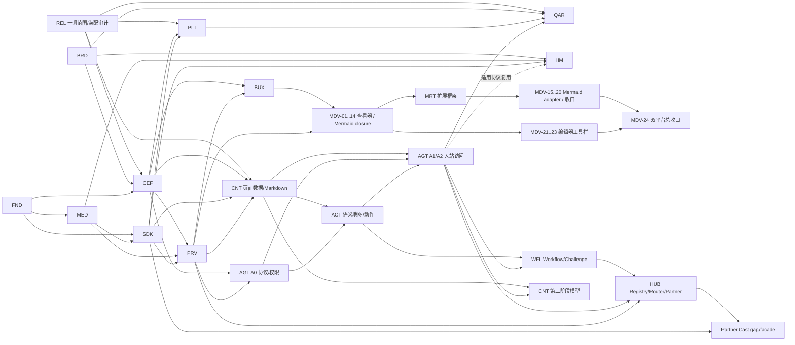

# 蜡笔 AI Agent 投屏浏览器总 Roadmap

- 版本：v0.9（第一期三大闭环发布范围冻结）
- 日期：2026-08-31
- 状态：活跃
- 当前任务总数：287
- 当前测试用例总数：212

## 1. 当前结论

- 已收口：`BRD-01..04`、Foundation、`MED-01..19`、`BUX-01..18`、`SDK-01..14`、`RNM-01..08`；CEF 为 `CEF-01..05/15 DONE`、`CEF-06..14 VERIFIED`，`ACT-01..12` 已完成契约/模型层总 Review，`MRT-01..08 DONE`。
- 页面数据 C1 算法与数据面 `CNT-01..10` 已收口；一期产品链 `CNT-17..20 DONE`，其中 Windows `CNT-20W1/W2` 已用真实 CEF 对称闭合。`CNT-21W` 等三大闭环平台切片完成后的 `PRV-13AW` 再做总 Review。
- 第一期范围由 `REL-01 DONE` 冻结为网页 Markdown、LAN Direct/Relay 投屏、本地 Markdown 编辑三大闭环；远程后续已在 macOS arm64 闭合共享协议与大部分产品链。`REL-05 DONE` 按 2026-08-31 用户决策改为 Windows 10/11 x64 先形成发布候选，macOS 特有验证后置且不阻塞 Windows。Agent/CLI/MCP、Workflow、Hub、Partner、模型与 HarmonyOS 默认关闭并进入第二期。
- 平台剩余重点：网页 Markdown 的 `CNT-20W1/W2` 与本地 Markdown 生产隔离 `MDV-25W` 已闭合；`PLT-W05a/W05b/W05c0 DONE`，`PLT-W05c` 的产品投屏码/播控装配与双配置自动化已闭合，但当前远程桌面点击被标记为 `LLMHF_INJECTED`，须在可信物理输入控制台补 ADB 正式接收端 Direct 真机证据后才能继续 W05d..f；独立主线继续 `MDV-20W -> MRT-09W`、`PRV-13AW -> CNT-21W` 与 QAR Windows 核心矩阵。macOS `PLT-M05b4..b6/M05c`、QAR-10 和其他 macOS 特有门禁保留后续，不得改写已有证据或冒充 Windows 结果。
- 产品依赖顺序不变，但发布拆为两期：第一期先完成浏览器/LAN 投屏/网页 Markdown/本地 MDV；第二期再开放 Agent 协议与语义动作、Workflow/Challenge、Capability Hub/合作方和模型。
- CAAP、CLI/入站 MCP、高性能读页和授权操作仍是产品核心方向，但不进入第一期发布包启用范围；具体模型/provider 与视频/文档总结同属第二期。
- Windows/macOS 为当前桌面；HarmonyOS 只做鸿蒙电脑 PC 形态技术预览；Linux 无活跃任务。
- `BUX` 独立承接完整桌面浏览器体验；`MDV` 承接本地 Markdown 查看/编辑/保存、图标工具栏、图片与 Mermaid Full，`MRT` 独立承接闭合 Extension Framework、Highlight/KaTeX 与后续扩展门禁（PRD v0.8）；`ACT`、`WFL`、`HUB` 分别承接语义动作、持久化工作流和 connector 安全边界，避免把大模块塞进 CEF、AGT 或 CNT。

## 2. 交付不变量

1. 浏览器基础与 LAN Direct/Relay 投屏先形成闭环，再开始正式当前页 Markdown。
2. CAAP 协议/权限内核可先设计，但 R1 页面工具和语义地图必须复用正式 page-data 管线。
3. 入站 MCP 是 CAAP adapter；出站 Partner MCP/API 是隔离 connector，二者不共享 session、token、registry 或授权。
4. Agent 外部只看语义地图/action_id，不看 raw DOM/CDP/长期 selector；动作必须前置检查、用户确认和效果验证。
5. Workflow 只从 verified success 生成候选，用户预览保存；Challenge 只检测/暂停/接管，不自动解题。
6. self-heal 只覆盖唯一、低风险、效果可验证的漂移；高风险、跨源、低置信度变化 fail closed。
7. 每次 Hub fallback 重新做 scope、risk、grant、confirmation 和幂等判断，未知副作用不得跨路径重试。
8. 模型型 AI 必须等 Markdown、Agent 权限与 provider 数据门禁稳定；模型不参与确定性安全决策。
9. 浏览器投屏仅 LAN Direct/Relay；无路由只 ExternalClientHandoff，不做 WebRTC/采集/编码。
10. Partner/TV Cast Manifest 由 Cast-SDK/接收端拥有；浏览器只做缺口分析并消费受审 facade。

## 3. 模块与任务数

| 模块 | 任务数 | 目标 |
|---|---:|---|
| BRD | 4 | 品牌图标母版、跨平台确定性资产与接入门禁 |
| FND | 20 | Workspace、契约、质量入口与仓库基线 |
| CEF | 20 | Windows/macOS CEF 浏览器壳（含 `01A..01E`、`02W/02M` 拆分） |
| BUX | 19 | Chrome-inspired 蜡笔浏览器 UI 与日用基础功能（含 `04A/04B` 拆分） |
| MDV | 25 | 本地 Markdown Runtime：查看/编辑/保存、图标工具栏、图片、Mermaid Full、生产隔离与跨平台门禁 |
| MRT | 19 | Markdown Runtime Extension Framework、Highlight/KaTeX、后续图表/演示与跨域 gap analysis |
| MED | 19 | 媒体观察、LAN Relay 与外部客户端交接语义 |
| SDK | 16 | Cast-SDK 发现/投送/控制；后续 Partner Cast facade |
| PLT | 7 | Windows/macOS 系统与本机 IPC/客户端交接适配 |
| REL | 5 | 第一期三大闭环范围、装配审计、Windows 首发顺序与发布聚合 |
| PRV | 14 | Profile、隐私、安全、日志与分期数据流 Review |
| CNT | 21 | 页面数据/Markdown 产品闭环；第二阶段模型总结 |
| ACT | 12 | 语义地图、action_id、前置条件与效果验证 |
| AGT | 16 | CAAP、入站 registry、CLI/MCP 与授权访问 |
| WFL | 16 | Workflow、Challenge、个人 Site Skill 与受控修复 |
| HUB | 16 | Capability Registry、Router 与 Partner connector |
| HM | 12 | HarmonyOS 电脑 PC 形态技术预览 |
| QAR | 18 | 核心/第二期 feature 分离的质量、性能、安全、发布和回滚 |
| RNM | 8 | `get-video` → `crayon-browser` 命名迁移 |
| **合计** | **287** | |

## 4. 依赖关系

`AGT` 与 `ACT` 采用垂直切片：AGT-01..05 先冻结协议/权限，ACT 构建语义动作，随后 AGT-15 接入 R4；不允许形成循环领取。

## 5. 阶段安排

### V0：工程、投屏语义与 SDK discovery 基线（已完成）

- 品牌资产 `BRD-01..04`、Foundation 19 项、`MED-01..19`、`CEF-01A..01B`、`SDK-01..12`；后续 `FND-13` 仅做规范治理，不改变 V0 产品能力。
- 产出：`Direct/Relay/ExternalClientHandoff/Reject`，固定 SDK source/facade/Fake/真实 service/discovery/连接/投送/监督与 runtime 语义，以及 CEF/ArkWeb 共享的 C++17 engine-api 契约。

### V1：桌面浏览器与 Markdown Runtime P0 可用（macOS 先行）

- `CEF-01D`、`CEF-02W`、`CEF-03..12`、`BUX-01..18`、`MDV-01..25`、`MRT-01..09`、`PLT-01/02/W04` 与适用 PRV；MDV/MRT 不阻塞 BUX 主线，第三方 runtime 与工具栏均按 macOS 先行、Windows 回归收口。
- 本节保留已执行阶段的历史顺序；当前 R1 首发顺序由 `REL-05` 覆盖为 Windows x64 先形成候选，不据此恢复 macOS 前置依赖。
- 验收：Chrome-inspired 蜡笔 UI、本地起始页、地址栏、导航、标签/窗口、书签、历史、下载、设置、Profile/无痕、权限、安全反馈、崩溃恢复、快捷键/无障碍、生命周期和本地 Markdown 查看/预览/分栏编辑/保存/图片/标准 Mermaid/Code Highlight/KaTeX 可用；无对应节点的文档零额外 runtime 加载，含扩展文档完全离线且错误隔离。

### A0：Agent 协议与权限内核

- 在 `CEF-08` 与基础隐私契约稳定后推进 `AGT-01..05,11`。
- 产出：CAAP v1、入站 registry、task、grant、确认和 receipt；不开 transport，不宣称 Agent 可用。

### V2：LAN FakeCastSdk 闭环

- `SDK-07..12`、`CEF-13` 与相应 PRV/MED 用例。
- 验收：发现、连接、Direct/Relay、控制、停止、ExternalClientHandoff，无 WebRTC。

### V3：真实接收端闭环

- `SDK-13..14`、`CEF-14..15`、`PRV-01..13`。
- 验收：Windows/macOS 真实 Cast-SDK 与接收端通过 LAN Direct/Relay。

### V4W/V4M：Windows/macOS Alpha

- Windows：`PLT-W04/W05`；macOS：`CEF-01E`、`PLT-M04/M05`。
- 验收：系统存储、网络、生命周期、更新、安装/签名和客户端交接。

### C1：高性能页面数据与 Markdown

- `CNT-01..10`；前置 `CEF-15`、`BUX-18`、`SDK-14`、`MED-19`、`PRV-08`。
- 验收：当前页结构化快照、缓存/分页/增量、确定性 Markdown、导出控制器模型和性能基线。C1 GO 只表示数据面冻结，不表示真实 CEF 与用户入口已装配。

### R1：第一期三大闭环 Windows 首发候选

- `REL-01..05`、`CNT-17..21` 的 Windows slices、`PLT-W05/19W`、`MDV-20W/24W/25W`、`MRT-09W`、`PRV-13AW` 与 `QAR-01W..16W` 的核心 A 任务。
- 顺序：范围/调用图审计 → Windows 网页 Markdown → Windows 媒体观察/Direct/Relay/交接 → Windows MDV/MRT P0 收口 → 安全/性能/长稳 → 安装/升级/回滚 → Windows Go/NoGo。
- 验收：Windows x64 候选包真实完成网页→Markdown→复制/保存、网页视频→设备→Direct/Relay→控制/停止、本地 `.md`→编辑→预览→安全保存；P0/P1=0。Agent/Workflow/Partner/model 等第二期 feature 默认为 off/NOT_IN_RELEASE。
- 平台：Windows 10/11 x64 为当前首发候选。已有 macOS arm64 共享实现和证据保留；macOS 签名/公证、Keychain、原生生命周期、安装/升级/回滚与最终 Go/NoGo 后续独立验证，不能阻塞或冒充 Windows 候选。

以下 S1 对外装配、A1/A2/W/H/X/M2/Harmony 阶段统一属于第二期，不阻塞 R1：

### S1：语义地图与可验证动作内核

- `ACT-01..12`，与 AGT A1 后半段按依赖垂直切片。
- 验收：Page/Action/Form/Media/Risk Map、ChangeSet、短期 action_id、风险、前置条件、效果验证和人工接管结果。

### A1：只读 Agent Developer Preview

- `AGT-06..08,12..14`。
- 验收：CLI/入站 MCP 经 CAAP 提供 R0/R1；默认关闭、local only；页面读取达到 P95 预算。

### A2：受控 Agent 操作 Preview

- `AGT-09,10,15,16`，依赖 `ACT-12`。
- 验收：R2/R3 确认、R4 action_id/effect 接入、prompt injection/confused deputy/恶意 client/性能与 Release surface Review 通过。

### W1：Challenge 与个人 Site Skill Preview

- `WFL-01..13`。
- 验收：challenge 检测/暂停/接管/checkpoint/恢复；verified-only 学习、用户预览保存、隔离 store、fixture 验证、runner、健康/版本/回滚。

### W2：漂移与受控修复

- `WFL-14..16`。
- 验收：失败分类、drift 证据、低风险受控修复；高风险和低置信度不静默修改。

### H0：本地 Capability Hub

- `HUB-01..08`。
- 验收：built-in/Site Skill/Web/Human 能力统一 registry、route_reason、fallback 重授权、入站 CAAP 能力发现。

### H1：合作方 API/MCP Preview

- `HUB-09..16`。
- 验收：出站 connector 隔离、信任/签名/kill switch、OAuth/scope/token、SSRF、tool injection、限流/熔断和审计。

### X1：Partner/TV Cast 能力

- `SDK-15` 做浏览器侧缺口分析与外部 API 提案；外部 Cast-SDK/接收端获批发布后才执行 `SDK-16`。
- 验收：浏览器无 raw manifest/协议拼接，只消费固定版本正式 facade。

### M2：模型型 AI 第二阶段

- `CNT-11..16`；前置 `CNT-21`、`AGT-16`、`PRV-13B`。
- 验收：provider ADR、发送预览、文档总结、合法文本来源的视频总结、引用和降级。可与 W/H 后期按资源并行，但不能替代其确定性门禁。

### V5：Windows/macOS 稳定发布

- 第一期 Windows 候选执行 `QAR-02AW/05AW/08AW` 与其余 W 核心任务；第二期 feature 执行 `QAR-02B/05B/08B`。Agent、Workflow、Partner、模型分别做 feature GO/NO-GO；任一后续 feature NO-GO 不阻塞三大核心闭环发布。

### VH：HarmonyOS 电脑技术预览

- `HM-01..12`；共享 CAAP 和适用语义契约，平台 transport/ArkWeb 能力单独验证。

## 6. 资源与工期建议

以 2～3 名工程师、共享 Core 已有但 CEF 壳/真实接收端未完成为前提：

| 阶段 | 建议工期 | 说明 |
|---|---:|---|
| V1 | 4～6 周 | Windows CEF 浏览器主链路 |
| A0 | 2～3 周 | 可与 V1 后半段有限并行；先协议/权限 |
| V2/V3 | 4～6 周 | Fake 到真实 LAN 接收端，受外部环境影响 |
| V4W/V4M | 4～6 周 | 两平台可错峰并行 |
| C1 | 3～4 周 | 页面数据、Markdown 与性能基线 |
| R1 | 6～10 周 | 三大闭环产品装配与 Windows x64 首发候选；macOS 特有门禁后续 |
| S1 | 3～4 周 | 语义地图、动作和效果验证 |
| A1/A2 | 5～8 周 | 入站 transport、只读与受控写 Preview |
| W1/W2 | 4～6 周 | 人机接管、个人技能、健康与修复 |
| H0 | 2～3 周 | 本地 registry/router |
| H1 | 4～6 周 | 合作方信任、OAuth、网络与运维门禁 |
| X1 | 待外部 API 评审 | 不把外部仓库工作伪装为浏览器任务 |
| M2 | 3～5 周 | provider 决策后估算；不含新 ASR |
| V5 | 2～3 周 | 长稳、发布、升级/回滚 |
| VH | 4～6 周 | 独立技术预览 |

这是容量估算，不是发布日期承诺；单人串行按约 1.8～2.2 倍放大。

## 7. 当前领取顺序

1. `PLT-W05a/b/c0 DONE -> W05c BLOCKED -> W05d..f`：Windows media-host、Cast UI、投屏码/播控入口与自动化已装配；W05c 等待可产生非 injected 点击的 Windows 控制台闭合 ADB 正式接收端 Direct，之后才能继续 Relay、拒绝/交接与 100 次资源稳定性。
2. `MDV-25W DONE -> MDV-20W -> MRT-09W`：Windows 本地 Markdown 生产隔离已闭合，继续 P0 Runtime、包体与真机回归。
3. `PRV-13AW -> CNT-21W -> PLT-19W -> QAR Windows slices -> REL-03/04 -> QAR-16W`：三闭环数据流与网页 Markdown 总 Review后，执行安全、性能、长稳、安装/升级/回滚、SBOM 与候选 Go/NoGo。

第二期保持排队：`AGT-12C/13/14/16`、`WFL`、`HUB`、`CNT-11..16`、`MRT-10..19`、`SDK-15/16`、`HM`。其中 `CNT-11` 等 `CNT-21 + AGT-16 + PRV-13B + provider ADR`；不得在 R1 完成前抢占 CEF 装配和真机矩阵。

## 8. 发布门禁

- 287 项任务按所选发布范围提供真实状态、命令与证据；212 个唯一当前测试 ID 可追踪，新增一期装配/生产隔离/Windows 顺序任务复用并扩展 CT/E2E/MD/CP/RG 用例映射；P0/P1 Review 为零。
- 一期核心发布不得依赖 QAR 的第二期 B 任务；Agent/Workflow/Partner/model 保持默认关闭并在 QAR-15 标记 `NOT_IN_RELEASE`。
- MDV/MRT 发布包仅包含各 manifest 锁定的浏览器运行时闭包，无 tiny/CDN/npm runtime/动态插件；普通 Markdown 对未命中扩展的 runtime 零读取，Mermaid/Highlight/KaTeX 离线可用且通过类型化输出 policy、lazy/cache、generation 与资源回落门禁。
- CLI/入站 MCP 共用 CAAP；出站 connector 独立；无 raw CDP/WebDriver/任意 JS/remote bind/通用文件上传。
- 页面数据有界、action 有前置与效果、Workflow verified-only、Challenge 不绕过、self-heal 高风险 fail closed。
- Hub route_reason/fallback 重授权和 Partner 信任/OAuth/SSRF/kill switch 通过后才开放对应 feature。
- 模型门禁未满足则保持关闭；Partner Cast facade 未发布则 `SDK-16` 保持阻塞，二者都不影响核心浏览器/LAN Cast。
- Direct/Relay/ExternalClientHandoff、隐私、生命周期、性能、长稳、安装、升级和回滚有真实平台证据。
