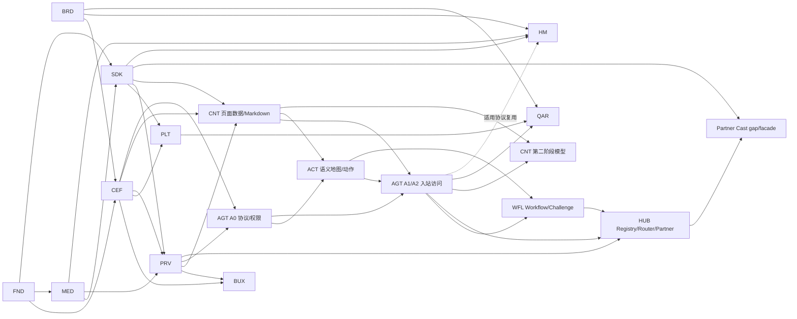

# 蜡笔 AI Agent 投屏浏览器总 Roadmap

- 版本：v0.7
- 日期：2026-08-13
- 状态：活跃
- 当前任务总数：227
- 当前测试用例总数：186

## 1. 当前结论

- 品牌资产 `BRD-01..04`、Foundation 19 项、`MED-01..19`、`CEF-01A..01D`、`CEF-02W`、`CEF-03`、`BUX-01..03`、`SDK-01..12` 与 `RNM-01..08` 已完成，共 71 项。
- `RNM-01..08 DONE` 已将历史 `get-video` 仓库/package/README/GitHub/本地目录统一迁移为 `crayon-browser`，并完成新路径 Windows CEF configure smoke；`CEF-02W/CEF-03 DONE` 已交付正式多进程/sandbox 和 Windows 窗口/标签/基础导航命令链。`BUX-02 DONE` 已交付 Windows UI shell/command/focus/event adapter 骨架并通过 Debug/Release 与 Windows 实机门禁，`BUX-03 DONE` 已交付 Windows 本地新标签页并通过启动、`Ctrl+T`、`Ctrl+L` 与零残留 Debug/Release 实机门禁；`CEF-01E VERIFIED` 的 macOS 双架构/实机证据及 `CEF-02M` 后置，不再阻塞 Windows。`SDK-13 BLOCKED`，等待真实接收端 Harness。Windows x64 CEF 壳、真实标题栏品牌图标、Debug/Release sandbox 和完整退出已验证，macOS App/Helper Bundle 构建图与 CI 已实现，桌面信息架构、规范功能 glyph 与本地新标签页已冻结；实际完整 UI、macOS 平台验收、真实接收端闭环与页面数据面尚未完成。
- 产品仍按“浏览器与 LAN 投屏 -> 页面数据/Markdown -> Agent 协议与语义动作 -> Workflow/Challenge -> Capability Hub/合作方 -> 模型”的依赖顺序交付。
- CAAP、CLI/入站 MCP、高性能读页和授权操作是核心；具体模型/provider 与视频/文档总结属于第二阶段。
- Windows/macOS 为当前桌面；HarmonyOS 只做鸿蒙电脑 PC 形态技术预览；Linux 无活跃任务。
- `BUX` 独立承接完整桌面浏览器体验；`ACT`、`WFL`、`HUB` 分别承接语义动作、持久化工作流和 connector 安全边界，避免把大模块塞进 CEF、AGT 或 CNT。

## 2. 交付不变量

1. 浏览器基础与 LAN Direct/Relay 投屏先形成闭环，再开始正式当前页 Markdown。
2. CAAP 协议/权限内核可先设计，但 R1 页面工具和语义地图必须复用正式 page-data 管线。
3. 入站 MCP 是 CAAP adapter；出站 Partner MCP/API 是隔离 connector，二者不共享 session、token、registry 或授权。
4. Agent 外部只看语义地图/action_id，不看 raw DOM/CDP/长期 selector；动作必须前置检查、用户确认和效果验证。
5. Workflow 只从 verified success 生成候选，用户预览保存；Challenge 只检测/暂停/接管，不自动解题。
6. self-heal 只覆盖唯一、低风险、效果可验证的漂移；高风险、跨源、低置信度变化 fail closed。
7. 每次 Hub fallback 重新做 scope、risk、grant、confirmation 和幂等判断，未知副作用不得跨路径重试。
8. 模型型 AI 必须等 Markdown、Agent 权限与 provider 数据门禁稳定；模型不参与确定性安全决策。
9. 浏览器投屏仅 LAN Direct/Relay；无路由只 ExternalClientHandoff，不做 WebRTC/采集/编码。
10. Partner/TV Cast Manifest 由 Cast-SDK/接收端拥有；浏览器只做缺口分析并消费受审 facade。

## 3. 模块与任务数

| 模块 | 任务数 | 目标 |
|---|---:|---|
| BRD | 4 | 品牌图标母版、跨平台确定性资产与接入门禁 |
| FND | 19 | Workspace、契约、质量入口与仓库基线 |
| CEF | 19 | Windows/macOS CEF 浏览器壳 |
| BUX | 18 | Chrome-inspired 蜡笔浏览器 UI 与日用基础功能 |
| MED | 19 | 媒体观察、LAN Relay 与外部客户端交接语义 |
| SDK | 16 | Cast-SDK 发现/投送/控制；后续 Partner Cast facade |
| PLT | 7 | Windows/macOS 系统与本机 IPC/客户端交接适配 |
| PRV | 13 | Profile、隐私、安全、日志与删除语义 |
| CNT | 16 | 页面数据/Markdown；第二阶段模型总结 |
| ACT | 12 | 语义地图、action_id、前置条件与效果验证 |
| AGT | 16 | CAAP、入站 registry、CLI/MCP 与授权访问 |
| WFL | 16 | Workflow、Challenge、个人 Site Skill 与受控修复 |
| HUB | 16 | Capability Registry、Router 与 Partner connector |
| HM | 12 | HarmonyOS 电脑 PC 形态技术预览 |
| QAR | 15 | 质量、性能、安全、发布和回滚 |
| **合计** | **218** | |

## 4. 依赖关系

`AGT` 与 `ACT` 采用垂直切片：AGT-01..05 先冻结协议/权限，ACT 构建语义动作，随后 AGT-15 接入 R4；不允许形成循环领取。

## 5. 阶段安排

### V0：工程、投屏语义与 SDK discovery 基线（已完成）

- 品牌资产 `BRD-01..04`、Foundation 19 项、`MED-01..19`、`CEF-01A..01B`、`SDK-01..12`。
- 产出：`Direct/Relay/ExternalClientHandoff/Reject`，固定 SDK source/facade/Fake/真实 service/discovery/连接/投送/监督与 runtime 语义，以及 CEF/ArkWeb 共享的 C++17 engine-api 契约。

### V1：Windows 浏览器可用

- `CEF-01D`、`CEF-02W`、`CEF-03..12`、`BUX-01..18`、`PLT-01/02/W04` 与适用 PRV。
- 验收：Chrome-inspired 蜡笔 UI、本地起始页、地址栏、导航、标签/窗口、书签、历史、下载、设置、Profile/无痕、权限、安全反馈、崩溃恢复、快捷键/无障碍和生命周期可用。

### A0：Agent 协议与权限内核

- 在 `CEF-08` 与基础隐私契约稳定后推进 `AGT-01..05,11`。
- 产出：CAAP v1、入站 registry、task、grant、确认和 receipt；不开 transport，不宣称 Agent 可用。

### V2：LAN FakeCastSdk 闭环

- `SDK-07..12`、`CEF-13` 与相应 PRV/MED 用例。
- 验收：发现、连接、Direct/Relay、控制、停止、ExternalClientHandoff，无 WebRTC。

### V3：真实接收端闭环

- `SDK-13..14`、`CEF-14..15`、`PRV-01..13`。
- 验收：Windows/macOS 真实 Cast-SDK 与接收端通过 LAN Direct/Relay。

### V4W/V4M：Windows/macOS Alpha

- Windows：`PLT-W04/W05`；macOS：`CEF-01E`、`PLT-M04/M05`。
- 验收：系统存储、网络、生命周期、更新、安装/签名和客户端交接。

### C1：高性能页面数据与 Markdown

- `CNT-01..10`；前置 `CEF-15`、`BUX-18`、`SDK-14`、`MED-19`、`PRV-08`。
- 验收：当前页结构化快照、缓存/分页/增量、Markdown 预览/复制/保存和性能基线。

### S1：语义地图与可验证动作内核

- `ACT-01..12`，与 AGT A1 后半段按依赖垂直切片。
- 验收：Page/Action/Form/Media/Risk Map、ChangeSet、短期 action_id、风险、前置条件、效果验证和人工接管结果。

### A1：只读 Agent Developer Preview

- `AGT-06..08,12..14`。
- 验收：CLI/入站 MCP 经 CAAP 提供 R0/R1；默认关闭、local only；页面读取达到 P95 预算。

### A2：受控 Agent 操作 Preview

- `AGT-09,10,15,16`，依赖 `ACT-12`。
- 验收：R2/R3 确认、R4 action_id/effect 接入、prompt injection/confused deputy/恶意 client/性能与 Release surface Review 通过。

### W1：Challenge 与个人 Site Skill Preview

- `WFL-01..13`。
- 验收：challenge 检测/暂停/接管/checkpoint/恢复；verified-only 学习、用户预览保存、隔离 store、fixture 验证、runner、健康/版本/回滚。

### W2：漂移与受控修复

- `WFL-14..16`。
- 验收：失败分类、drift 证据、低风险受控修复；高风险和低置信度不静默修改。

### H0：本地 Capability Hub

- `HUB-01..08`。
- 验收：built-in/Site Skill/Web/Human 能力统一 registry、route_reason、fallback 重授权、入站 CAAP 能力发现。

### H1：合作方 API/MCP Preview

- `HUB-09..16`。
- 验收：出站 connector 隔离、信任/签名/kill switch、OAuth/scope/token、SSRF、tool injection、限流/熔断和审计。

### X1：Partner/TV Cast 能力

- `SDK-15` 做浏览器侧缺口分析与外部 API 提案；外部 Cast-SDK/接收端获批发布后才执行 `SDK-16`。
- 验收：浏览器无 raw manifest/协议拼接，只消费固定版本正式 facade。

### M2：模型型 AI 第二阶段

- `CNT-11..16`；前置 `CNT-10`、`AGT-16`、`PRV-13`。
- 验收：provider ADR、发送预览、文档总结、合法文本来源的视频总结、引用和降级。可与 W/H 后期按资源并行，但不能替代其确定性门禁。

### V5：Windows/macOS 稳定发布

- `QAR` 适用任务。Agent、Workflow、Partner、模型分别做 feature GO/NO-GO；任一后续 feature NO-GO 不阻塞浏览器/LAN 投屏核心发布。

### VH：HarmonyOS 电脑技术预览

- `HM-01..12`；共享 CAAP 和适用语义契约，平台 transport/ArkWeb 能力单独验证。

## 6. 资源与工期建议

以 2～3 名工程师、共享 Core 已有但 CEF 壳/真实接收端未完成为前提：

| 阶段 | 建议工期 | 说明 |
|---|---:|---|
| V1 | 4～6 周 | Windows CEF 浏览器主链路 |
| A0 | 2～3 周 | 可与 V1 后半段有限并行；先协议/权限 |
| V2/V3 | 4～6 周 | Fake 到真实 LAN 接收端，受外部环境影响 |
| V4W/V4M | 4～6 周 | 两平台可错峰并行 |
| C1 | 3～4 周 | 页面数据、Markdown 与性能基线 |
| S1 | 3～4 周 | 语义地图、动作和效果验证 |
| A1/A2 | 5～8 周 | 入站 transport、只读与受控写 Preview |
| W1/W2 | 4～6 周 | 人机接管、个人技能、健康与修复 |
| H0 | 2～3 周 | 本地 registry/router |
| H1 | 4～6 周 | 合作方信任、OAuth、网络与运维门禁 |
| X1 | 待外部 API 评审 | 不把外部仓库工作伪装为浏览器任务 |
| M2 | 3～5 周 | provider 决策后估算；不含新 ASR |
| V5 | 2～3 周 | 长稳、发布、升级/回滚 |
| VH | 4～6 周 | 独立技术预览 |

这是容量估算，不是发布日期承诺；单人串行按约 1.8～2.2 倍放大。

## 7. 当前领取顺序

1. `SDK-13`：等待真实接收端 Harness，当前 `BLOCKED`，不得用 Fake 冒充真机证据。
2. `BUX-03`：已 `DONE`；Windows 本地 `crayon://newtab`、普通/无痕差异与固定快捷入口模型已交付，`BUX-04` 仍等待 `PRV-06`，下一项 Windows 原子任务按依赖重新领取。
3. `CEF-01E/CEF-02M`：macOS bootstrap 为 `VERIFIED`，平台证据和正式 sandbox 后置；不阻塞 Windows，也不用 Windows 结果转 `DONE`。
4. `AGT-01` 在 `FND-08/PRV-08` 满足后冻结 CAAP v1；不得提前开放 CLI/MCP。
5. `CNT-01` 等 `CEF-15/BUX-18/SDK-14/MED-19/PRV-08` 完成。
6. `ACT-01` 等 `CNT-03/AGT-01` 完成；`WFL/HUB` 不得越过语义动作和权限依赖。

## 8. 发布门禁

- 227 项任务按所选发布范围提供真实状态、命令与证据；186 个唯一测试 ID 可追踪，P0/P1 Review 为零。
- CLI/入站 MCP 共用 CAAP；出站 connector 独立；无 raw CDP/WebDriver/任意 JS/remote bind/通用文件上传。
- 页面数据有界、action 有前置与效果、Workflow verified-only、Challenge 不绕过、self-heal 高风险 fail closed。
- Hub route_reason/fallback 重授权和 Partner 信任/OAuth/SSRF/kill switch 通过后才开放对应 feature。
- 模型门禁未满足则保持关闭；Partner Cast facade 未发布则 `SDK-16` 保持阻塞，二者都不影响核心浏览器/LAN Cast。
- Direct/Relay/ExternalClientHandoff、隐私、生命周期、性能、长稳、安装、升级和回滚有真实平台证据。
