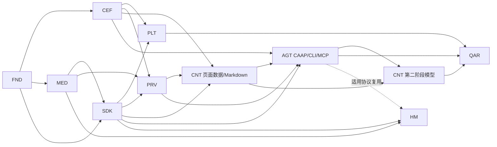

# 蜡笔 AI Agent 投屏浏览器总 Roadmap

- 版本：v0.6
- 日期：2026-08-11
- 状态：活跃
- 当前任务总数：150
- 当前测试用例总数：116

## 1. 当前结论

- Foundation 19 个原子任务、`MED-01..18`、`CEF-01A`、`SDK-01` 已完成，共 39 项。
- `MED-19` 优先把历史 `Mirror`/WebRTC 语义迁移为外部客户端交接。
- `CEF-01B`、`SDK-02` 已就绪；CEF 壳和真实 Cast-SDK 闭环尚未完成。
- 产品仍是 Agent-native 浏览器：CAAP 自有协议、CLI/MCP、高性能读页和授权操作是核心，不是模型功能的附属项。
- 具体模型/provider 与视频/文档总结属于第二阶段；当前先定义任务和门禁，不预选模型。
- 当前桌面为 Windows/macOS；HarmonyOS 只做鸿蒙电脑 PC 形态技术预览；Linux 无活跃任务。

## 2. 交付不变量

1. 浏览器基础与 LAN Direct/Relay 投屏先形成闭环，再开始当前页 Markdown。
2. CAAP 协议/权限内核可在浏览器基础阶段后半段设计，但 R1 读页工具必须复用正式 page data/Markdown 管线。
3. CLI 与 MCP 共用 CAAP/tool registry/guard/app-runtime；没有第二套浏览器自动化实现。
4. R2～R4 副作用操作必须用户确认，页面/模型内容不能扩大授权。
5. 模型型 AI 必须等 Markdown、Agent 权限与 provider 数据门禁稳定后进入第二阶段。
6. 浏览器内投屏仅 LAN Direct/Relay；无路由只交接独立客户端，不做 WebRTC/采集/编码。
7. Linux、新模型/provider、远程 Agent transport 和放宽永久禁止工具都需独立评审。

## 3. 模块与任务数

| 模块 | 任务数 | 目标 |
|---|---:|---|
| FND | 19 | Workspace、契约、质量入口与仓库基线 |
| CEF | 19 | Windows/macOS CEF 浏览器壳 |
| MED | 19 | 媒体观察、LAN Relay 与外部客户端交接语义 |
| SDK | 14 | Cast-SDK 发现、连接、投送与控制 |
| PLT | 7 | Windows/macOS 系统与本机 IPC/客户端交接适配 |
| PRV | 13 | Profile、隐私、安全、日志与删除语义 |
| CNT | 16 | 页面数据/Markdown；第二阶段模型总结 |
| AGT | 16 | CAAP、tool registry、CLI/MCP、高性能读页和授权操作 |
| HM | 12 | HarmonyOS 电脑 PC 形态技术预览 |
| QAR | 15 | 质量、性能、安全、发布和回滚 |
| **合计** | **150** | |

## 4. 依赖关系

## 5. 阶段安排

### V0：工程与领域基线（已完成）

- Foundation 19 项、`MED-01..18`、`CEF-01A`、`SDK-01`。

### V0.1：投屏语义收口

- `MED-19`。
- 产出：`Direct/Relay/ExternalClientHandoff/Reject`，删除新实现对 Mirror/WebRTC 的依赖。

### V1：Windows 浏览器可用

- `CEF-01B..01D`、`CEF-02..12`、`PLT-01/02/W04` 与适用 PRV。
- 验收：浏览、标签、Profile、下载、权限、崩溃、生命周期可用。

### A0：Agent 协议与权限内核

- 在 `CEF-08` 与基础隐私契约稳定后推进 `AGT-01..05`、`AGT-11`。
- 产出：CAAP v1、tool registry、task、grant、确认和 receipt；此阶段不开 transport、不宣称 Agent 可用。
- 该阶段可与 V1 后半段/投屏工作有限并行，不依赖模型。

### V2：LAN FakeCastSdk 闭环

- `SDK-02..08`、`CEF-13` 和相应 PRV/MED 用例。
- 验收：发现、连接、Direct/Relay、控制、停止、外部客户端交接，无 WebRTC。

### V3：真实接收端闭环

- `SDK-09..14`、`CEF-14..15`、`PRV-01..13`。
- 验收：Windows/macOS 真实 Cast-SDK 与接收端通过 LAN Direct/Relay。

### V4W/V4M：Windows/macOS Alpha

- Windows：`PLT-W04/W05`；macOS：`CEF-01E`、`PLT-M04/M05`。
- 验收：系统存储、网络、生命周期、更新、安装/签名和客户端交接。

### C1：高性能页面数据与 Markdown

- `CNT-01..10`。
- 前置：`CEF-15`、`SDK-14`、`MED-19`、`PRV-08`。
- 验收：当前页结构化快照、缓存/分页/增量、Markdown 预览/复制/保存和性能基线。

### A1：只读 Agent Developer Preview

- `AGT-06/07/12..14`。
- 验收：CLI/MCP 通过 CAAP 提供 R0/R1；默认关闭、local only；页面读取达到 P95 预算。

### A2：受控 Agent 操作 Preview

- `AGT-08..10/15/16`。
- 验收：R2/R3 确认、R4 语义 handle、prompt injection/confused deputy/恶意 client/性能与 Release surface Review 通过。

### M2：模型型 AI 第二阶段

- `CNT-11..16`。
- 前置：`CNT-10`、`AGT-16`、`PRV-13`。
- 验收：模型/provider ADR、发送前预览、文档总结、合法文本来源的视频总结、引用和降级。

### V5：Windows/macOS 稳定发布

- `QAR-01..12`、`QAR-14..16`。
- Agent Developer Preview 与模型功能分别做 feature/Go-NoGo；任一 NO-GO 不阻塞浏览器/投屏核心发布。

### VH：HarmonyOS 电脑技术预览

- `HM-01..12`；共享 CAAP 逻辑协议，平台 transport 能力单独验证。

## 6. 资源与工期建议

以 2～3 名工程师、共享 Core 已有但 CEF 壳/真实 SDK 未完成为前提：

| 阶段 | 建议工期 | 说明 |
|---|---:|---|
| V0.1 | 2～4 个工作日 | 先消除 Mirror/WebRTC 返工 |
| V1 | 4～6 周 | Windows CEF 浏览器主链路 |
| A0 | 2～3 周 | 可与 V1 后半段有限并行；先协议/权限，不开 transport |
| V2 | 2～3 周 | FakeCastSdk 闭环 |
| V3 | 2～3 周 | 真实 SDK/接收端，受外部环境影响 |
| V4W | 2～3 周 | Windows Alpha |
| V4M | 3～4 周 | 可与 V4W 后半段并行 |
| C1 | 3～4 周 | 页面数据面、Markdown与性能基线 |
| A1 | 2～3 周 | CAAP transport、CLI/MCP 只读 Preview |
| A2 | 3～5 周 | 受控写操作、安全和性能专项 |
| M2 | 3～5 周 | 模型决策后估算；不含新 ASR 能力 |
| V5 | 2～3 周 | 长稳、发布、升级/回滚 |
| VH | 4～6 周 | 独立技术预览 |

这是容量估算，不是发布日期承诺。单人串行按约 1.8～2.2 倍放大。建议在 V1 期间由一名工程师负责 CAAP/权限内核，避免浏览器完成后才反向改造数据面。

## 7. 当前领取顺序

1. `MED-19`：外部客户端交接语义迁移。
2. `CEF-01B`：Windows CEF bootstrap。
3. `SDK-02`：Cast-SDK facade 下一任务。
4. `AGT-01` 在其依赖满足后冻结 CAAP v1；不得提前开放 CLI/MCP。
5. `CNT-01` 等浏览器/投屏门禁完成；`CNT-11` 等 A1/隐私门禁完成。

## 8. 发布门禁

- 150 项范围任务的状态和证据符合各阶段实际发布选择。
- 116 个当前测试 ID 可追踪，P0/P1 Review 问题为零。
- CLI/MCP 共享 CAAP/tool registry，无 raw CDP/WebDriver/任意 JS/remote bind。
- R1 数据最小化，R2～R4 用户确认，grant/handle/generation/replay 安全通过。
- Agent 页面读取 benchmark 可重复，不以无证据口号宣称性能优势。
- 模型 feature 不满足 provider/隐私门禁时保持关闭，不影响本地 Markdown。
- Direct/Relay/外部交接、隐私、生命周期、性能、长稳、安装、升级和回滚有真实证据。
