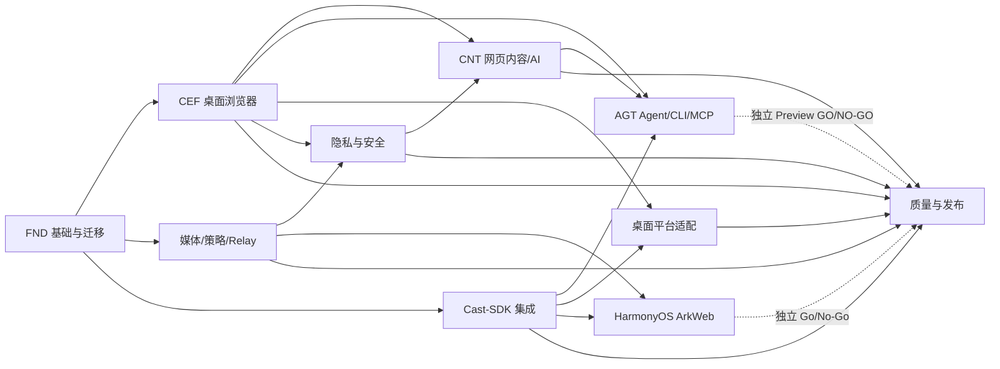

# 蜡笔 AI 投屏浏览器可执行开发 Roadmap

> 版本：v0.4
> 日期：2026-08-10
> 状态：执行中；`FND-01~12`（含 `07A~07E`）、`MED-01~18`、`CEF-01A` 与 `SDK-01` 已 DONE，`CEF-01B`、`SDK-02` READY
> 目标：任何新 Agent 读取 `AGENTS.md`、current 契约和所属模块 Roadmap 后，可以领取一个原子任务并独立实现、测试、Review 和更新状态。

## 1. 使用方式

本文件只管理跨模块依赖、交付切片和总体状态。具体实现步骤在 `docs/plans/` 的模块 Roadmap；测试口径和用例在 `docs/current/testing-standard.md`、`test-cases.md`。

Agent 开工顺序：

```text
AGENTS.md
 -> docs/current/README.md
 -> 本 Roadmap
 -> docs/plans/README.md
 -> 所属模块 Roadmap 的一个 READY 任务
 -> 相关代码/测试/Git 状态
 -> 实现 + 验证 + Code Review + 状态回写
```

禁止直接以阶段标题作为开发任务；只有带唯一 ID、依赖、路径、验收和测试的原子任务可执行。

## 2. 总体不变量

1. 产品跨平台，业务与协议统一；平台 API 通过 adapter/capability。
2. Desktop 使用 CEF，HarmonyOS 使用 ArkWeb，不维护 Chromium fork。
3. 设备发现、投屏码、DLNA/CastExtension、播控和会话监督复用 Cast-SDK。
4. 网页观察、候选、策略、Profile 和授权 relay 属于浏览器产品，不下沉 Cast-SDK。
5. 用户主动播放是投屏硬门禁；禁止自动播放、跳广告、快进广告和 DRM 绕过。
6. LAN 无通用解析/任意 URL proxy；Cookie/Authorization 不离开浏览器/Core。
7. 生产/测试物理隔离；每个交付都有测试、证据和 Code Review。
8. Legacy Tauri 在正式 CEF E2E 通过前只冻结和迁移，不先删除。
9. 确定性页面快照/Markdown 先于模型；模型和页面内容都不能参与安全、权限、DRM 或广告决策。
10. Agent 只通过版本化 tool registry -> capability guard -> `app-runtime` 用例，不暴露原始 CDP/WebDriver/脚本或第二套 Cast 控制路径。

## 3. 工作分解与依赖



| 模块 | 原子任务数 | 主要产物 | 最低完成证据 |
|---|---:|---|---|
| FND | 19 | workspace、领域 crate、legacy 隔离、repo guard、fast check | S2 |
| CEF | 19 | 三平台 CEF 壳、共享 UI、Profile、观察、IPC | S3 |
| MED | 18 | observation/candidate/probe/policy/session relay | S2；高风险 S3 |
| SDK | 14 | pinned SDK、adapter、发现/码/能力/播控/监督 | S4 |
| PLT | 19 | Win/macOS/Linux capture/codec/store/network/update | S4/平台 |
| PRV | 13 | 无痕/空间/防追踪/安全存储/威胁模型 | S3；密钥 S4 |
| CNT | 16 | 页面快照、Markdown、阅读卡片、可选模型与资料包 | S3；provider/接收端 S4 |
| AGT | 16 | tool registry、capability、CLI/MCP、确认与 receipt | S4 |
| HM | 14 | ArkWeb/Native 技术预览、真机结论 | S4 |
| QAR | 16 | E2E、压力、许可、安装更新、发布门禁 | S5 |

合计 164 个唯一原子任务。验收目录当前定义 122 个唯一测试用例；本次已验证任务/用例 ID 唯一，`CNT`/`AGT` 依赖与测试引用无缺失，后续状态更新继续维持同一检查口径。

模块任务详见 [`docs/plans/README.md`](plans/README.md)。

## 4. 可交付垂直切片

每个切片必须端到端可演示，不能只积累底层模块。

### V0：安全迁移基线

依赖：`FND-01`～`FND-06`。

交付：

- 特征测试证明 legacy 存在广告自动操作、通用 LAN 路由和内联测试问题。
- 正式构建路径阻断这些能力；legacy 仍可用于回归。
- core 单测迁出生产文件，53 项不减少。
- fast/core/security 检查入口可在限定时间内运行。

### V1：无设备的 CEF 浏览器

依赖：`FND-12`、`CEF-01A`～`CEF-01E`、`CEF-02`～`CEF-08`、`PRV-01`～`PRV-04`。

交付：Windows/macOS/Linux CEF 可导航、登录、标签、用户播放门禁、媒体 observation 和临时 Profile；关闭后清理可验证。

### C1：确定性网页内容 Alpha

依赖：`CEF-03`、`CEF-05`、`CEF-06`、`CEF-08`、`PRV-08`、`CNT-01`～`CNT-09`。

交付：当前顶层页面语义快照、提取预览、Markdown/CSV 本机导出、阅读模式和大屏阅读卡片本机预览。没有模型配置、用户拒绝上传或 provider 失败时仍可完整使用；不接收端新协议、不做站点爬虫。

### V2：Fake Receiver 投屏闭环

依赖：`MED-01`～`MED-08`、`SDK-01`～`SDK-08`、`CEF-09`～`CEF-12`。

交付：本地 fixture 点击播放 -> 选择 fake device -> 策略选择 -> Direct 或 Mirror fake -> 控制 -> stop -> session 清理。

### V3：Session Relay 与真实蜡笔接收端

依赖：`MED-09`～`MED-18`、`SDK-09`～`SDK-14`。

交付：公开 MP4/HLS 直投；需要浏览器会话但合规允许的 clear media 使用 tokenized relay；真实接收端发现/投屏码/控制/终态闭环。

### V4W：Windows 桌面 Alpha

依赖：`PLT-01`～`PLT-03`、`PLT-W01`～`PLT-W05`、`PRV-05`～`PRV-13`。

交付：Windows 标签页画面+音频、硬件编码、安全存储、网络/休眠/权限闭环。Windows 是首个设备 Alpha，用于尽早校准首帧、包体、接收端和模型 secure-store 风险；不把结果冒充 macOS/Linux 已通过。

### V4M：macOS 桌面 Alpha

依赖：共享 `PLT-01`～`PLT-03`、`PLT-M01`～`PLT-M05`、`PRV-05`～`PRV-13`。

交付：Apple Silicon/Intel、ScreenCaptureKit、系统音频、Keychain、权限恢复和签名开发包闭环。共享策略不分叉，发布日期可晚于 Windows。

### V4L：Linux 桌面 Beta

依赖：共享 `PLT-01`～`PLT-03`、`PLT-L01`～`PLT-L05`、`PRV-05`～`PRV-13`。

交付：先明确 Wayland/PipeWire、发行版和 GPU 支持清单，再完成画面/音频/编码/Secret Service/网络闭环；Linux 可用 Beta 身份发布，不阻塞 Windows/macOS 稳定版。

### C2：AI 内容 Beta

依赖：`C1`、`PRV-05`、`PRV-08`、`PRV-09`、`CNT-11`～`CNT-16`。

交付：批准 provider 的安全配置与轮换、发送前 payload 预览、单页摘要/要点/大纲/问答和用户选择的多标签资料包。先在 Windows Alpha 验证，再复用契约进入其他平台；模型错误不影响确定性导出。

`CNT-10` 单独给出阅读卡片原生投屏 GO/NO-GO；若 Cast-SDK/接收端缺少正式 capability，只保留本机预览或标签页镜像，并在 Cast-SDK 外部仓库新建协议 Roadmap。

### A1：Agent Developer Preview

依赖：`C1`、`SDK-12`、`PRV-10`、`AGT-01`～`AGT-16`。

交付：默认关闭、loopback-only 的 CLI/MCP。先开放当前页/Markdown/标签/投屏状态读取，再开放逐次确认的导航和投屏控制；页面点击/输入属于 P2 安全实验。该切片有独立 GO/NO-GO，不阻塞不带 Agent 控制面的桌面 GA。

### V5：桌面 Beta/GA

依赖：`QAR-01`～`QAR-16`。

交付：签名安装包、升级/回滚、SBOM/NOTICE、许可放行、目标平台 E2E/长稳/安全 Review；Windows、macOS、Linux 分别 GO/NO-GO，不等待未达门禁平台。若以“AI 投屏浏览器”名义进入稳定版，目标平台必须同时完成 `C1` 和 `C2`；`A1` 仍作为独立 Developer Preview，不阻塞桌面 GA。

### VH：HarmonyOS 技术预览

与 V2～V4 并行，依赖 `HM` Roadmap。HarmonyOS 不阻塞 Desktop GA，但不能复用 Desktop 测试结论；完成后给出完整浏览器、轻量浏览器或遥控形态的 Go/No-Go。

## 5. 任务状态总表

初始状态只把无依赖首批任务标为 READY。

| 模块 | READY | TODO | IN_PROGRESS | DONE | 当前阻塞 |
|---|---:|---:|---:|---:|---|
| FND | 0 | 0 | 0 | 19 | 无；FND V0 已收口 |
| CEF | 1 | 17 | 0 | 1 | CEF-01B 因用户切换到 SDK 接入而退回 READY；macOS/Linux runner 留待 01E |
| MED | 0 | 0 | 0 | 18 | 无 |
| SDK | 1 | 12 | 0 | 1 | SDK-01 已固定 source revision；SDK-02 待接 adapter 实际依赖 |
| PLT | 0 | 19 | 0 | 0 | 等 CEF-07、SDK-05 |
| PRV | 0 | 13 | 0 | 0 | 等 FND-08（已达）、CEF-05 |
| CNT | 0 | 16 | 0 | 0 | 等 CEF 页面/IPC 与 PRV 数据分级；先确定性提取，后模型 |
| AGT | 0 | 16 | 0 | 0 | 等 CNT 内容边界、SDK app-runtime 用例和 Agent 威胁模型 |
| HM | 0 | 14 | 0 | 0 | 等 SDK-05 与真机 |
| QAR | 0 | 16 | 0 | 0 | 等目标切片实现 |

任务状态发生变化时同步更新模块 Roadmap；本表只在模块汇总状态变化时更新。（2026-08-10 更新：FND 19 项、MED 18 项、CEF-01A、SDK-01 DONE；总计 39/164 DONE。）

## 6. 现状到目标的迁移映射

| 当前路径 | 现状 | 目标 | 迁移任务 |
|---|---|---|---|
| `src/lib.rs` | 正式 Core 兼容 re-export；legacy UA/helper 仅在 `legacy-dev` | 最终由稳定 workspace crate 取代 | FND-02/05/12 |
| `src/codec.rs` | codec/probe + 224 行内联测试 | `crayon-media-probe` + 独立测试 | FND-02/06 |
| `src/drm.rs` | DRM 识别 + 内联测试 | `crayon-media-probe::protection` | FND-02/06 |
| `src/extract/*` | 静态/站点提取和重复决策 | observer/candidate/adapter registry | FND-06、MED-01～04 |
| `src/probe.rs` | 画面统计 + 内联测试 | probe verdict；浏览器捕获适配另置 | FND-02/06 |
| `src/relay/*` | 任意 URL proxy/API/player | session relay；legacy router 隔离 | FND-01/04、MED-09～18 |
| `app/src/main.rs` | 51 行 Tauri legacy 装配入口；自动广告操作已移除 | CEF/Runtime/observer 独立模块；Tauri 仅回归 | FND-01/04/07/12、CEF/MED |
| `app/ui` | 解析型单页 UI | `browser/shared-ui` 产品 UI | FND-07、CEF-08/13 |
| `tests/fixtures.rs` | 1124 行混合 fixture/测试 | `tests/fixtures` + test-support | FND-02/03 |
| `tests/online.rs` | 公共网络测试 | 本地确定性集成；公网标记 manual | FND-03/10 |

## 7. Agent 并行与文件所有权

可并行的任务必须不修改相同所有权根：

- CEF shell 与纯 Rust media 可以并行，但 IPC schema 由 `crayon-ipc-schema` owner 先冻结。
- Windows/macOS/Linux adapter 可以并行，只依赖 `platform/api` 已冻结接口。
- 测试 fixture 与生产模块可以并行，但 schema/golden owner 必须单一。
- 同一时间禁止两个 Agent 修改根 `Cargo.toml`、`AGENTS.md`、`docs/plans/README.md` 或同一模块 Roadmap；由当前任务 owner 收口。
- Cast-SDK revision 升级期间冻结 `crayon-cast-adapter` 的 API 变更，完成 contract diff 后解冻。

## 8. 每个任务的 Definition of Ready

- 前置任务为 `DONE` 或有明确、批准的替代证据。
- 目标文件和接口存在；不存在时任务本身明确负责创建。
- 输入 schema、错误码、配置和测试用例 ID 已确定。
- 没有未解决的产品/法律选择会改变实现方向。
- 所需平台、设备、证书或依赖权限可用；不可用时任务只允许做到预先声明的证据级别。

## 9. 每个任务的 Definition of Done

- 只完成任务范围，代码位于正确模块，无临时占位和 dead code。
- 对应测试用例已实现并通过；Format/Lint/Build 按任务要求执行。
- 生产/测试隔离、文件规模、硬编码、依赖边界门禁通过。
- Code Review 无 P0/P1；P2 有后续 ID。
- Roadmap 记录真实验证命令、结果、证据级别、未覆盖和下一任务。
- 稳定契约变化已同步 `docs/current/`；没有把实现中间态写成长期事实。

## 10. 估算与发布

原子任务按 0.5～2 工程日设计，设备/发布任务按测试窗口单独估算。以下是依赖与证据窗口，不是承诺日期；小团队按 Windows -> macOS -> Linux 波次执行：

- V0：3～4 周。
- V1：6～8 周。
- V2：6～8 周。
- V3：6～8 周。
- V4W：6～8 周；V4M：共享接口稳定后另 4～6 周；V4L：另 6～8 周并以支持矩阵为准。
- C1：4～6 周，可在 CEF 页面/IPC 稳定后与 SDK/平台任务并行。
- C2：4～6 周，受 secure store、provider 隐私评审和成本策略门禁。
- A1：6～8 周，必须在正常浏览/投屏用例稳定后启动，不占用当前 CEF/Cast 关键路径。
- V5：每个平台 4～6 周发布证据窗口。

以当前 39/164 个任务 DONE、`SDK-02 READY`、`CEF-01B READY` 的事实估算，Windows“确定性内容 + 隐私投屏 Alpha”仍是数月级工作；三桌面平台稳定版、云端 AI 与 Agent Preview 不应承诺同一日期。阶段完成只由 Roadmap 证据决定，不用日历替代门禁。

## 11. 已知首要风险

- 广告自动操作和通用 LAN 路由已从正式构建隔离，但 legacy 源仍需在迁移完成前持续扫描。
- 当前 CEF 尚未落地，三平台工具链、专有 codec 和 CDM 仍需 Spike。
- Cast-SDK 源码 revision 与仓库边界已由 SDK-01 固化；实际依赖、feature 和包体边界仍由 SDK-02 验证。
- 正式 workspace 已分层并在热缓存约 1.3 秒通过；平台/CEF/真机测试时长仍需后续 QAR 实测。
- Linux PipeWire/发行版差异、macOS 系统音频权限、HarmonyOS ArkWeb/Native 能力必须真机验证。
- H.264/AAC/Widevine 分发许可未书面放行前不得作为完成项。
- 页面内容可能包含个人信息、版权内容和间接提示注入；快照、模型与 Agent 必须分别做数据分级和安全 Review。
- 模型 provider、费用、地区可用性和数据保留策略未定；在 secure store 与发送前预览完成前不得接真实 Key 或默认上传正文。
- 普通 DLNA、阅读卡片原生投屏和内容方 Manifest 都取决于 Cast-SDK/接收端公开 capability；不得在浏览器仓库复制协议以赶阶段。

## 12. 当前执行指令

`CEF-01A` 与 `SDK-01` 已完成，`CEF-01B READY`、`SDK-02 READY`。Cast-SDK source revision、submodule 边界和可复现证据已经固定；实际 facade 依赖只能由 SDK-02 在 `crayon-cast-adapter` 建立。`CNT` 在 CEF 页面生命周期、IPC 和 PRV 数据分类前保持 TODO；`AGT` 在正常内容/投屏用例与威胁模型稳定前保持 TODO。不得为了“AI”标签先接真实模型 Key、MCP transport 或任意页面操作。
