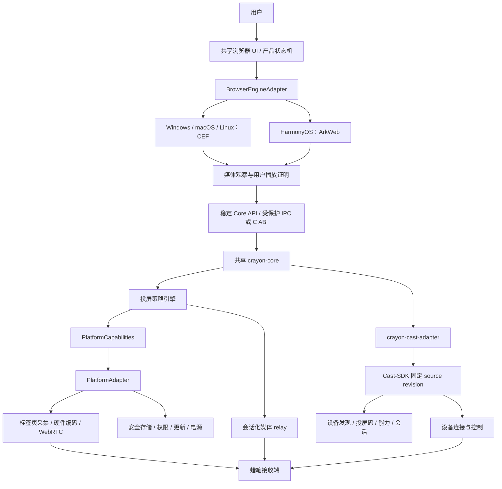

# 蜡笔 AI 投屏浏览器技术方案

> 版本：v0.4
> 日期：2026-08-10
> 状态：架构评审稿
> 关联文档：`docs/crayon-private-cast-browser-prd.md`

> 本文保留浏览器、媒体、投屏与平台技术背景；网页内容/模型与 Agent 的当前权威边界分别以 `docs/current/architecture.md`、`docs/plans/content-intelligence-roadmap.md` 和 `docs/plans/agent-access-roadmap.md` 为准。

## 1. 技术目标

以“共享产品核心 + 浏览器引擎适配器 + 平台能力适配器”构建跨平台 AI 投屏工作台。Windows、macOS、Linux 桌面端统一采用 Chromium Embedded Framework（CEF）；HarmonyOS 不承诺移植 CEF，而采用 ArkUI/ArkWeb 后端接入同一产品契约。复用现有 Rust `get-video` 的媒体检查、DRM、编码探测和 relay 能力；从固定 Cast-SDK source revision 复用设备发现、投屏码连接、播放控制和会话监督；新增独立的确定性页面内容 Core 与受控 Agent gateway；建立可验证的无痕会话、防追踪、模型数据预览和 capability 授权能力。

核心约束：

- 不依赖 Chrome 扩展权限模型。
- 不把媒体或浏览历史上传云端。
- 不开放通用局域网代理。
- 不通过 JS 伪装实现“反检测指纹浏览器”。
- 不修改或绕过 DRM、广告编排和站点授权控制。
- 产品策略、投屏协议、隐私语义和错误码跨平台一致。
- 平台差异必须封装在适配层并通过能力协商显式降级，不允许散落在业务逻辑中。
- 页面快照与模型输出都不可信；模型不参与安全/权限/DRM/广告判断，CLI/MCP 不暴露原始调试协议或任意脚本。

## 2. 技术选型结论

### 2.1 浏览器引擎

桌面端选择 CEF，原因：

- 基于 Chromium/Blink，适配国内主流视频网站。
- 提供浏览器/渲染多进程模型、RequestContext、网络回调、V8/JS 桥接和自定义 UI 能力。
- CEF 跟踪 Chromium 分支，避免直接维护完整 Chromium 产品分支。
- BSD 许可适合开源客户端，但仍需维护第三方许可清单和品牌独立性。

不建议 P0 直接 fork Chromium。Chrome/Chromium 的安全更新节奏将从 2026 年 9 月起进入双周 Stable 周期，自有分支会产生持续 rebase 与安全补丁压力。

HarmonyOS 采用 ArkUI/ArkWeb：

- 官方应用栈以 ArkUI/ArkTS 和 ArkWeb 为主，不能把“桌面 CEF”当作可直接复用的既定能力。
- ArkWeb 通过页面消息通道和脚本注入实现 `BrowserEngineAdapter`，其能力与 CEF 不完全等价。
- HarmonyOS 高级安全模式可能限制 WebAssembly、WebGL、WebRTC 数据通道、摄像头和非代理 UDP，必须通过能力探测和兼容性矩阵管理。
- HarmonyOS NDK 支持 C/C++。Rust Core 是否直接交叉编译必须先做工具链、ABI、线程、网络和应用商店验证；稳定边界使用 C ABI，必要时以 C++ shim 接入，不把“Rust 可编译”写成未经验证的产品承诺。

### 2.2 跨平台边界

共享部分：

- `CastPolicyEngine`、媒体候选 schema、DRM/广告连续性规则。
- relay、Cast-SDK facade、设备能力协商和版本兼容规则。
- 隐私数据分类、生命周期、日志脱敏、错误码和遥测 schema。
- 本地 HTML/CSS/TypeScript 浏览器 UI、设计系统和交互状态机，平台控件仅承接系统窗口与权限入口。
- Cast-SDK facade 契约测试、媒体协议测试向量和接收端模拟器。

平台部分：

- 浏览器引擎与网络观察能力。
- 标签页/窗口/系统音频采集。
- 硬件编解码与 GPU 互操作。
- 安全存储、本地网络权限、防火墙、休眠唤醒。
- 安装、签名、公证、自动更新和崩溃采集。

### 2.3 语言与进程边界

桌面端推荐采用“CEF 薄壳 + Rust Core 独立进程”，而不是直接使用不成熟的 Rust CEF 全封装：

- `crayon-browser`：C++/CEF，负责窗口、标签页、Profile、网络观察、页面注入和本地浏览器 UI。
- `crayon-core`：Rust，复用当前 crate，负责媒体归一化、检查、策略、relay、Profile 编排和产品状态机。
- `crayon-cast-adapter`：统一产品 facade 与 DTO；Windows/macOS 直接包装源码中的 `SenderCommandService`，HarmonyOS 从同一 revision 构建 ArkTS/native bridge，复用设备发现、投屏码、能力评估、播放控制和会话监督。
- `crayon-receiver`：蜡笔接收端，负责 WebRTC/标准媒体播放与状态回报。

HarmonyOS 侧使用 `crayon-harmony-shell`（ArkUI/ArkWeb）和稳定的 Native 接口。若平台不适合独立 Core 进程，则以 Native library/平台服务承载相同接口；进程形态可以不同，协议语义和安全边界必须一致。

这一边界使浏览器引擎升级与 Rust 媒体逻辑解耦，浏览器崩溃、媒体服务崩溃和接收端断线可以独立恢复。

## 3. 总体架构



## 4. 进程模型

| 进程 | 职责 | 权限边界 |
|---|---|---|
| Browser process | 窗口、标签页、导航、RequestContext、IPC、投屏 UI | 可启动/停止 Rust Core，不直接处理上游媒体 |
| CEF render process | 页面渲染、媒体元素观察、受控 JS bridge | 页面输入视为不可信，不可直接触发 relay 或设备命令 |
| GPU/utility/network process | Chromium 内部能力 | 跟随 CEF sandbox，不放宽沙箱 |
| Rust Core | 媒体检查、策略、relay、Profile 与产品状态 | 控制接口仅本机，LAN 仅暴露 tokenized media route |
| Cast Adapter | 浏览器领域模型与 Cast-SDK facade 映射 | 不实现 SOAP/DLNA/CastExtension，不接收网页 secret |
| Receiver | 播放、遥控状态、设备能力报告 | 按 Cast-SDK 现有协议工作 |

要求：

- 保持 CEF sandbox 开启。
- Rust Core 由 Browser process 以子进程启动，浏览器退出时有界关闭。
- Browser 与 Core 使用当前会话随机 secret 完成本机 IPC 鉴权。
- Core 不信任从 render process 直接传来的 URL、标题、请求头或播放状态。
- HarmonyOS 若采用库内集成，ArkWeb 页面消息必须先由 ArkUI 层校验，再进入稳定 C ABI；网页不得直接调用 Core。

### 4.1 跨平台能力接口

平台适配层至少提供以下稳定接口：

- `BrowserEngineAdapter`：导航、标签、Profile、权限、输入事件、媒体/网络观察。
- `TabCaptureProvider`：标签页或应用画面、系统音频、受保护画面状态。
- `CodecProvider`：编码器能力、颜色空间、零拷贝路径、热降级。
- `SecureStore`：设备私钥、Profile 元数据和更新信任根。
- `LocalNetworkProvider`：mDNS/UDP、IPv4/IPv6、多网卡、VPN 与权限状态。
- `LifecycleProvider`：休眠、唤醒、网络切换、电源模式和后台限制。
- `UpdateProvider`：签名校验、渠道、原子升级和安全回滚。

启动时生成只读 `PlatformCapabilities`，例如：

```json
{
  "browser_engine": "cef",
  "tab_video": true,
  "system_audio": true,
  "hardware_h264": true,
  "local_discovery": "mdns+udp",
  "secure_store": "os_native",
  "protected_surface": "blocked"
}
```

共享策略引擎只依据该清单选择能力和降级路径。能力清单需随诊断包展示，但不得包含用户身份和网页 URL。

### 4.2 平台实现矩阵

| 能力 | Windows | macOS | Linux | HarmonyOS（预研） |
|---|---|---|---|---|
| 浏览器 | CEF | CEF | CEF | ArkUI + ArkWeb |
| 画面/音频采集 | Windows Graphics Capture + WASAPI | ScreenCaptureKit | PipeWire portal；X11 兼容另评估 | AVScreenCapture |
| 硬件编码 | Media Foundation / D3D11 | VideoToolbox | VA-API/V4L2；软件回退受许可与性能门禁 | AVCodec |
| 安全存储 | DPAPI | Keychain | Secret Service/libsecret | HUKS |
| 本地发现 | mDNS/UDP + 防火墙规则 | mDNS/UDP + 本地网络权限 | mDNS/UDP + NetworkManager/防火墙适配 | 平台网络/近场发现 API，需真机验证 |
| 本机接口 | Named Pipe | Unix domain socket | Unix domain socket | C ABI/NAPI/平台 IPC，按沙箱验证 |
| 发布 | EXE/MSIX + 签名 | DMG/PKG + 签名/公证 | deb/rpm/AppImage/Flatpak 选型 | HAP + 应用市场审核 |

表中是适配目标而非已完成承诺。技术 Spike 必须验证录制权限、系统音频、HDR/色彩、GPU 共享、受保护画面黑屏和后台限制。

## 5. 模块设计

### 5.1 浏览器壳与引擎适配器

模块：

- `BrowserWindowManager`：窗口、多标签、恢复与关闭。
- `NavigationController`：地址栏、前进/后退、刷新、停止、页面缩放。
- `ProfileManager`：隐私会话和常用空间。
- `PermissionController`：摄像头、麦克风、通知、定位、剪贴板、下载。
- `MediaObserverBridge`：向页面注入只读媒体观察器并接收事件。
- `NetworkObserver`：桌面端通过 CEF ResourceRequestHandler、HarmonyOS 通过 ArkWeb 可用回调收集媒体候选 URL 和响应元数据；缺失字段必须标注而非猜测。
- `CastController`：投屏 UI、设备列表、模式选择、遥控状态。
- `PrivacyController`：清理、跟踪器规则、第三方 Cookie 和防指纹策略。
- `UpdateController`：签名更新、CEF 版本与回滚。

浏览器 UI 建议采用本地打包的 HTML/CSS/TypeScript 页面，通过受限 native bridge 调用平台壳；业务页面和浏览器 UI 使用不同 scheme/origin，不共享脚本能力。桌面端与 HarmonyOS 共享设计系统和状态机，窗口装饰、菜单、权限入口和无障碍桥接按平台实现。

### 5.2 Rust Core

在现有 `get-video` 基础上拆分以下服务：

- `media::extract`：复用 L1/L3，仅作为当前页观察结果的补充，不允许任意后台批量解析。
- `media::inspect`：HLS/DASH 活性、DRM、编码/封装和质量检查。
- `media::candidate`：候选归一化、去重、评分和当前媒体关联。
- `cast::policy`：选择标签页投屏、高清直投或拒绝。
- `relay::session`：按投屏会话生成受控媒体路由。
- `cast_adapter`：调用 Cast-SDK 稳定 facade，映射发现、投屏码、设备能力、播放控制、会话 handle 和终态；不得复制协议栈。
- `security::audit`：本地安全事件和可脱敏诊断。

### 5.3 接收端

接收端至少提供：

- Cast-SDK 现有自动发现和投屏码连接能力。
- Cast-SDK 设备描述、能力报告和控制端点。
- WebRTC 接收播放。
- MP4/HLS/DASH 播放。
- H.264/AAC 作为首版兼容目标，须通过平台能力和许可门禁；HEVC、AV1、EAC3 按设备能力与许可上报。
- 字幕/音轨能力上报。
- 播放状态、进度、缓冲、错误回报。
- 六位投屏码展示 UI。

## 6. Profile 与无痕实现

### 6.1 隐私会话

- 使用独立 `CefRequestContext`。
- 不设置持久化 `cache_path`，Cookie 和站点存储以临时上下文运行。
- 隐私窗口共享同一临时上下文，关闭最后一个隐私窗口后销毁上下文。
- 销毁前停止所有投屏、撤销页面权限、注销 Service Worker 并清理临时目录。
- 清理失败必须写本地告警并在 UI 中提示，不允许静默成功。

### 6.2 常用空间

- 每个空间使用独立 RequestContext 和独立数据目录。
- 空间 ID 使用随机 UUID，不使用用户输入名称作为路径。
- 空间元数据和其他本机敏感配置使用 Windows DPAPI、macOS Keychain、Linux Secret Service、HarmonyOS HUKS 保护。
- 禁止通过符号链接/目录联接将空间目录指向外部路径。
- 删除空间前解析绝对路径并验证位于应用专属 profile 根目录内。

### 6.3 数据清理测试

自动化验证项：Cookie、CacheStorage、LocalStorage、IndexedDB、Service Worker、HTTP cache、权限、浏览历史、表单数据、session restore、媒体 URL 临时库。

## 7. 防追踪与防指纹

### 7.1 标准模式

- 网络层跟踪器阻断列表，规则作为数据更新，不远程执行代码。
- 第三方 Cookie 限制和存储分区。
- 跨站 Referer 收敛。
- HTTPS 优先。
- 权限按站点最小授权。
- 禁用不必要的后台预取、遥测和实验服务。

### 7.2 严格模式

- 对高熵 API 做标准化或降低精度：Canvas、WebGL、Audio、字体、硬件并发、设备内存、时区和屏幕信息。
- 目标是让用户落入较大的统一匿名集合，而不是给每个 Profile 生成独特随机值。
- 先建立兼容性矩阵，再逐项开启；严格模式不作为 P0 默认。
- 页面级 JS 补丁只能作为过渡，不作为最终安全边界，因为页面可检测原型链、函数序列化和时序差异。

### 7.3 明确禁止

- 可编程指纹模板。
- 每账号随机 Canvas/WebGL/UA/时区。
- 代理池与指纹绑定。
- Cookie 批量导入导出。
- Playwright/Selenium 批量控制入口。

## 8. 媒体观察与用户播放门禁

### 8.1 观察来源

- CEF 网络回调：请求 URL、resource type、initiator、frame、响应 Content-Type 和状态码。
- MAIN world 媒体观察器：`video/audio`、`source`、MSE、fetch/XHR、Performance、iframe、Worker。
- DOM 状态：媒体尺寸、可见性、播放时间、readyState、音量和暂停状态。
- 页面上下文：当前顶层 URL、frame URL、最近可信用户输入时间。

不得读取或上报页面正文、密码字段、表单内容和完整 Cookie。

### 8.2 用户播放证明

投屏候选必须同时满足：

- 当前标签页处于前台。
- 最近存在可信鼠标、触摸或键盘操作。
- 媒体触发 `play/playing`，且 `currentTime` 或 live edge 在推进。
- 媒体可见，或由用户明确选择后台音频。
- 候选请求与该 frame、该媒体时间窗口相关联。

页面发送的“正在播放”消息不可直接信任；Browser process 根据 CEF 输入事件、标签页状态和网络活动进行交叉校验。

### 8.3 候选评分

建议评分因子：

- 当前媒体直接 `src/currentSrc`：高权重。
- 与 `play` 事件时间相邻的 manifest 请求：高权重。
- 可见面积和音频活动：中权重。
- 顶层 frame：中权重。
- 初始化分片、短广告片段、追踪请求：仅作为媒体编排证据，不做“广告过滤”。
- DRM、失效或已知私有加扰：直接拒绝高清直投。

## 9. 投屏策略引擎

### 9.1 输入

```json
{
  "page": {"url": "https://example.com/watch", "tab_id": "..."},
  "playback": {"position": 123.4, "duration": 3600, "is_live": false},
  "candidate": {
    "url": "https://cdn.example.com/master.m3u8",
    "protocol": "hls",
    "drm": false,
    "headers_class": "referer_only",
    "codec": "h264+aac",
    "ad_continuity": "unknown"
  },
  "receiver": {"hls": true, "h264": true, "max_height": 2160}
}
```

### 9.2 决策顺序

1. 未满足用户主动播放门禁：拒绝。
2. DRM/私有加扰/授权状态异常：拒绝高清直投；不得尝试绕过。
3. 接收端不兼容：标签页投屏。
4. 需要 Cookie、Authorization 或不可安全传递的会话凭据：标签页投屏。
5. 广告连续性未知且用户选择从头播放：标签页投屏。
6. 站点或媒体类型未进入高清直投策略允许范围：标签页投屏。
7. 其余情况：高清直投；运行中失败可降级为标签页投屏，但需用户确认避免突然切换画面。

### 9.3 广告连续性状态

- `preserved`：服务端拼接、官方接口或经产品/法务验证会保留完整编排。
- `not_applicable`：用户自有、本地、开源或明确无广告内容。
- `unknown`：默认值。
- 不设置 `skippable`、`ad_free` 等容易驱动规避行为的状态。

## 10. 标签页投屏

标签页投屏是 P0 法律和兼容性兜底，必须先完成技术 Spike。

### 10.1 捕获方案候选

方案 A：CEF/Chromium `getDisplayMedia` + WebRTC。

- 优点：使用 Chromium 内建 WebRTC 管线，跨平台潜力好。
- 风险：当前标签页选择、系统提示、音频回环和 CEF 集成需要验证。

方案 B：原生窗口捕获 + 原生音频捕获 + 硬件编码 + WebRTC。

- Windows：Windows Graphics Capture + WASAPI loopback + Media Foundation/硬件编码。
- macOS：ScreenCaptureKit + VideoToolbox。
- Linux：PipeWire portal + VA-API/软件编码。
- 优点：控制强、可捕获浏览器 chrome 或纯页面区域。
- 风险：三平台实现差异大，权限与黑屏处理复杂。

决策门禁：先在 Windows、macOS、Linux 各做最小 Spike，再选择“共享 WebRTC 管线 + 平台采集后端”或全原生管线。每个平台均测试 1080p30、音画同步、CPU/GPU、延迟、窗口遮挡、全屏、HDR、受保护画面黑屏、权限撤销、休眠恢复和多屏缩放。不能用 Windows 结果替代其他平台结论。

### 10.2 WebRTC 约束

- 首选 H.264 + Opus/AAC，按接收端能力和分发许可协商；未完成 H.264/AAC 商业许可评估时，不将专有编码支持视为可发布事实。
- 局域网直连优先，不经 TURN 转发媒体。
- 信令可经本地 WSS 或蜡笔云，但 SDP 中不得附加浏览 URL。
- 目标延迟 P95 小于 1.5 秒。
- DRM 画面遵循系统捕获限制；不得使用规避 protected surface 的实现。

## 11. 高清直投与 relay

### 11.1 当前实现迁移

复用：

- `src/extract/*`：候选归一化和站点补充解析。
- `src/drm.rs`：HLS/DASH DRM 和受限判断。
- `src/codec.rs`：编码/封装探测。
- `src/probe.rs`：实际解码可播性判断。
- `src/relay/proxy.rs`：HLS 重写、Range、防盗链与流式转发。
- DASH MPD 内存仓库与双轨合成。

需要重构：

- 不再向 LAN 暴露 `/api/extract`、`/player`、`/probeplayer` 和任意 URL `/proxy`。
- relay URL 从“编码上游 URL”改为不透明 session/resource ID。
- 上游 URL、Referer 和 UA 只保存在 Rust Core 内存 session 中。
- 会话绑定当前 Cast-SDK 连接 route、有效期、最大并发和允许的上游 host。

### 11.2 路由设计

本机控制面，仅监听 loopback：

- `POST /internal/cast/session`
- `DELETE /internal/cast/session/{id}`
- `GET /internal/health`

局域网媒体面：

- `GET /s/{session_token}/master.m3u8`
- `GET /s/{session_token}/r/{resource_id}/{decorative_name}`
- `GET /s/{session_token}/manifest.mpd`

要求：

- token 至少 128 bit 随机熵。
- session 默认 2 小时上限，停止后立即撤销。
- 可选绑定 Cast-SDK receiver device ID、当前 route 和首次请求 IP。
- 只允许 session 创建时解析出的上游 host 集合，禁止运行时任意跳转到私网地址。
- 对 DNS 重绑定做解析前后地址校验。
- 保持 SSRF 私网、loopback、link-local 和 metadata 地址阻断。
- 日志默认对上游 URL 查询参数做脱敏。

### 11.3 Cookie 与请求头

- Cookie、Authorization 不得进入接收端命令或媒体 URL。
- P0 高清直投只允许无需 Cookie，或仅依赖合理页面 Referer/UA 的媒体。
- 需要账号 Cookie 或动态 Authorization 的内容降级标签页投屏。
- 不逆向签名、不生成平台私有鉴权参数。

## 12. Cast-SDK 源码接入、设备连接与控制

浏览器只消费 Cast-SDK 固定 revision 中的公开 facade，不重新设计设备协议、身份认证、临时授权或使用许可代码。当前阶段不等待 NuGet、SwiftPM、OHPM 或应用市场，直接从源码构建。

### 12.1 Source lock

| 项 | 值 |
|---|---|
| Repository | `https://github.com/shenyingjun5/Cast-SDK.git` |
| Revision | `44c3a99871aa1e68cbda71eacefbb41d23a747a8` |
| Submodule path | `third_party/cast-sdk` |
| Lock manifest | `config/cast-sdk-source.toml` |

- `.gitmodules` URL、superproject gitlink 和 source lock revision 必须一致。
- `git submodule update --init --recursive` 是唯一还原入口；不得引用开发者本机 sibling 路径。
- repo guard 跳过嵌套 git submodule 的内部源码，避免把 SDK 测试、依赖和文件规模误算为浏览器代码。
- 本阶段不处理 Linux 发送端 SDK；Linux 不阻塞 Windows、macOS、HarmonyOS 的 SDK 接入和验收。

### 12.2 浏览器 facade

`crayon-cast-adapter` 向产品暴露统一 `CastFacade`。Windows、macOS 映射到 `cast-sender-service::SenderCommandService`；HarmonyOS 从固定 submodule 构建并映射 ArkTS `CastSenderClient`。稳定语义只包括：

- `start/stop/refresh/list discovery`
- `resolve by cast code`、`connect`、`disconnect`
- receiver capability 与 cast assessment
- video/HLS/relay URL 和已确认的 mirror descriptor 投送
- session handle 绑定的 play/pause/seek/volume/stop
- current session、route lost、receiver stop/end 和 stale generation

UI、CEF、ArkWeb、媒体观察和 relay 不得直接导入任何平台 SDK 类型。平台 callback 在 adapter 边界复制数据并转换为共享 DTO；SDK 调用不在 CEF/ArkUI 主线程或持有产品状态锁时执行。

### 12.3 自动发现和投屏码

- 自动发现完全调用平台 SDK 的 discovery facade；浏览器只展示设备快照和增量状态。
- 六位投屏码原样交给 SDK 的 resolve/connect API；算法、端口池、fallback 和错误判断只属于 Cast-SDK。
- 浏览器只映射成功、未找到、格式错误、取消、断开和 route lost，不增加配对、设备身份或授权状态机。
- P0 不接入云端 rendezvous；媒体 URL、Cookie、Authorization 和页面标题均不进入 Cast-SDK diagnostics。

### 12.4 版本与升级

- 三个平台从同一 Cast-SDK commit 构建，并按相同 capability schema 对齐。
- 升级先在独立任务中更新 gitlink 与 source lock，执行 public API diff、构建、CS contract、真接收端 Harness 和回滚演练。
- SDK 能力缺口回到 Cast-SDK 建公共 API 任务并合入新 commit；浏览器不得复制 SOAP、DLNA metadata、CastExtension、投屏码或 receiver control URL。

## 13. 本机 IPC 与 Native ABI

Windows 推荐命名管道；macOS/Linux 使用 Unix domain socket；HarmonyOS 根据应用沙箱采用 C ABI/NAPI 或平台 IPC。对外统一使用版本化 schema；桌面协议采用 length-prefixed protobuf 或严格 JSON schema，首版可先用 JSON，但必须：

- 进程启动时由 Browser 生成随机 secret，经继承句柄或受保护环境传入 Core。
- 校验对端进程和用户会话。
- 限制消息大小、字段长度、URL scheme 和命令集合。
- render process 事件先由 Browser process 校验，再转发 Core。
- Core 返回的错误使用稳定错误码，不把内部路径和上游完整 URL返回页面。
- C ABI 只暴露不透明 handle、显式长度和所有权规则，不跨边界传递 Rust/C++ 容器或异常。
- 协议至少支持当前版本与前一版本，浏览器壳与 Core 独立更新时先协商版本和能力。

## 14. 安全威胁模型

| 威胁 | 场景 | 缓解 |
|---|---|---|
| 恶意网页触发投屏 | 页面伪造 play/IPC 消息 | 可信用户输入、Browser process 二次确认、设备选择 UI |
| LAN 开放代理 | 邻居调用通用 proxy | 移除通用 LAN API、session token、当前 route 绑定、host allow-set |
| SSRF/DNS 重绑定 | 上游跳向路由器或云 metadata | 解析前后 IP 分类、重定向逐跳校验、私网阻断 |
| Cookie 泄露 | URL/日志/接收端命令带 Cookie | Cookie 不出浏览器/本机 Core，结构化脱敏日志 |
| 页面越权调用 native | 远程页面访问 browser bridge | UI origin 隔离、最小 bridge、schema 校验 |
| Profile 数据残留 | 无痕关闭后目录未删除 | 临时 RequestContext、退出审计、失败显式提示、启动补偿清理 |
| 更新供应链攻击 | 恶意 CEF/规则/安装包 | 签名更新、固定依赖、SBOM、双人发布、可复现构建 |
| 指纹保护反而唯一 | 每用户随机值形成稳定特征 | 统一值/降低精度，不提供任意随机模板 |

## 15. 可观测性与隐私

本机日志允许：

- 错误码、协议、编码、分辨率、耗时、状态转换。
- 设备能力摘要的 hash。
- 脱敏 host 类别。

默认禁止：

- 完整页面 URL、查询参数、标题。
- 完整媒体 URL。
- Cookie、Authorization、表单和页面正文。
- 设备局域网 IP 的云端上传。

匿名遥测必须 opt-in，上传前在客户端聚合；提供“查看将要发送的数据”。

## 16. 测试策略

### 16.1 浏览器兼容

- Windows、macOS、Linux 分别测试登录、Cookie、输入法、字体、无障碍、iframe、Worker、MSE、Service Worker、文件下载、全屏、权限。
- 主流视频站只验证正常页面与投屏行为，不建立破解站点规则。
- 每次 CEF 升级跑自动化回归和人工媒体矩阵。
- HarmonyOS 使用相同站点样本、协议测试向量和隐私断言；ArkWeb 的差异进入显式兼容性清单。

### 16.2 投屏矩阵

- MP4：Range、拖动、moov 位置。
- HLS：master/media playlist、AES-128、直播、fMP4、字幕/音轨。
- DASH：单轨、音画双轨、seek。
- 编码：H.264、HEVC、AV1；音频 AAC、EAC3、Opus。
- 网络：丢包、抖动、Wi-Fi 切换、休眠恢复、接收端重启。
- 网络拓扑：IPv4/IPv6、多个网卡、VPN、访客网络、系统防火墙与本地网络权限撤销。
- 安全：token 猜测、旧 token、跨设备访问、SSRF、重定向和 DNS 重绑定。

### 16.3 隐私回归

- 关闭隐私窗口后的全存储扫描。
- 空间隔离。
- 默认无遥测。
- 日志敏感字段扫描。
- 指纹保护兼容性与熵测试。

### 16.4 跨平台契约测试

- `CastPolicyEngine` 对固定输入在所有平台返回相同决策与错误码。
- Cast-SDK facade、控制、relay、token 撤销和协议降级使用统一 golden vectors。
- 平台能力缺失只改变可选模式，不改变用户播放门禁、DRM 和隐私结论。
- CI 至少包含 Windows、macOS、Linux 原生 runner；HarmonyOS 使用模拟器做基础测试、真机做 ArkWeb、音频、录屏和本地网络门禁。
- 每个平台发布前执行安装、覆盖升级、降级阻断、卸载数据边界、崩溃恢复和签名校验。

## 17. 构建、更新与供应链

- CEF/Chromium 与 ArkWeb/系统兼容性更新进入统一安全看板、各平台独立 release train。
- 严重安全更新目标：上游修复后 72 小时内完成评估和可用构建；无法按期发布时公告风险与临时缓解。
- 安装包、更新 manifest 和二进制全部签名。
- 生成 SBOM、第三方许可和源码对应关系。
- 规则更新仅允许签名数据，不允许远程 JS/WASM 或可执行表达式。
- Stable/Beta/Dev 三渠道隔离 Profile。
- 支持安全回滚，但不得回滚到已知高危 CEF 版本。

### 17.1 编解码器与 DRM 组件门禁

CEF 的开源构建默认不等于包含可商业分发的 H.264/AAC 等专有编解码器；CEF 项目本身也不为产品提供专有编解码器授权。浏览器网页播放、标签页投屏编码和接收端解码分别建立物料与许可清单，不能因为操作系统有硬件接口就推定已获得全部专利或内容分发权。

Widevine/CDM 是另一条独立工作流：

- 产品可以允许受 DRM 保护的网页在本机按平台授权正常播放，但投屏策略仍拒绝直接提取或绕过。
- CEF 集成 Widevine 可能涉及供应商协议、二进制签名、Verified Media Path 和持久许可证限制。
- 在 CDM 集成、签名、地区许可与更新机制完成前，不承诺与 Chrome 完全一致的 DRM 站点兼容性。
- 将“网页能否本机播放”和“内容能否投屏”设为两个独立能力与错误状态。

每个平台发布物必须生成 SBOM、第三方许可、专利/商业组件清单和源码对应关系；法务门禁与技术门禁具有同等阻断权。

## 18. 建议代码结构

```text
browser/
  shared-ui/                 # 跨平台浏览器 chrome UI、设计系统、状态机
  engine-api/                # BrowserEngineAdapter 契约
  cef-shell/                 # Windows/macOS/Linux C++ CEF 后端
  harmony-shell/             # HarmonyOS ArkUI/ArkWeb 后端
platform/
  windows/                   # capture/codec/store/network/update
  macos/
  linux/
  harmony/
core/
  media/                     # 从现有 src/extract, drm, codec, probe 迁移
  relay/                     # 会话化 relay
  cast-adapter/              # Cast-SDK facade 的唯一产品适配层
  privacy/                   # 清理审计、脱敏日志
third_party/
  cast-sdk/                  # 固定 revision 源码 submodule
core-api/
  schema/                    # IPC/C ABI 版本与能力协商
  c-api/                     # 稳定 C ABI 头文件
tests/
  browser/
  cast/
  privacy/
  security/
  conformance/               # 跨引擎/跨平台契约测试
docs/
```

迁移期间保留当前 crate API，先增加 session relay 和设备协议，再把 Tauri UI 标记为 legacy/demo，避免一次性重写导致媒体能力回归。

## 19. 技术决策门禁

在进入 Alpha 前必须完成：

1. CEF 在 Windows、macOS、Linux 均能加载目标站点，并完成 Profile 隔离、sandbox 和最小自动更新验证。
2. ArkWeb 技术 Spike 完成浏览、页面消息、用户播放识别、NDK/C ABI、本地网络和 AVScreenCapture 真机验证，明确不可用能力。
3. 四个平台的标签页采集/系统音频/硬件编码性能 Spike 完成；桌面端确定首版实现，HarmonyOS 给出 Go/No-Go。
4. `BrowserEngineAdapter`、`PlatformAdapter`、`PlatformCapabilities` 和 Core API v1 冻结，并有跨平台契约测试。
5. 接收端 WebRTC/MP4/HLS 基线能力确认。
6. relay session 化安全评审，确认无通用 LAN proxy。
7. Cast-SDK submodule 的干净 checkout、source lock、公开 facade 构建和 revision 回滚验证。
8. 广告连续性状态模型经产品与法务确认。
9. H.264/AAC、Widevine/CDM 和接收端编解码许可路线完成书面结论。
10. CEF/ArkWeb 更新 SLA、各平台签名/公证/包管理与发布责任人确认。

发布策略说明：架构和主干开发从第一天跨平台；各平台构建、测试和安装包独立。某个平台未通过门禁时可以推迟该平台发布日期，但不得创建另一套产品协议或把临时平台特例写入共享策略。

## 20. 外部参考

- [CEF 官方项目](https://github.com/chromiumembedded/cef)
- [CEF 跨平台示例与构建工具链](https://github.com/chromiumembedded/cef-project)
- [CEF General Usage](https://chromiumembedded.github.io/cef/general_usage.html)
- [Chromium 项目](https://www.chromium.org/Home/)
- [Chrome 双周发布周期](https://developer.chrome.com/blog/chrome-two-week-release)
- [HarmonyOS 应用开发规划与 ArkWeb](https://developer.huawei.com/consumer/cn/app/planning)
- [ArkWeb 应用与页面消息通道](https://developer.huawei.com/consumer/cn/doc/HarmonyOS-Guides/web-app-page-data-channel)
- [HarmonyOS AVScreenCapture 音频采集实践](https://developer.huawei.com/consumer/en/doc/best-practices/bpta-audio-record-base-on-avscreencapture)
- [HarmonyOS HUKS Native 密钥能力](https://developer.huawei.com/consumer/en/doc/harmonyos-guides/huks-import-envelop-key-ndk)
- [ArkWeb 高级安全模式能力限制](https://developer.huawei.com/consumer/cn/doc/doccenter-capabilities/web-secure-shield-mode)
- [CEF 专有编解码器构建与许可讨论](https://github.com/chromiumembedded/cef/issues/3559)
- [CEF 不提供专有编解码器二进制](https://github.com/chromiumembedded/cef/issues/3820)
- [CEF Widevine 持久许可证与 VMP 限制](https://github.com/chromiumembedded/cef/issues/3404)
- [Firefox Resist Fingerprinting 兼容性说明](https://support.mozilla.org/en-US/kb/resist-fingerprinting)
