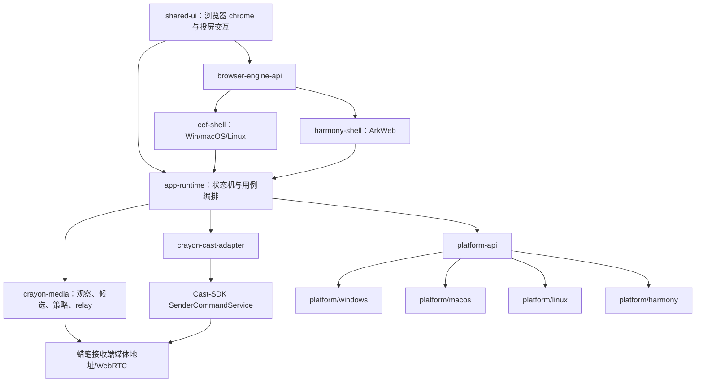

# 蜡笔隐私投屏浏览器当前目标架构

## 1. 架构结论

产品采用六层结构：共享产品 UI、浏览器引擎适配、应用编排、浏览器媒体 Core、Cast-SDK facade、平台能力适配。桌面端共享 CEF，HarmonyOS 使用 ArkWeb；设备协议和播控复用 Cast-SDK，不在本仓库重复实现。



## 2. 目标仓库目录

```text
get-video/
├── AGENTS.md
├── Cargo.toml                         # Rust workspace；不放产品依赖细节
├── cmake/                             # CEF/C++ 共用构建 helper
├── config/
│   ├── product-defaults.toml          # 非秘密产品默认值
│   ├── feature-schema.json            # capability/feature schema
│   └── policy-schema.json             # 策略签名数据 schema
├── browser/
│   ├── shared-ui/                     # TypeScript UI、状态机视图、本地化资源
│   ├── engine-api/                    # C++ BrowserEngineAdapter 稳定接口
│   ├── cef-shell/                     # Desktop CEF browser/render process
│   │   ├── include/
│   │   ├── src/browser/
│   │   ├── src/renderer/
│   │   ├── src/ipc/
│   │   └── tests/
│   └── harmony-shell/                 # ArkUI/ArkWeb；Harmony Roadmap 启动后创建
├── crates/
│   ├── crayon-domain/                 # 共享 ID、错误、能力、状态，不依赖平台/网络
│   ├── crayon-media-observer/         # SourceObservation、候选关联
│   ├── crayon-cast-policy/            # 唯一 Mirror/Direct/Reject 决策器
│   ├── crayon-media-probe/             # MP4/HLS/DASH/DRM/codec 有界预检
│   ├── crayon-relay/                   # session relay、HLS/DASH、SSRF
│   ├── crayon-profile/                 # Profile 生命周期与清理编排
│   ├── crayon-cast-adapter/            # Cast-SDK facade 的唯一产品适配层
│   ├── crayon-app-runtime/             # 产品用例、状态机、Core API
│   ├── crayon-ipc-schema/              # 版本化 Browser/Core schema
│   └── crayon-legacy-adapter/           # 迁移期兼容；完成后删除
├── platform/
│   ├── api/                            # capture/codec/store/network/lifecycle/update 接口
│   ├── windows/
│   ├── macos/
│   ├── linux/
│   └── harmony/
├── third_party/
│   └── cast-sdk/                       # 固定 revision 的 submodule；不直接修改
├── apps/
│   ├── desktop/                        # CEF 正式装配根
│   ├── harmony/                        # Harmony 正式装配根
│   └── legacy-tauri/                   # 当前 app 迁入；仅回归/迁移，不发布
├── test-support/                       # 仅测试依赖：clock、mock upstream、fake receiver
├── tests/
│   ├── contracts/                      # IPC、策略、Cast-SDK facade golden tests
│   ├── integration/                    # 本地 upstream/relay/receiver
│   ├── e2e/                            # 浏览器到接收端闭环
│   ├── fixtures/                       # 许可清晰、无秘密的媒体/manifest
│   └── security/                       # SSRF、token、重放、泄漏
├── tools/
│   ├── repo-guard/                     # 模块、文件、硬编码、测试隔离门禁
│   └── receiver-simulator/
├── scripts/                            # 跨平台入口脚本；核心逻辑放 tools
└── docs/
    ├── current/
    ├── plans/
    └── archive/
```

目录按迁移 Roadmap 分阶段创建，禁止一次性创建空目录或占位模块。根 `src/`、`app/`、`demo/` 在兼容迁移完成前保留；正式 CEF 闭环和回归门禁完成后才移动到 `apps/legacy-tauri/` 或删除。

## 3. 模块职责

| 模块 | 唯一职责 | 可以依赖 | 禁止承担 |
|---|---|---|---|
| `crayon-domain` | 强类型 ID、错误、能力和状态 | serde 等基础库 | 网络、平台、UI、Cast-SDK |
| `media-observer` | 可信输入关联、Observation -> Candidate | domain | 投屏方式决策、设备控制 |
| `cast-policy` | Mirror/Direct/Reject 纯决策 | domain、probe DTO | 网络请求、平台 API、UI |
| `media-probe` | 有界格式/DRM/可访问性证据 | domain、HTTP adapter | 用户体验和设备控制 |
| `relay` | 授权 session、资源注册、媒体流 | domain、probe | 任意 URL API、设备发现 |
| `profile` | 无痕/常用空间生命周期与清理结果 | domain、平台接口 | CEF/ArkWeb 具体对象 |
| `cast-adapter` | 浏览器语义到 Cast-SDK facade 映射 | domain、Cast-SDK | SOAP/DLNA 协议副本、网页逻辑 |
| `app-runtime` | 用例编排和唯一产品状态机 | 上述领域接口 | CEF/OS 具体调用、协议实现 |
| `ipc-schema` | 版本、消息和兼容协商 | domain | 业务实现 |
| `platform/*` | 权限、采集、编码、安全存储、更新 | platform-api | 产品策略和站点规则 |

## 4. Cast-SDK 集成边界

固定使用 Cast-SDK 的稳定 facade：

- 发现：`start_discovery`、`stop_discovery`、`refresh_discovery`、`list_devices`。
- 连接：`connect_device`、`disconnect_device`、`resolve_device_by_cast_code`。
- 能力：`list_devices_with_capabilities`、`assess_cast`、receiver app capability。
- URL 投送：通过公开 URL/HLS facade 或经 SDK 批准的统一 remote media API。
- 控制：session handle 绑定的 play/pause/seek/volume/stop。
- 会话监督：监听 current session、route lost、receiver stop/end 和 stale generation。

浏览器拥有：

- CEF/ArkWeb 页面、Cookie、Profile、用户输入和媒体观察。
- `SourceObservation`、`MediaCandidate`、广告连续性/DRM 策略。
- 网页授权 relay 的 secret vault 和生命周期。
- 标签页采集与 WebRTC 镜像。

集成规则：

- `third_party/cast-sdk` 固定 commit，升级独立任务完成 API diff、许可证、测试和回滚记录。
- 只有 `crayon-cast-adapter` 可以依赖 Cast-SDK crate；UI、CEF 和 media 模块不得直接依赖。
- SDK 缺少能力时返回稳定 unsupported 或建立 Cast-SDK Roadmap；不得在浏览器仓库拼协议补洞。

## 5. 核心状态机

```text
Idle
 -> Browsing
 -> PlaybackEligible
 -> SelectingReceiver
 -> Planning
 -> StartingMirror | StartingDirect
 -> Casting
 -> Stopping
 -> Browsing

任意活动态 -> Failed -> Browsing/Idle
导航、标签关闭、route lost、receiver stop、Profile 销毁 -> Stopping
```

状态写入只由 `crayon-app-runtime` 完成。CEF/ArkWeb、relay、Cast-SDK 和平台 adapter 只能产生带 session/generation 的事实事件；旧 generation 事件必须丢弃。

## 6. 配置和能力

- `ProductConfig`：端口范围、超时、容量、更新渠道等非秘密默认值，可由签名配置覆盖。
- `PlatformCapabilities`：browser engine、tab video/audio、hardware codec、secure store、local discovery、protected surface。
- `ReceiverCapabilities`：只来自 Cast-SDK，不由 UI 或站点规则猜测。
- `CastPolicyInput`：用户播放证明、候选证据、平台能力、接收端能力、广告连续性和授权状态。
- 秘密、Cookie 和 Authorization 不进入上述可序列化诊断模型。

## 7. 迁移不变量

1. 先用特征测试记录现状，再做纯移动，再做行为修复；三者不混在同一提交。
2. 当前 53 项 core 测试不得减少；迁移内联测试只能改变位置，不能删断言。
3. 正式 App 不得依赖 legacy 任意 URL proxy、隐藏 WebView 自动交互和 beacon 端口。
4. 任何时刻至少保留一条可运行的端到端开发链路；正式 CEF 达到门禁前不删除 Tauri 迁移源。
5. 公共错误、协议和状态变更必须版本化并有前后兼容测试。
