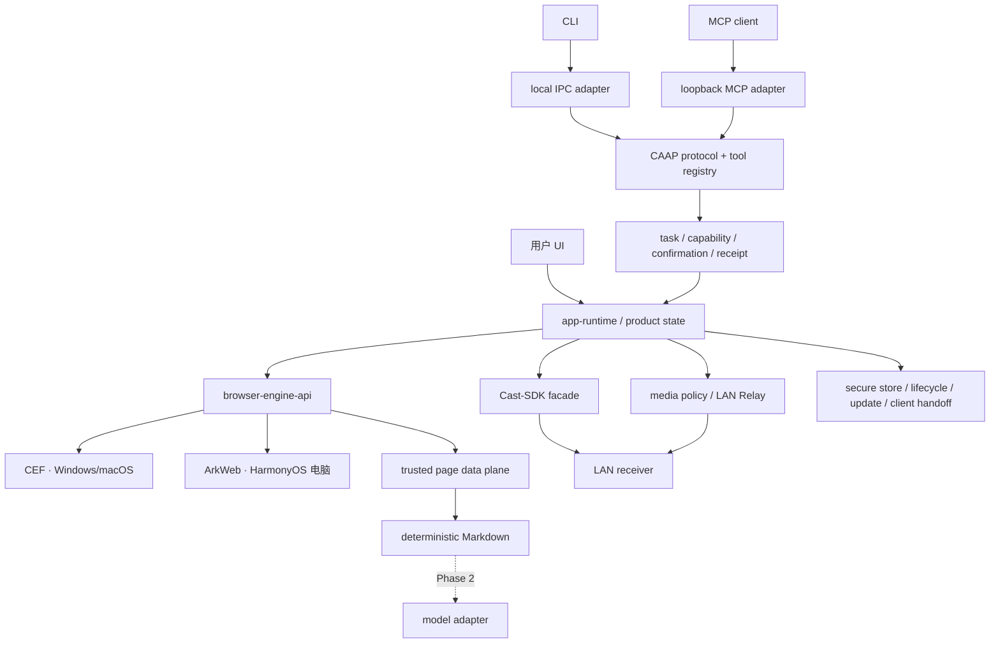
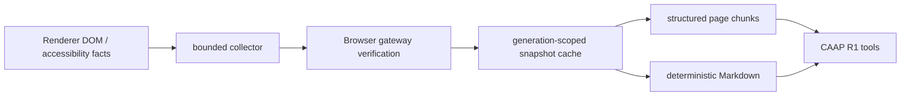
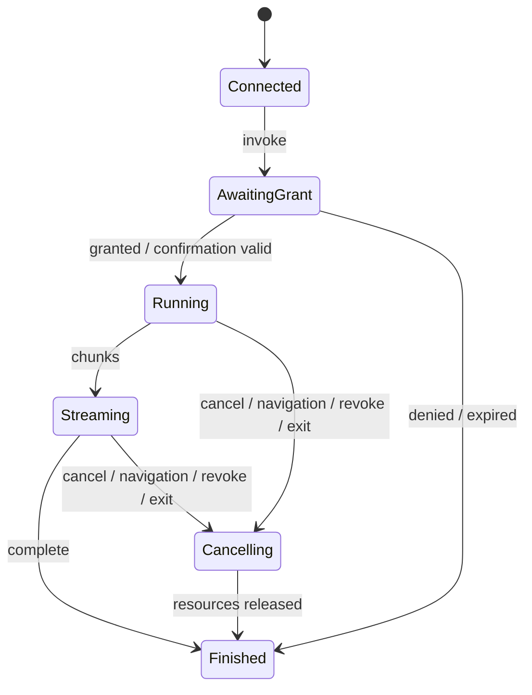

# 蜡笔 AI Agent 投屏浏览器当前架构

- 版本：v0.6
- 日期：2026-08-11
- 状态：当前权威架构契约

## 1. 架构结论

产品由四个互相隔离、通过 app-runtime 编排的领域组成：浏览器、媒体/投屏、内容数据面、Agent 安全访问。第二阶段模型能力建立在内容数据面之上，但不能参与权限或安全决策。

## 2. 依赖方向

固定方向：`UI/CLI/MCP adapter -> CAAP/应用编排 -> 领域接口 -> Core/Cast-SDK facade -> 平台 adapter`。

- CLI/MCP 不能直接调用 CEF、ArkWeb、Cast-SDK、Relay、平台 API 或数据库。
- MCP 是 CAAP adapter，不单独实现工具、权限、确认或状态机。
- CEF/ArkWeb 类型不进入 CAAP schema、领域 Core 或 tool registry。
- 模型 adapter 只消费用户确认过的内容 DTO，不能回调 capability guard 扩权。
- 状态唯一所有，callback/timer/worker 不越权修改 owner 集合。

## 3. 主要模块

| 模块 | 所有权 | 不拥有 |
|---|---|---|
| `crayon-domain` / `crayon-ipc-schema` | 稳定 ID、DTO、错误、CAAP schema 与兼容窗口 | 引擎/平台对象、secret 正文 |
| `crayon-browser-gateway` | 可信输入、tab/navigation/generation 和 Browser-side 验证 | Agent grant、模型策略 |
| `crayon-page-data` | 结构化语义快照、分页/增量、provenance 和资源上限 | UI 操作授权、原始 CDP 输出 |
| `crayon-content-*` | 主内容、Markdown、导出与第二阶段模型输入 DTO | provider 密钥、Agent 权限 |
| `crayon-agent-gateway` | CAAP session、tool registry、task、grant、confirmation、receipt | CEF/SDK/Relay/平台直接调用 |
| `crayon-app-runtime` | 正常浏览、页面操作、内容和投屏用例 | transport 与平台实现 |
| `crayon-media-*` / `crayon-relay` | 媒体事实、策略和 LAN Relay | 设备协议、通用代理 |
| `crayon-cast-adapter` | Cast-SDK facade、handle 与事件映射 | 页面、Agent transport、WebRTC |
| `crayon-platform-api` | 存储、网络、生命周期、更新、外部客户端交接、本机 IPC | Agent 工具语义、采集/编码 |
| `crayon-model-adapter`（第二阶段） | provider 契约、发送/流式/取消/错误 | capability、DRM、页面操作 |

## 4. CAAP 自有协议

### 4.1 逻辑协议

`CAAP v1` 是 transport-independent 的本机 Agent 协议，必须定义：

- `Hello/Welcome`：协议版本、产品版本、feature/capability、最大消息与兼容窗口。
- `ClientSession`：短期 secret、Profile scope、client identity、到期和撤销。
- `TargetRef`：opaque `profile_id/tab_id/navigation_id/generation`，不包含对象指针。
- `ToolDescriptor`：tool ID/version、risk、输入/输出 schema、是否确认、资源预算。
- `Invoke/Chunk/Complete/Error`：流式结果、sequence、deadline、cancel token 和稳定错误。
- `Grant/Confirmation`：scope、目标、关键参数摘要、到期、一次性 nonce。
- `IdempotencyKey`：重复请求不产生重复副作用。
- `ActionReceipt`：脱敏结果、目标类别、时间、状态和 TTL。

schema 使用 current/previous golden，拒绝未知高风险字段。逻辑协议不绑定 JSON、Protobuf 或 CBOR；wire 编码由任务基准和可审查性决策，但 CLI/MCP 看到的行为必须一致。

### 4.2 Transport

- CLI：Windows named pipe、macOS Unix domain socket；仅当前用户可访问。
- MCP：只绑定 loopback，默认关闭，使用短期高熵 session secret；映射 MCP initialize/list/call/cancel 到 CAAP。
- HarmonyOS 电脑：本机 IPC 方案在 `HM` Roadmap 评估，但逻辑协议和工具不分叉。
- 不提供 LAN/WAN Agent 监听，不通过网页端口复用 Agent 控制面。

### 4.3 工具风险

- R0/R1 可按任务或 App 会话授予。
- R2/R3 每次显示目标和关键参数，目标变化或确认超时后重确认。
- R4 只接受 Browser 签发的可见 `SemanticNodeHandle`，handle 绑定 origin/tab/navigation/generation/节点语义和短 TTL。
- Cookie、Authorization、密码/支付、文件上传、隐藏/跨源元素、任意 JS/CDP、任意文件/网络永久不可表达。

## 5. 高性能页面数据面

### 5.1 数据路径

- Renderer 只发送受限事实；Browser process 确认 frame、origin、navigation 和 generation。
- 快照缓存按 Profile/tab/navigation 所有，导航、标签关闭、撤销、Profile 销毁立即失效。
- 首次快照可分块；重复读取优先复用已验证结构或返回版本化增量。
- 对标题、可见文本、链接/表格/代码和交互元素建立字段级索引，避免每个工具重复遍历整树。
- 大结果有 chunk、游标、最大节点/字节/深度和 deadline；消费者背压不能阻塞 Renderer/UI。
- page data 带 provenance 与 untrusted 标记；页面指令永远不是系统/授权指令。

### 5.2 性能原则

- 常规读页不走 screenshot/OCR，不把完整 DOM/HTML反复序列化为 JSON。
- 快照构建不在 UI 线程执行不可控工作；支持取消与 generation 失效。
- 同一导航的多个 Agent 工具共享一次采集/清洗结果。
- 热路径不做高频日志、同步文件 IO、无界字符串复制或锁内 IPC。
- benchmark 至少覆盖小页、100KB 长文、复杂表格、无限列表截断和高频增量变化。

## 6. Agent task 生命周期

- 每个 task 绑定 client/session/Profile/target/generation/tool/version/grant。
- 取消、deadline、导航、标签关闭、Profile 切换、App 退出和 transport 断开都能收敛。
- 旧结果只允许丢弃，不能补偿性执行新的副作用。
- 队列、并发、chunk、receipt 和任务表有界，满载 fail closed。

## 7. 正常用例边界

Agent 工具调用 app-runtime 的正常用例：

- `browser.read_targets/read_page/read_markdown`
- `browser.navigate/tab_open/tab_switch/tab_close/back/refresh/scroll`
- `browser.semantic_action`
- `cast.read_devices/read_session/start/control/stop`

这些用例同样被产品 UI 使用。Agent gateway 不能创建“更强”的隐藏版本，也不能绕过用户播放、DRM、广告、Relay、下载、权限和外部协议门禁。

## 8. 投屏与外部客户端

- 当前投屏决策是 `Direct/Relay/ExternalClientHandoff/Reject`。
- Direct/Relay 只在 LAN，由 Cast-SDK facade 投送与控制。
- `ExternalClientHandoff` 需要用户确认，不创建 Cast-SDK、Relay 或 WebRTC session。
- R3 Agent 投屏工具需要独立确认，并沿用相同 policy；Agent 无权调用独立客户端的采集/镜像控制面。
- 历史 `Mirror` 决策已由 `MED-19` 迁移为 `ExternalClientHandoff`（`mirror` wire 值保留兼容读取窗口，不再发出）；`tab_video`/`system_audio` 字段不再被策略引用，不能成为 Agent capability。

## 9. 第二阶段模型能力

- model adapter 位于内容 DTO 之后，默认没有 provider。
- 文档总结消费清洗后的 snapshot/Markdown 子集。
- 视频总结首期只消费合法可得且用户可见的字幕/转录或用户提供文本，不下载媒体或绕过 DRM。
- 模型请求使用独立发送确认，不复用 Agent R1 grant；payload 与预览逐字段一致。
- 输出绑定 snapshot/hash/provenance，标识 AI 生成；超时/取消/失败不影响本地 Markdown。
- 模型输出保持 untrusted，不能生成 grant、工具确认或新的 CAAP 调用。

## 10. 安全威胁

- 间接提示注入：页面/模型/工具结果不得改变 capability 或串联第二工具。
- confused deputy：R1 grant 不能复用为 R2～R4；一个 target 不能替换为另一个。
- 本机恶意 client：当前用户 ACL、短期 secret、版本握手、限流、重放防护和单客户端策略。
- TOCTOU：确认摘要绑定 target/generation/handle/参数 hash，变化即过期。
- 跨 Profile：ID、缓存、grant、receipt 和 transport session 全部隔离。
- 数据泄漏：不返回 Cookie、Authorization、完整敏感 query、浏览历史、密码/支付/隐藏表单值。
- Release surface：扫描 remote bind、原始 CDP/WebDriver、任意 JS、文件上传、通用文件/网络工具和 debug control。

## 11. 平台与范围

- Windows/macOS CEF 是当前桌面范围。
- HarmonyOS 只按鸿蒙电脑 PC 形态技术预览。
- Linux 不提供当前 adapter。
- 浏览器不实现 WebRTC、屏幕/标签页/系统音频采集或编码。

## 12. 生命周期释放顺序

1. 停止接收新 CAAP/MCP/CLI 请求，撤销 session/grant。
2. 取消 Agent、page snapshot、Markdown和第二阶段模型任务。
3. 停止 Cast-SDK session/listener。
4. 撤销 Relay token/recipe/cache。
5. 销毁 tab/profile/engine。
6. 清理无痕数据并报告失败。
7. 停止 transport、receipt/诊断 consumer 和平台对象。

## 13. 架构变更门禁

下列变化先修订独立 Roadmap：CAAP v2/远程 transport、新工具风险级别、放宽永久禁止能力、模型/provider/密钥、新平台、浏览器 WebRTC/采集/编码、Cast-SDK 公共 API 或新设备协议。
