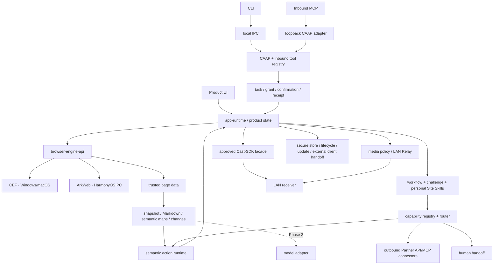
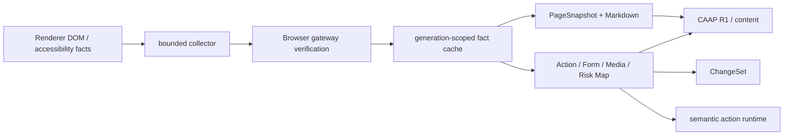
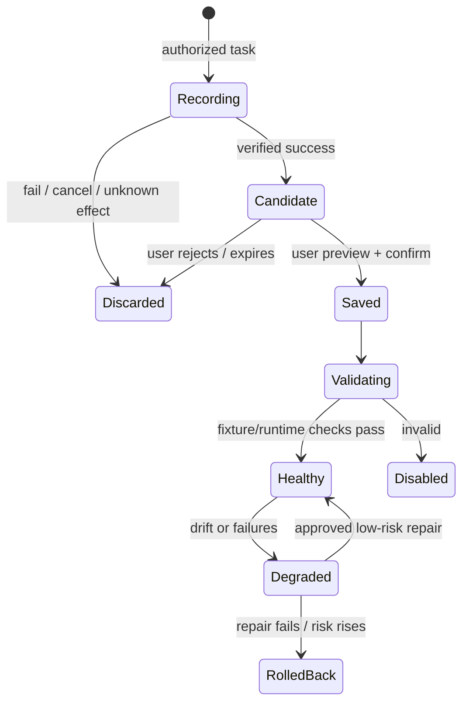
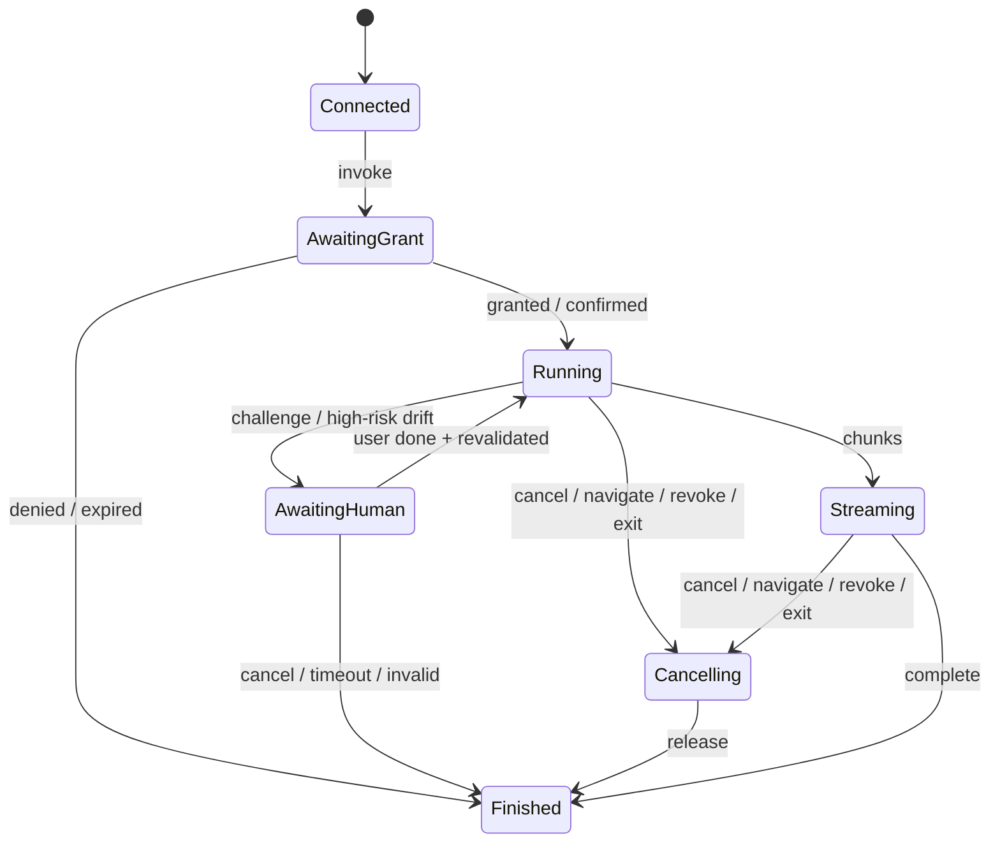

# 蜡笔 AI Agent 投屏浏览器当前架构

- 版本：v0.7
- 日期：2026-08-11
- 状态：当前权威架构契约

## 1. 架构结论

产品由浏览器、媒体/投屏、页面数据、语义动作、Agent 安全访问、Workflow/Challenge、Capability Hub 七个领域通过 `crayon-app-runtime` 编排。第二阶段模型位于内容与建议边界之后，不能参与权限、风险、路由、挑战或高风险修复决策。

## 2. 依赖方向与信任边界

固定方向为：`UI/CLI/入站 MCP -> CAAP/应用编排 -> 领域接口 -> Core/Cast-SDK facade -> 平台 adapter`。

- CLI、入站 MCP、Workflow、Hub 均不能直接调用 CEF、ArkWeb、Cast-SDK、Relay、平台 API 或数据库。
- 入站 MCP 是 Agent 到蜡笔的 CAAP adapter；出站 Partner MCP/API 是蜡笔到合作方的 connector。两者不得共享 session、token、tool registry、授权或审计语义。
- MCP、CLI、产品 UI 与 Site Skill 最终调用同一 `app-runtime` 用例；不存在更强的隐藏工具。
- CEF/ArkWeb 类型、DOM 指针、CDP 对象和平台句柄不得进入公共 schema。
- 模型、页面文字、合作方 tool description 和 connector 响应统一视为不可信内容，不能创建 grant、confirmation、route override 或修复决定。
- Cast-SDK/接收端拥有设备协议。浏览器不得自行解释或签发 Partner/TV Cast Manifest。

## 3. 模块所有权

| 模块 | 所有权 | 明确不拥有 |
|---|---|---|
| `crayon-domain` / `crayon-ipc-schema` | 稳定 ID、DTO、CAAP 与兼容窗口 | 引擎对象、secret、业务状态 |
| `crayon-browser-gateway` | tab/navigation/generation、Renderer 来源和 Browser-side 验证 | Agent grant、Workflow、connector |
| `crayon-page-data` | 有界 PageSnapshot、分页/增量、provenance、Markdown 基础事实 | 页面操作和授权 |
| `crayon-semantic-action` | Action/Form/Media/Risk Map、ChangeSet、action_id、前置条件与效果验证 | CEF 直调、长期 selector、用户授权 |
| `crayon-content-*` | 主内容、确定性 Markdown、导出和模型输入 DTO | provider 密钥、Agent 权限 |
| `crayon-agent-gateway` | CAAP session、入站 registry、task、grant、confirmation、receipt | 出站 connector、CEF/SDK 直调 |
| `crayon-workflow` | 最小 trace、Recipe、个人 Site Skill、Challenge、checkpoint、健康/版本/回滚 | 密码/正文/secret、权限继承 |
| `crayon-capability-hub` | 统一能力描述、可解释路由、fallback 状态 | OAuth token、具体网络调用 |
| `crayon-partner-connector` | 出站 Partner API/MCP、OAuth/scope、网络策略、健康/熔断 | 入站 CAAP session、页面操作直通 |
| `crayon-app-runtime` | 正常浏览、语义动作、内容、Workflow、Hub 与投屏用例 | transport 和平台实现 |
| `crayon-media-*` / `crayon-relay` | 媒体事实、策略和 LAN Relay | 设备协议、通用代理 |
| `crayon-cast-adapter` | 固定 Cast-SDK facade、handle 和事件映射 | 新设备协议、网页/Agent transport |
| `crayon-platform-api` | secure store、生命周期、更新、外部客户端交接、本机 IPC | 工具语义、采集/编码 |
| `crayon-model-adapter`（第二阶段） | provider、流式/取消/错误和建议 DTO | capability、风险、动作、路由 |

## 4. CAAP 与入站访问

`CAAP v1` 是 transport-independent 的本机协议，包含：

- `Hello/Welcome`：协议/产品版本、能力、消息限制和兼容窗口。
- `ClientSession`：当前用户、Profile scope、client identity、短期 secret、到期与撤销。
- `TargetRef`：opaque profile/tab/navigation/generation，不含对象指针。
- `ToolDescriptor`：ID/version、risk、schema、确认要求、预算与 app-runtime 用例。
- `Invoke/Chunk/Complete/Error/Cancel`：sequence、deadline、backpressure 和稳定错误。
- `Grant/Confirmation/IdempotencyKey/ActionReceipt`：最小授权与可验证副作用。

CLI 在 Windows 使用 named pipe、macOS 使用 Unix domain socket。入站 MCP 默认关闭、只绑定 loopback、使用短期高熵 secret，并把 MCP initialize/list/call/cancel 映射到 CAAP；不提供 LAN/WAN 监听。

R0/R1 可按最小任务范围授权；R2/R3 逐次确认；R4 必须使用短期 action_id、重新检查前置条件并验证效果。Cookie、Authorization、密码、支付、通用文件上传、任意 JS/CDP、远程监听、任意文件/网络永久不可表达。

## 5. 页面理解数据面

- Renderer 只发送受限事实；Browser process 验证 frame、origin、navigation 和 generation。
- `compact`/`standard` 可对外；`full` 仅为内部、有界、显式诊断或受控修复使用，仍不得等同原始 DOM/HTML/CDP。
- 快照和地图按 Profile/tab/navigation 所有；导航、关闭、撤销、Profile 销毁、TTL 或内存压力立即失效。
- 同一导航的 Agent、Markdown、动作和 Workflow 共享已验证事实与增量，不能各自重复抓取整页。
- 大结果有最大节点/字节/深度、chunk、游标、deadline 和背压。页面内容带 provenance 与 untrusted 标记。
- 常规读页不走 screenshot/OCR。视觉/截图仅可作为内部有界 fallback 或人工辅助，不能成为绕过语义/权限门禁的控制路径。

## 6. 语义动作运行时

`action_id` 是 Browser 签发、目标与 generation 绑定的短期引用；外部调用方不持有长期 CSS/XPath selector。内部 locator 可综合 role/name/text/结构邻近/可见性/几何等信号，但每次执行必须：

1. 解析当前 TargetRef 与 action_id，拒绝过期或跨 Profile/导航引用。
2. 重定位并校验唯一性、可见性、可操作性、same-origin 与风险。
3. 校验声明的 precondition、grant、confirmation nonce 和参数 hash。
4. 经 `app-runtime` 正常用例执行，不在 Renderer 暴露任意脚本入口。
5. 等待有界 effect，例如字段状态、导航、页面 ChangeSet 或投屏状态。
6. 返回 verified/failed/indeterminate；不确定副作用不自动重放。

风险是确定性、单调的：后续信息只能维持或提高风险，模型/页面/connector 不能降级风险。密码、支付、文件、隐藏或跨源元素不可产生可执行 action_id。

## 7. Workflow、Challenge 与个人技能

### 7.1 生命周期

- trace 只记录语义意图、参数占位符、步骤结果和 provenance，不保存 secret、敏感字段值或正文副本。
- 只有已验证成功的任务可生成候选 Recipe；保存前用户必须看到站点、步骤、参数、权限、风险和数据流。
- Site Skill 每次运行都重新获取当前 grant/confirmation，不继承记录时权限。
- 技能有 owner/Profile、origin matcher、版本、来源、健康度、验证记录、禁用与回滚。
- 自修复只能处理低风险、唯一匹配、效果可验证的漂移；高风险动作、跨源、低置信度或目标语义变化必须暂停并请求确认。

### 7.2 Challenge 接管

Challenge Detector 只检测验证码、滑块、登录确认、风控或设备验证信号。命中后任务进入 `AwaitingHuman`，停止自动动作，创建有 TTL 的最小 checkpoint。用户完成后必须重新 snapshot、risk、action、grant 与 precondition；挑战仍存在、导航异常、checkpoint 过期或副作用未知时终止。禁止自动解题、调用打码服务、模拟绕过或降低挑战可见性。

## 8. Capability Hub 与出站连接器

Registry 的每个能力声明稳定 ID/version、来源（built-in/personal/partner）、信任状态、输入/输出、风险、数据范围、支持站点、健康、成本、确认与生命周期。Router 输出选定 route、候选、`route_reason`、必要授权和 fallback 条件。

默认策略：`approved Partner API/MCP -> healthy Site Skill -> Web Automation -> Human Handoff -> Reject`。用户偏好、安全风险、数据外发、健康和能力完整性可改变顺序。fallback 不是透明重试：切换 provider/路径时重新做 scope、grant、risk、confirmation、idempotency 与数据预览。

出站 `crayon-partner-connector` 必须具备：

- allowlisted endpoint、DNS/重定向重验、私网/metadata/loopback 阻断、schema/大小/时间/并发限制。
- OAuth state/PKCE（适用时）、最小 scope、tenant/provider 绑定 token vault、撤销与到期。
- 包/manifest 来源、版本、签名、兼容、禁用/撤销和 kill switch。
- tool description/response 作为不可信数据，namespace 隔离，不得映射成更高权限入站工具。
- rate limit、retry budget、circuit breaker、health 与不含正文/secret 的审计。

## 9. Agent task 与人工接管状态

task 绑定 client/session/Profile/target/generation/tool/version/grant/route。队列、并发、chunk、checkpoint、receipt、trace 和任务表全部有界。迟到结果只丢弃；不以“补偿执行”产生新副作用。

## 10. 投屏、模型与平台边界

- 投屏决策仅 `Direct/Relay/ExternalClientHandoff/Reject`；Direct/Relay 只在 LAN。
- R3 Agent 与 Workflow 投屏调用相同 use case，继续受用户真实播放、DRM、广告、设备能力和 Relay 安全门禁。
- Partner/TV Cast Manifest 是 Cast-SDK/接收端协议变更；浏览器侧仅在外部 API 正式批准、固定版本并发布后通过 facade 接入。
- 第二阶段模型只消费用户确认的内容 DTO或生成不可信建议；失败不影响本地 Markdown/动作/技能。
- Windows/macOS 使用 CEF；HarmonyOS 电脑使用 ArkWeb；Linux 不在当前范围。
- 浏览器无 WebRTC、屏幕/标签页/系统音频采集与编码。

## 11. 生命周期释放顺序

1. 停止入站 CAAP/MCP/CLI，冻结 Hub 新路由，撤销 session/grant。
2. 取消 Agent、动作验证、Workflow、Challenge checkpoint、页面数据与模型任务。
3. 停止出站 connector，请求取消并清理短期 token view。
4. 停止 Cast-SDK session/listener，撤销 Relay token/recipe/cache。
5. 销毁 tab/profile/engine；清理无痕数据并显式报告失败。
6. 停止 transport、receipt/trace/审计 consumer 和平台对象。

## 12. 架构变更门禁

以下变化必须先建立或修订独立 Roadmap：CAAP v2/远程 transport、新风险级别、通用文件上传、模型/provider/密钥、新平台、浏览器 WebRTC/采集/编码、新 connector trust 模型、长期 Workflow 持久化 schema、挑战处理策略、Partner Cast Manifest、Cast-SDK 公共 API 或新设备协议。
