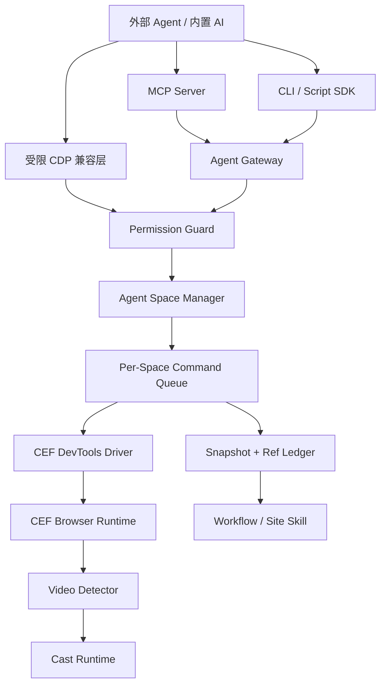

# 入库说明（2026-09-18）

- 本文档为用户提供的外部研究输入，原文件《蜡笔AI浏览器_ego-lite与BrowserSkill借鉴完整方案.md》V1.0（研究基线 2026-09-18），正文原样入库，未作修改。
- 参考项目：ego lite（Agent Space/TaskSpace 编程模型、站点学习沉淀）与 Tencent BrowserSkill（Rust CLI/daemon、会话隔离、Borrow/Return、RefStore 工程实现），两项目均为 MIT License；如需复制/修改/分发代码必须保留原版权与许可文本。
- 定位：路线借鉴输入，不是当前契约。凡与仓库 `AGENTS.md` 红线冲突之处（含“受限 CDP 兼容层”——当前红线禁止对外暴露原始 CDP/WebDriver/任意 JavaScript），以 `AGENTS.md` 为准；放宽红线必须先修订规则并独立评审。
- 与现有 Roadmap 的映射见总 Roadmap §1/§5 及 `docs/plans/agent-access-roadmap.md`、`docs/plans/workflow-learning-roadmap.md` 的借鉴章节。

---

# 蜡笔投屏 AI 浏览器：参考 ego lite 与 Tencent BrowserSkill 的 Agent 原生浏览器方案

> 文档版本：V1.0  
> 研究基线：2026-09-18，两项目 `main` 分支  
> 目标读者：产品、架构、CEF/Rust/前端开发、Codex/其他开发 Agent  
> 适用项目：get-video / 蜡笔投屏 AI 浏览器

---

## 1. 结论先行

对蜡笔 AI 浏览器最有价值的，不是简单复制一个“浏览器自动化工具”，而是把浏览器从一开始设计成 **人和多个 AI Agent 可以并行使用的 Agent-Native Browser Runtime**。

建议吸收两类设计：

1. **借鉴 ego lite 的产品与运行时模型**
   - 浏览器自身原生支持 Agent，而不是再通过插件桥接。
   - 每个任务/Agent 使用独立 `Space`。
   - Space、页面、登录态、快照引用能够跨多轮 Agent 调用持续存在。
   - Agent 可以把多个动作组合为一次脚本执行，降低模型调用次数和 Token 消耗。
   - 成功经验沉淀为站点学习、工具和工作流。

2. **借鉴 Tencent BrowserSkill 的安全边界与工程实现**
   - 每个 Agent 会话拥有独立 Agent Window。
   - 用户标签页只有在明确授权后才允许“借用”，任务结束必须归还。
   - 同一会话串行执行，不同会话可以并行。
   - 提供暂停、接管、停止、人工协助等 Human-in-the-loop 能力。
   - Rust CLI/daemon、协议 Schema、会话管理、RefStore、CDP 驱动的工程拆分清晰。

3. **结合蜡笔现有能力形成差异化**
   - 内置 CEF，不需要安装浏览器插件。
   - 除普通网页自动化外，提供网页转 Markdown、视频检测、DLNA 投屏、蜡笔高级接收端、播放列表、自动下一集、广告+正片 Manifest。
   - 对外同时提供 CDP 兼容层与蜡笔高层 Agent 协议/MCP。
   - 有合作网站 API/MCP 时走接口，没有接口时走 Site Skill，再没有时才走网页探索。

最终架构应该是：

```text
外部 Agent / 内置 AI
        │
        ├── MCP
        ├── CLI / Script SDK
        ├── Crayon Agent Protocol
        └── 受限 CDP 兼容层
        │
        ▼
Agent Gateway / Permission Guard
        │
        ▼
Agent Space Manager
        │
        ├── Human Space
        ├── Agent Space A
        ├── Agent Space B
        └── Agent Space N
        │
        ▼
CEF Browser Runtime
        │
        ├── Page Snapshot / Ref Ledger
        ├── CDP Input / Network / DOM
        ├── Workflow Learning
        ├── Video Detector
        └── Cast Runtime
```

---

## 2. 两个项目分别是什么

## 2.1 ego lite

ego lite 是一款从产品层面为“人和 AI 共用”设计的 Chromium 浏览器。

其核心概念是：

- 用户有自己的 Space；
- 每个 Agent 或任务可以建立独立 Task Space；
- Agent 在自己的 Space 里打开网页、点击、填写、抓取；
- 用户仍可以在自己的 Space 中继续浏览；
- 多个 Agent Space 可以同时执行；
- Agent 可复用浏览器已有的 Profile、Cookie 和登录状态；
- Agent 使用结构化 Snapshot 和持久 Page 引用操作页面；
- 多个动作可以写成一次 JavaScript 脚本执行；
- 站点经验放入 `learnings/<site>/`，逐步形成可复用能力。

### 重要限制

ego lite 的开源仓库并不包含完整的浏览器原生核心。

仓库公开了：

- Agent Skill；
- Node helper runtime；
- TaskSpace/Page 高层 API；
- Snapshot/Ref 使用模型；
- Element Resolver；
- Driver 辅助逻辑；
- Site Learnings 结构；
- Native bindings 文档。

但真正由浏览器 App 提供的：

- `globalThis.ego` 原生绑定；
- Task Space 原生窗口和页面管理；
- 内核级 Snapshot；
- 浏览器 UI 与 Chromium 修改；
- Profile/Space 的原生实现；

并不在当前仓库中。

因此：

> ego lite 适合作为“产品架构、API、Agent 编程模型、站点学习模型”的重点参考，不能把仓库直接当成一个完整 Chromium 浏览器 Fork 来使用。

---

## 2.2 Tencent BrowserSkill

BrowserSkill 不是独立浏览器，而是把外部 Agent 接到用户现有 Chrome/Edge 的桥接系统。

其架构是：

```text
Agent
  ↓ shell
bsk CLI（Rust）
  ↓ UDS / Named Pipe
bsk daemon（Rust）
  ↓ WebSocket JSON
Chromium Extension
  ↓ chrome.debugger / CDP + WebExtension API
Chrome / Edge 标签页
```

核心设计：

- 每个 session 有一个独立 Agent Window；
- Agent 默认只能控制自己创建的标签页；
- 用户现有标签页需要明确借用；
- 借用时记录原窗口和原位置，任务结束后归还；
- 每个会话有独立 RefStore；
- 同一会话命令串行，不同会话并行；
- `--no-focus` 可以创建不抢焦点的 Agent Window；
- 遇到验证码、登录、确认等情况可以请求用户接管；
- 页面内显示控制 Overlay，用户随时可停止自动化；
- CDP Driver 统一管理 attach、detach、Network、Console、Frame/OOPIF。

BrowserSkill 的 Rust CLI/daemon、协议、会话隔离和人机接管代码较完整，是更直接的工程参考。

---

## 3. 两个项目的关键差异

| 项目 | ego lite | Tencent BrowserSkill | 蜡笔建议 |
|---|---|---|---|
| 产品形态 | 独立 Chromium 浏览器 | Chrome/Edge 插件 + CLI/daemon | 独立 CEF AI 浏览器 |
| Agent 资源 | Task Space | Agent Window / Session | Agent Space |
| 用户是否受干扰 | 用户和 Agent 在不同 Space | Agent 使用独立窗口 | 默认不同 Space/窗口 |
| 是否抢 OS 鼠标 | 不使用 OS 全局鼠标 | 不使用 OS 全局鼠标 | 只允许目标页 CDP Input |
| 登录态 | 可选择浏览器 Profile | 使用现有 Chrome Profile | Shared / Dedicated / Ephemeral 三类 |
| 用户 Tab | 可 Claim/Takeover Space | 显式 Borrow/Return | 必须显式授权借用 |
| 快照 | 内核级语义 Snapshot | Snapshot + RefStore | AX + DOM + FrameGraph + Ref Ledger |
| Agent 调用 | JS 脚本 + Skill | CLI 工具 | MCP + CLI + Script SDK |
| 经验沉淀 | Site Learnings | Skill 指令为主 | Workflow + Site Skill Store |
| 投屏能力 | 无 | 无 | 蜡笔核心差异能力 |

---

## 4. “不影响用户操作、不移动鼠标”的技术原理

这个能力是方案中最重要的部分。

## 4.1 Agent 不是在操作系统层移动鼠标

传统桌面自动化经常使用：

- `pyautogui`；
- Win32 `SendInput`；
- macOS CGEvent；
- 鼠标坐标模拟；
- 系统级键盘事件。

这种方式会：

- 移动用户真实鼠标；
- 抢用户焦点；
- 与用户同时输入冲突；
- 很难同时运行多个 Agent。

ego lite 和 BrowserSkill 的关键做法是：

```text
Agent
  ↓
指定 Page / Tab 的 CDP Session
  ↓
Input.dispatchMouseEvent
Input.dispatchKeyEvent
Input.insertText
  ↓
只作用于目标 WebContents
```

这类事件直接投递到指定 Chromium 页面，不需要移动操作系统的真实鼠标指针。

### 精确定义

不能说“Agent 完全不用鼠标”。

更准确的说法是：

> Agent 会向自己的页面发送 Chromium 内部的合成鼠标事件，但不会控制或移动用户的 OS 级真实鼠标。

页面内部仍可能产生：

- hover；
- click；
- mousemove；
- drag；
- tooltip；
- CSS `:hover`；

但这些变化只发生在 Agent 所控制的页面中。

---

## 4.2 Agent 页面不抢窗口焦点

BrowserSkill 创建 Agent Window 时支持：

```text
focused: false
```

蜡笔 CEF 版应采用相同策略：

### Windows

- Agent Window 使用非激活方式创建/显示；
- 不调用 `SetForegroundWindow`；
- 不主动切换前台窗口；
- CEF Browser Host 不获得系统焦点；
- Agent 输入通过 CDP 发到指定 Target。

### macOS

- 创建窗口但不 `makeKeyAndOrderFront`；
- 初始使用 `orderBack` 或非 Key Window；
- 不改变当前 First Responder；
- Agent 输入仍通过页面 CDP Target 发送。

### 产品原则

默认：

```text
Agent Space 可见，但不抢焦点
```

而不是完全隐藏。

原因是部分网页会根据以下状态改变行为：

- `document.visibilityState`；
- 页面是否在后台；
- 定时器节流；
- 视频自动播放限制；
- 权限弹窗；
- 原生文件选择器；
- WebAuthn；
- 系统剪贴板；
- IME；
- 支付或安全验证。

因此建议使用：

> 可观察、非聚焦的独立 Agent Window/Space。

需要用户处理时，再由用户主动点击“接管”。

---

## 4.3 不使用用户真实剪贴板和输入法作为默认通道

建议优先级：

1. `Input.insertText`
2. CDP `Input.dispatchKeyEvent`
3. DOM/CEF 文件接口
4. `DOM.setFileInputFiles`
5. 只有富文本或系统限制场景才临时使用剪贴板
6. 原生对话框、系统权限、验证码交给用户

避免：

- 修改用户剪贴板后不恢复；
- 模拟系统 `Cmd+V` / `Ctrl+V` 作为常规输入；
- 调系统鼠标键盘；
- 抢占用户当前输入焦点。

---

## 4.4 Human Handoff

下列情况应暂停 Agent：

- 验证码；
- 扫码登录；
- 短信/邮箱验证码；
- 人脸或设备安全确认；
- 支付；
- 原生系统权限；
- 用户明确要求接管；
- 页面行为超出 Agent 权限；
- 高风险发布、删除、购买。

标准流程：

```text
Agent 执行
  ↓
检测到挑战或高风险动作
  ↓
保存 Checkpoint
  ↓
Space 状态切为 USER_CONTROLLED
  ↓
显示该 Agent Space
  ↓
用户完成操作
  ↓
用户点击“交还给 AI”
  ↓
重新 Snapshot
  ↓
Agent 从断点继续
```

在 `USER_CONTROLLED` 状态下，所有变更页面的 Agent API 必须拒绝或等待，不能与用户并发修改同一个页面。

---

## 5. Agent Space：蜡笔浏览器的核心资源模型

建议不要只做“每个 Agent 一个 Tab”。

应把 **Agent Space** 定义为第一等资源。

```text
Browser App
├── Human Space
│   ├── Tab
│   ├── Tab
│   └── Profile
├── Agent Space A
│   ├── Page p1
│   ├── Page p2
│   ├── Ref Ledger
│   ├── Workflow State
│   └── Profile / RequestContext
├── Agent Space B
│   └── ...
└── Agent Space N
```

## 5.1 Agent Space 包含什么

```rust
struct AgentSpace {
    space_id: SpaceId,
    agent_id: AgentId,
    name: String,

    ownership: OwnershipState,
    profile_id: ProfileId,
    request_context_id: RequestContextId,

    window_id: WindowId,
    pages: Vec<PageHandle>,
    active_page: Option<PageId>,

    ref_ledger: RefLedger,
    workflow_state: WorkflowState,
    permission_scope: PermissionScope,

    resource_policy: ResourcePolicy,
    cast_session: Option<CastSessionId>,

    created_at: Timestamp,
    last_active_at: Timestamp,
}
```

每个 Space 至少独立：

- 页面集合；
- Agent 任务状态；
- 页面 Ref；
- 命令队列；
- 下载与上传权限；
- 审计日志；
- Workflow；
- 视频候选；
- 投屏会话；
- 用户接管状态。

---

## 5.2 三层隔离

“独立浏览器资源”需要明确是哪一层隔离。

### L1：控制隔离

- 独立 Agent Window；
- 独立 Tab 集合；
- 独立 RefStore；
- 独立命令队列；
- 用户鼠标、焦点不受影响。

适合：

- 多个 Agent 并行读取公开网页；
- 相同登录态下的不同任务。

### L2：身份与存储隔离

每个 Space 使用独立 `CefRequestContext`：

- Cookie；
- Cache；
- LocalStorage；
- IndexedDB；
- Service Worker；
- 站点权限；
- HTTP Auth；
- 登录状态。

适合：

- 多账号；
- 企业/个人隔离；
- Agent 沙盒；
- 测试账号；
- 隐私任务。

### L3：进程级强隔离

- 独立 RequestContext；
- 必要时独立 Browser App/Browser Process；
- 独立资源限额和崩溃边界。

适合：

- 高风险企业任务；
- 不可信站点；
- 强安全要求；
- 需要防止单个任务拖垮整个浏览器。

第一版优先完成 L1 + L2。L3 放到企业版或后续版本。

---

## 5.3 Profile 类型

建议支持三类：

### Shared Profile

```text
Agent Space → 用户授权的现有 Profile
```

用途：

- 复用用户已经登录的网站；
- 草稿创建；
- 读取私有页面；
- 课程或企业后台。

风险：

- Agent 能接触用户真实登录态；
- 必须按域名和动作授权；
- 不允许直接导出 Cookie。

### Dedicated Agent Profile

```text
每个 Agent/工作区持久化独立 Profile
```

用途：

- 多账号；
- 长期 Agent；
- 企业工作区；
- 固定站点机器人。

### Ephemeral Task Profile

```text
内存或临时目录 RequestContext
```

用途：

- 临时研究；
- 无痕任务；
- 不需要登录；
- 任务结束自动清理。

---

## 5.4 每个 Agent 是否一定一个 Profile

不建议默认“每个 Agent、每个 Tab 都建新 Profile”。

推荐：

```text
一个独立任务目标 = 一个 Agent Space
一个身份/账号边界 = 一个 Profile
一个 Space 可包含多个 Page
```

这样既保持隔离，也控制内存和磁盘占用。

---

## 6. 控制权状态机

建议实现如下状态：

```text
CREATING
   ↓
AGENT_CONTROLLED
   ├──→ HANDOFF_PENDING
   │        ↓
   │   USER_CONTROLLED
   │        ↓
   │   RESUME_PENDING
   │        ↓
   └──── AGENT_CONTROLLED
            ↓
         FINISHING
            ↓
          FINISHED
```

其他异常状态：

- `PAUSED`
- `CHALLENGE_REQUIRED`
- `BORROW_PENDING`
- `ERROR`
- `CANCELLED`

### 核心规则

1. `AGENT_CONTROLLED`
   - Agent 可以读写页面。
   - 用户可以观察。
   - 用户点击“接管”后立即暂停 Agent。

2. `USER_CONTROLLED`
   - 所有 mutating API 被拒绝。
   - 允许只读状态查询。
   - Agent 不发送输入事件。

3. `BORROW_PENDING`
   - Agent 请求操作用户已有 Tab。
   - 用户明确同意后才建立控制权。

4. `FINISHING`
   - 保存结果；
   - 关闭 Agent 创建的页面；
   - 归还借用 Tab；
   - 清理临时文件和 Profile。

---

## 7. 用户 Tab 借用模型

直接借鉴 BrowserSkill 的原则：

> Agent 默认不能控制 Human Space 中的 Tab。

需要使用用户当前 Tab 时：

```text
Agent 发起 borrow 请求
  ↓
UI 显示：
“Agent X 请求操作：小红书创作中心”
  ↓
用户选择：
- 允许一次
- 允许本次任务
- 拒绝
  ↓
Tab 被标记为 borrowed
  ↓
Agent 执行
  ↓
任务结束
  ↓
Tab 回到原窗口、原位置、原所有权
```

借用记录：

```rust
struct BorrowedPage {
    page_id: PageId,
    original_space_id: SpaceId,
    original_window_id: WindowId,
    original_index: usize,
    granted_scope: PermissionScope,
    expires_at: Option<Timestamp>,
}
```

不能仅靠“页面现在位于 Agent 窗口”判断所有权。

必须显式记录：

- 谁创建了页面；
- 谁借用了页面；
- 原始所有者；
- 授权范围；
- 归还策略。

---

## 8. CEF 实现架构



---

## 8.1 CEF Browser Manager

职责：

- 创建/关闭 `CefBrowser`；
- Tab/Page 生命周期；
- Window 与 Space 映射；
- Popup 归属；
- Browser ID/Target ID 映射；
- 进程和崩溃处理；
- 下载、权限和 Dialog；
- RequestContext/Profile 选择。

每个 Tab 仍是一个独立 `CefBrowser`。

每个 Space 持有多个 Page/Tab，但只有：

- 当前 Active 页面；
- 少量 Warm 页面；

保持完整活跃。

其余可以 Discard，避免多 Agent 内存失控。

---

## 8.2 DevTools/CDP Transport

在 CEF 中不要依赖 Chrome Extension。

应直接使用 CEF DevTools 接口实现：

```text
CefBrowserHost::ExecuteDevToolsMethod
CefBrowserHost::AddDevToolsMessageObserver
```

适配出统一接口：

```rust
trait DevToolsTransport {
    async fn call(
        &self,
        page_id: PageId,
        method: &str,
        params: JsonValue,
    ) -> Result<JsonValue>;

    fn subscribe(
        &self,
        page_id: PageId,
        domain: &str,
    ) -> EventStream;
}
```

需支持：

- `Page`
- `Runtime`
- `DOM`
- `DOMSnapshot`
- `Accessibility`
- `Network`
- `Input`
- `Target`
- `Browser`
- `Fetch`（按需）
- `Performance`（按需）

### 安全要求

普通 Agent 不直接获得 Browser 范围的原始 CDP。

低层 CDP 只在以下场景开放：

- 开发者模式；
- 明确授权；
- 仅作用于该 Space 的 Target；
- 有方法 Allowlist；
- 有审计日志。

---

## 8.3 非抢焦点输入驱动

建议驱动优先级：

### 点击

1. Snapshot Ref 定位元素；
2. 获取 Content Quad；
3. 检查可见、启用、Hit Target；
4. 必要时滚动到可见区域；
5. 对该 Page Target 调用：
   - `Input.dispatchMouseEvent(mouseMoved)`
   - `mousePressed`
   - `mouseReleased`
6. 验证业务结果。

### 输入

优先：

```text
focus target
Input.insertText
```

需要键盘语义时：

```text
Input.dispatchKeyEvent
```

避免：

```text
OS global input
真实鼠标移动
默认使用系统剪贴板
```

### Agent Cursor

可在 Agent Page 内显示独立的虚拟光标：

- 光标只属于 Space；
- 不映射到 OS 光标；
- 显示动作描述；
- 用户可开关；
- 截图或直播预览中可显示。

---

## 9. Snapshot 与稳定 Ref

这是 ego lite 最值得重点学习的部分。

## 9.1 Snapshot 内容

建议组合：

```text
Accessibility Tree
+ DOM 可交互节点
+ Frame / OOPIF 图
+ 可见区域与坐标
+ Stable Locator
+ 风险标签
+ 页面状态摘要
```

输出示例：

```json
{
  "snapshot_id": "snap_29",
  "page_id": "p1",
  "document_revision": 17,
  "elements": [
    {
      "ref": "@e12",
      "role": "textbox",
      "name": "标题",
      "frame_id": "main",
      "backend_node_id": 812,
      "visible": true,
      "enabled": true,
      "locator": "role:textbox[name='标题']"
    },
    {
      "ref": "@e18",
      "role": "button",
      "name": "保存草稿",
      "risk": "medium",
      "locator": "role:button[name='保存草稿']"
    }
  ]
}
```

## 9.2 Ref Ledger

不要每次 Snapshot 后简单重新编号并丢失旧语义。

建议保存：

```text
ref
page_id
frame_id
document_revision
backend_node_id
stable_locator
element_signature
generation
```

失效条件：

- 主文档导航；
- Frame 导航；
- Renderer 重建；
- 节点被删除；
- Target 被关闭；
- RequestContext 变化。

页面只发生小变化时，未变化节点的 Ref 可继续使用。

这会显著降低 Agent 重新观察页面的次数。

---

## 10. Script/Batch 执行模型

ego lite 不是让模型每一步调用一个 CLI 命令，而是允许 Agent 写一段 JavaScript，一次组合多个浏览器动作。

蜡笔建议同时提供两种模式。

## 10.1 标准 MCP Tool 模式

适合简单任务：

```text
browser.snapshot
browser.click
browser.fill
browser.extract_markdown
video.detect
cast.play
```

## 10.2 Script Runtime 模式

适合复杂连续任务：

```javascript
const space = await spaces.get("xhs-draft");
const page = space.page("p1");

await page.goto(targetUrl);
const snapshot = await page.snapshot();

await page.fill("@title", title);
await page.fill("@content", content);
await page.click("@saveDraft");
await page.waitForText("草稿已保存");

return {
  url: await page.url(),
  title: await page.title()
};
```

### 推荐实现

第一版不需要在浏览器 App 内嵌完整 Node。

可实现：

```text
crayon-browser run < script.js
```

CLI 中的 Node/JS helper：

- 通过本地 Socket 调 Rust Core；
- 预加载高层 SDK；
- 脚本中的浏览器操作实际在 App 内执行；
- JS 进程结束后 Space 和 Page 仍在浏览器中保留。

这样可以复用 ego lite 的优秀编程模型，又不把 Node runtime 强塞进主 App。

---

## 11. Crayon Agent Protocol

建议高层 API：

### Profile

```text
profiles.list
profiles.create
profiles.delete
profiles.clear_site_data
```

### Space

```text
spaces.create
spaces.list
spaces.get
spaces.pause
spaces.handoff
spaces.resume
spaces.finish
spaces.claim_user_space
```

### Page

```text
pages.list
pages.new
pages.goto
pages.snapshot
pages.screenshot
pages.click
pages.fill
pages.press
pages.evaluate
pages.wait
pages.close
```

### User Tab Borrowing

```text
tabs.request_borrow
tabs.confirm_borrow
tabs.return
```

### Content

```text
content.extract_markdown
content.extract_table
content.summarize
content.get_selected_text
```

### Video

```text
video.detect
video.get_candidates
video.get_metadata
video.get_subtitles
video.get_playlist
```

### Cast

```text
cast.discover_devices
cast.play
cast.play_playlist
cast.pause
cast.seek
cast.next
cast.stop
cast.get_status
```

### Workflow

```text
workflow.record_start
workflow.record_stop
workflow.save_skill
workflow.run_skill
workflow.repair_skill
```

### Human Handoff

```text
human.request_help
human.wait_for_control
human.resume_agent
```

---

## 12. CDP 兼容层与蜡笔高层协议

继续采用前面已经确定的双层设计。

## 12.1 CDP 兼容层

价值：

- 兼容现有自动化工具；
- 兼容部分 Playwright/Puppeteer/CDP Agent；
- 方便调试和测试；
- 降低生态接入门槛。

策略：

- 默认关闭；
- 只监听本机；
- 使用随机端口和会话 Token；
- Target 只暴露授权 Space；
- 禁止未经授权访问 Human Space；
- Browser Domain 高风险方法默认拒绝。

## 12.2 Crayon Agent Protocol

价值：

- 更高层；
- 更安全；
- 更省 Token；
- 支持 Workflow；
- 支持投屏；
- 支持风险分级；
- 支持站点能力路由。

原则：

```text
CDP 是兼容入口
Crayon Protocol 是主入口
```

---

## 13. Workflow Learning 与 Site Skill

建议吸收 ego lite 的目录思路，但扩展为蜡笔自己的 Skill Manifest。

```text
skills/
  xiaohongshu/
    manifest.json
    notes/
    tools/
    workflows/
    assertions/
```

示例：

```json
{
  "id": "xiaohongshu",
  "name": "小红书创作中心",
  "domains": [
    "creator.xiaohongshu.com"
  ],
  "capabilities": {
    "create_draft": {
      "description": "创建图文草稿",
      "risk": "medium",
      "requires_profile": true,
      "inputs": {
        "title": "string",
        "content": "string",
        "images": "file[]",
        "tags": "string[]"
      },
      "workflow": "workflows/create-draft.json",
      "success_assertion": "草稿保存成功"
    },
    "publish": {
      "risk": "high",
      "confirm_every_time": true
    }
  }
}
```

### 学习流程

```text
首次 Agent 探索
  ↓
记录 Snapshot、Action、等待条件、结果
  ↓
任务成功
  ↓
生成 Workflow Candidate
  ↓
用户确认保存
  ↓
进入 Site Skill Store
  ↓
后续优先复用
  ↓
失败时 Selector Healer 修复
```

---

## 14. Partner Capability Router

站点能力路由顺序：

```text
Partner API / MCP
  ↓ 不可用
Site Skill
  ↓ 不可用或失效
Web Automation
  ↓ 遇到验证
Human Handoff
```

蜡笔 Agent 不应该无条件打开网页找按钮。

例如：

```text
创建小红书草稿
```

路由器先判断：

1. 是否有合作 API；
2. 是否有已验证的站点技能；
3. 是否需要网页探索；
4. 是否需要用户接管；
5. 是否属于禁止自动执行的高风险动作。

---

## 15. 视频与投屏能力的结合

这是蜡笔浏览器相比 ego lite 和 BrowserSkill 的核心壁垒。

每个 Agent Space 可以拥有独立 `CastSession`：

```rust
struct CastSession {
    cast_session_id: CastSessionId,
    space_id: SpaceId,
    device_id: DeviceId,
    candidate_id: VideoCandidateId,
    playback_mode: PlaybackMode,
    queue: Vec<CastItem>,
    state: CastState,
}
```

Agent 可以完成：

```text
打开视频页
  ↓
检测候选 MP4/HLS/DASH
  ↓
识别标题、封面、字幕、剧集
  ↓
合规判断
  ↓
发现普通 DLNA 或蜡笔接收端
  ↓
投屏
  ↓
生成播放队列
  ↓
自动下一集
```

### 普通 DLNA

- 播放单个媒体 URL；
- 基础暂停、进度、音量；
- 能力降级。

### 蜡笔接收端

- 广告+正片 Manifest；
- 自动下一集；
- 字幕；
- 剧集列表；
- 播放状态回传；
- 大屏模板；
- 商品/课程信息区；
- AI 控制播放。

---

## 16. UI 设计建议

增加“Agent Spaces”一级入口。

### 左侧 Space 栏

```text
我的浏览
Codex：小红书草稿
Claude：竞品研究
内置 AI：课程投屏
```

每个 Space 显示：

- Agent 头像；
- Profile；
- 当前页面；
- 任务状态；
- 是否在运行；
- 是否需要接管；
- 内存占用；
- 当前投屏设备。

### Space 操作

- 查看；
- 暂停；
- 接管；
- 交还给 Agent；
- 停止；
- 关闭；
- 保存为技能；
- 授权使用当前标签页。

### Agent 正在操作时

Agent Window/Page 显示：

- 彩色边框；
- Agent 名称；
- 当前动作；
- 虚拟 Agent 光标；
- “立即停止”按钮；
- 不覆盖网页关键区域。

---

## 17. 安全架构

## 17.1 默认最小权限

Agent 创建 Space 时只获得：

- 自己创建的 Page；
- 指定 Profile；
- 明确允许的域名；
- 指定工具集；
- 指定有效期。

## 17.2 网页内容不可信

网页文本可能包含 Prompt Injection。

所以：

- 网页内容不能直接修改 Agent 权限；
- 网页不能调用本地 MCP；
- 网站脚本不能获得 Native Bridge；
- Tool 调用必须经过 Permission Guard；
- 发布、删除、付款、账号设置必须单独确认。

## 17.3 本地通信

建议：

```text
Agent CLI/MCP
  ↓ Authenticated Local IPC
Rust Agent Gateway
```

Windows：

- Named Pipe。

macOS/Linux：

- Unix Domain Socket。

需要：

- 每安装实例随机密钥；
- 每 Agent 会话短期 Token；
- 协议版本握手；
- 方法级权限；
- 请求 ID；
- 取消协议；
- 超时后的 effect state；
- 审计日志。

## 17.4 命令队列

直接借鉴 BrowserSkill：

```text
同一 Space：串行
不同 Space：并行
```

原因：

- 避免同一页面同时填表和点击；
- 保证 RefStore 一致；
- 简化取消和补偿；
- 防止动作竞态。

---

## 18. 可以直接参考或复用的代码

两个仓库均使用 MIT License，但复制、修改或分发代码时必须保留原版权和许可文本。

## 18.1 ego lite

### 可重点参考/移植

```text
package/ego-browser/src/page-model.ts
```

参考：

- TaskSpace/Page 对象模型；
- Page 持久标签；
- Space 跨 Agent round 恢复；
- handoff/finish 生命周期。

```text
package/ego-browser/src/public-api-schema.ts
```

参考：

- API Schema 单一事实来源；
- 参数验证；
- 帮助文档自动生成；
- SDK 与 Skill 同步。

```text
package/ego-browser/src/browser-runtime.ts
```

参考：

- 高层 SDK 与浏览器原生绑定桥接；
- CDP Session；
- 事件；
- Result/Error 规范。

```text
package/ego-browser/src/element-resolver.ts
```

参考：

- Snapshot Ref；
- CSS/XPath/ARIA；
- Frame 搜索；
- Playwright 子集兼容。

```text
package/ego-browser/src/driver/
```

参考：

- pointer；
- keyboard；
- observe；
- nav；
- load；
- waits；
- files。

```text
package/ego-browser/src/learning/
skills/ego-browser/learnings/
```

参考：

- Site Learning 发现；
- Manifest 校验；
- 站点 Notes；
- Node Tools；
- Browser Tools。

```text
skills/ego-browser/SKILL.md
```

参考：

- 如何教 Agent 高效使用浏览器；
- Snapshot 优先；
- 多动作一次执行；
- 只在必要时观察；
- 人机接管；
- 文件、下载、弹窗处理。

### 不能直接获得的部分

- 完整 ego lite 浏览器源代码；
- `globalThis.ego` 原生实现；
- 内核级 Space；
- 内核 Snapshot；
- Chromium Patch；
- Browser UI。

这些需要蜡笔自己基于 CEF 实现。

---

## 18.2 Tencent BrowserSkill

### 可直接参考/部分 Fork

```text
crates/bsk-cli/
```

参考：

- Rust CLI；
- daemon 生命周期；
- UDS/Named Pipe；
- WebSocket 路由；
- session registry；
- 自动启动；
- doctor/status/update。

```text
crates/bsk-protocol/
```

参考：

- Request/Response/Event Frame；
- RpcId；
- ErrorCode；
- Cancel；
- Method Enum；
- 工具参数；
- Schema 生成；
- 版本兼容握手。

```text
apps/extension/src/session-manager/manager.ts
```

重点参考：

- SessionContext；
- Agent Window；
- agentCreatedTabs；
- borrowedTabs；
- borrow reservation；
- Window/Session 索引；
- 事务化创建和清理。

```text
apps/extension/src/session-manager/ref-store.ts
```

重点参考：

- `@e1` Ref；
- backendNodeId；
- tab/frame/CDP session 绑定；
- generation；
- 文档变化失效；
- Visual Ref。

```text
apps/extension/src/browser-driver/chromium-cdp.ts
```

重点参考：

- attach once；
- detach 生命周期；
- Network/Console buffer；
- Frame/OOPIF；
- CDP domain 初始化；
- Target session；
- bounded buffer。

在蜡笔中：

```text
chrome.debugger
```

替换为：

```text
CEF ExecuteDevToolsMethod
+ AddDevToolsMessageObserver
```

```text
apps/extension/src/session-manager/agent-window.ts
```

参考：

- 每 Session 独立窗口；
- `focused:false`；
- Window 生命周期。

```text
apps/extension/src/content/ControlOverlay.tsx
apps/extension/src/content/BorrowConfirmationOverlay.tsx
apps/extension/src/content/HelpRequestOverlay.tsx
```

参考：

- 用户接管；
- 借用确认；
- 请求人工帮助；
- 停止 Agent；
- 页面控制提示。

```text
apps/extension/src/browser-driver/frame-graph.ts
```

参考：

- iframe/OOPIF 目标图；
- Frame 到 CDP Session 的映射。

### 不建议照搬

- CEF 内置模式不需要 MV3 插件；
- 不需要通过 `chrome.debugger`；
- 不需要 Chrome Web Store 安装流程；
- UI 不应受扩展 API 约束。

可保留 BrowserSkill 式扩展作为后续“控制用户现有 Chrome/Edge”的可选桥接产品，但不应成为蜡笔自身浏览器的核心依赖。

---

## 19. 建议模块划分

```text
crayon-browser/
├── apps/
│   ├── desktop-ui/
│   └── helper/
├── crates/
│   ├── agent-protocol/
│   ├── agent-gateway/
│   ├── agent-space/
│   ├── cef-adapter/
│   ├── devtools-driver/
│   ├── snapshot-engine/
│   ├── ref-ledger/
│   ├── workflow-runtime/
│   ├── site-skill/
│   ├── video-detector/
│   ├── cast-runtime/
│   ├── permission-guard/
│   └── audit/
├── sdk/
│   ├── javascript/
│   ├── mcp/
│   └── cli/
└── skills/
    └── sites/
```

---

## 20. 分阶段落地计划

## P0：验证“不抢鼠标、不抢焦点”

原子任务：

1. CEF 创建 Human Browser 和 Agent Browser。
2. Agent Browser Window 默认不激活。
3. 在 Agent Browser 上执行 CDP 点击、输入、滚动。
4. 记录执行前后 OS 鼠标位置。
5. 用户同时在 Human Browser 输入和滚动。
6. 验证两者互不干扰。
7. 验证后台页面、视频页、富文本页。
8. 验证 Windows/macOS。

验收：

- 1000 次 Agent 点击中 OS 鼠标坐标不变化；
- Human Window 不丢失焦点；
- 用户输入不进入 Agent 页面；
- Agent 输入不进入 Human 页面；
- Agent Space 可在不激活窗口的情况下完成普通表单。

---

## P1：Agent Space 与 Profile

1. SpaceManager。
2. 每 Space 独立窗口/Tab 集合。
3. Space 状态机。
4. Shared/Dedicated/Ephemeral Profile。
5. `CefRequestContext` 管理。
6. Per-Space command queue。
7. Space UI。
8. Active/Warm/Discarded Page 生命周期。
9. 崩溃恢复。
10. 资源限额。

---

## P2：Snapshot、Ref 与 Agent API

1. Accessibility Tree。
2. DOM 可交互节点。
3. Frame/OOPIF Graph。
4. Snapshot 压缩输出。
5. Ref Ledger。
6. 文档版本和失效。
7. Click/Fill/Press/Wait。
8. CLI。
9. MCP。
10. Script SDK。
11. CDP 兼容层技术验证。

---

## P3：Borrow、Handoff 与安全

1. Human Tab 借用申请。
2. 授权 UI。
3. 原窗口/位置记录。
4. Tab 归还。
5. 用户接管。
6. Agent 恢复。
7. Challenge Detector。
8. 高风险确认。
9. 审计。
10. 取消和 effect state。

---

## P4：Workflow Learning

1. Trace Recorder。
2. Recipe Generator。
3. Site Skill Manifest。
4. 用户确认保存技能。
5. Skill Runner。
6. Selector Healer。
7. 成功率与版本。
8. 小红书草稿等试点技能。
9. Site Learnings 本地目录。
10. Skill 导入/导出。

---

## P5：网页内容与投屏

1. 网页转 Markdown。
2. DOM/网络视频检测。
3. 视频候选。
4. Manifest 解析。
5. DRM/登录/会员合规判断。
6. DLNA。
7. 蜡笔接收端。
8. 队列和下一集。
9. 广告+正片 Manifest。
10. Cast MCP/CLI。

---

## P6：Partner Capability Hub

1. Capability Registry。
2. Partner Adapter。
3. OAuth。
4. API/MCP 路由。
5. Site Skill fallback。
6. Web Automation fallback。
7. Human Handoff fallback。
8. 合作方 TV Manifest。

---

## 21. 核心验收指标

### 人机并行

- 用户鼠标不被移动；
- 用户窗口焦点不被抢；
- 用户键盘输入不串到 Agent 页面；
- 不同 Agent Space 输入不串页；
- 用户可随时停止或接管。

### 并发

- 同一 Space 严格串行；
- 不同 Space 并行；
- 5 个 Agent Space 可同时完成普通网页任务；
- 单个 Space 崩溃不破坏其他任务。

### Snapshot

- 普通表单可用语义 Ref 完成；
- iframe/OOPIF 有正确归属；
- 页面导航后旧 Ref 自动失效；
- 无需每一步重新截图。

### Profile

- Dedicated Profile 登录态互不相见；
- Shared Profile 只有授权 Agent 可用；
- Ephemeral Profile 关闭后清理；
- Cookie 不暴露给模型。

### 投屏

- Agent 可从页面检测视频并投到 DLNA；
- 蜡笔接收端支持队列和下一集；
- 受保护内容能识别并拒绝非法直投；
- 投屏任务归属于发起它的 Agent Space。

---

## 22. 最终产品定义

蜡笔 AI 投屏浏览器不应只是：

```text
浏览器 + AI 侧边栏
```

它应该是：

> 一个允许人和多个 AI Agent 在独立浏览器空间中并行工作，能够学习网页流程、聚合站点能力，并把网页内容与网页视频发送到大屏的 Agent-Native Browser Runtime。

最终形成四层壁垒：

1. **Space 与人机并行**
   - Agent 不抢鼠标、不抢焦点；
   - 多 Agent 独立资源。

2. **Snapshot 与 Workflow**
   - 页面理解更省 Token；
   - 成功路径越用越快。

3. **Capability Hub**
   - 有接口走接口；
   - 没接口走技能；
   - 长尾走网页；
   - 风控由人接管。

4. **Cast Runtime**
   - 其他 Agent 浏览器只能操作网页；
   - 蜡笔还能理解内容并投到普通 DLNA 或蜡笔高级大屏。

---

## 23. 给 Codex 的首轮任务建议

先不要一次实现整个系统。

第一轮只验证三件事：

1. 基于当前 CEF 150，为两个 `CefBrowser` 建立独立 Target/CDP 通道；
2. 在 Agent Browser 不激活窗口的情况下，通过 CDP 完成：
   - Navigate
   - Snapshot
   - Click
   - Fill
   - Scroll
3. 用户同时在 Human Browser 操作，证明：
   - OS 鼠标不移动；
   - 焦点不变化；
   - 键盘和页面状态不串扰。

完成后再实现：

```text
AgentSpaceManager
→ CefRequestContext Profile
→ RefLedger
→ CLI/MCP
→ Human Handoff
→ Workflow Learning
→ Video/Cast
```

这是风险最低、最容易确认方向是否正确的推进顺序。
