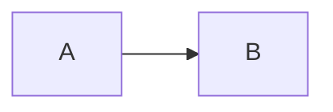
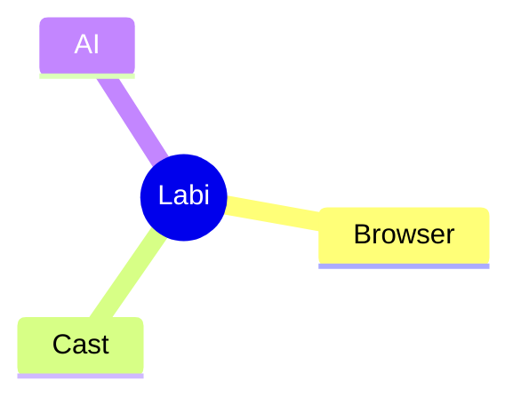
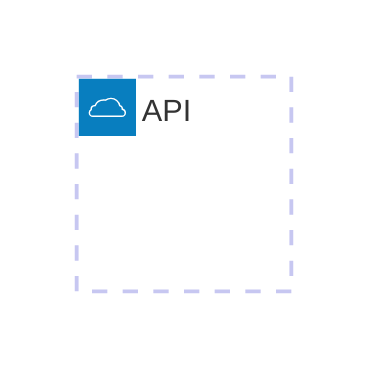

# 蜡笔投屏浏览器 Markdown + Mermaid 集成设计方案

## 1. 文档目的

本文用于指导 Codex 在 **蜡笔投屏浏览器** 中实现 Markdown 渲染与 Mermaid 图表能力。

目标不是单纯增加一个 Markdown Viewer，而是建设一个可持续扩展的 **Markdown Runtime**，后续可继续接入：

- Mermaid
- KaTeX
- 代码高亮
- ECharts
- Graphviz
- PlantUML
- AI 生成文档
- Markdown 演示模式
- 一键投屏

当前第一阶段重点是：

> 在不明显影响浏览器启动速度和主包体积的前提下，完整支持 Mermaid，尤其是 `mindmap`、`architecture`、`flowchart`、`sequenceDiagram` 等技术文档常用图类型。

---

# 2. 核心结论

建议采用以下方案：

1. 使用 Mermaid 官方完整版 11.x。
2. Mermaid 随应用本地打包，不依赖 CDN。
3. Mermaid 不进入浏览器启动主链路。
4. 仅当 Markdown 中出现 ` ```mermaid ` 代码块时，才动态加载 Mermaid。
5. Mermaid 运行在 WebView / Chromium 前端渲染层。
6. Rust Core 不负责 Mermaid 解析和绘制。
7. Markdown Runtime 采用扩展式架构。
8. Mermaid 默认使用 `securityLevel: "strict"`。
9. 不使用 Mermaid Tiny 版本。
10. 不自定义 `architecture`、`mindmap` 等 Markdown fenced block，统一使用标准 Mermaid fenced block。

推荐整体架构：

```text
Markdown 文件
    ↓
Markdown Parser
    ↓
AST / HTML
    ↓
Renderer Router
    ├── 普通 Markdown → HTML
    ├── mermaid → Mermaid Renderer → SVG
    ├── code → Syntax Highlight
    ├── math → KaTeX
    └── future extensions
```

---

# 3. 为什么选择 Mermaid 完整版

Mermaid 完整版体积不算小，但对于桌面浏览器不是核心问题。

当前可以大致理解为：

```text
完整浏览器 bundle
约 3MB+ 级别

ESM 主入口
几十 KB 级别

具体 diagram
通过 chunks 动态加载
```

真正需要优化的不是：

> “Mermaid 总共有多大”

而是：

> “是否在浏览器启动时就加载 Mermaid”

只要 Mermaid 不进入首屏加载链路，它对蜡笔浏览器整体启动体验的影响会非常有限。

---

# 4. 为什么不建议 Mermaid Tiny

Mermaid Tiny 虽然体积更小，但会牺牲部分能力。

对于蜡笔浏览器来说，以下能力很重要：

- mindmap
- architecture
- flowchart
- sequenceDiagram
- classDiagram
- stateDiagram
- erDiagram

而 Tiny 版本无法完整覆盖我们希望支持的图类型。

因此：

```text
不建议：
Mermaid Tiny

建议：
Mermaid Full + ESM + Dynamic Import
```

我们的目标不是为了节省 1~2 MB 安装包体积，而降低 Markdown 技术文档兼容性。

---

# 5. 产品定位

蜡笔浏览器中的 Markdown 能力应该被定义为：

> Markdown Runtime

而不是：

> Markdown 文件查看器

长期目标：

```text
AI
 ↓
生成 Markdown
 ↓
生成 Mermaid
 ↓
蜡笔浏览器实时渲染
 ↓
阅读 / 编辑
 ↓
演示模式
 ↓
投屏到 TV
```

因此 Markdown Runtime 应该一开始就支持扩展机制。

---

# 6. 推荐总体架构

```text
┌──────────────────────────────┐
│        Labi Browser          │
└──────────────┬───────────────┘
               │
               ▼
┌──────────────────────────────┐
│       Markdown Runtime       │
│                              │
│  Parser                      │
│  Renderer Router             │
│  Theme                       │
│  Extension Manager           │
└──────────────┬───────────────┘
               │
      ┌────────┼─────────┐
      │        │         │
      ▼        ▼         ▼
 Markdown   Mermaid    Code
 Renderer   Renderer   Highlight
      │        │
      │        ▼
      │      SVG
      │
      ├─────────────┐
      ▼             ▼
    KaTeX         Future
                  Renderer
```

---

# 7. 技术分层

## 7.1 Rust Core 负责

Rust 层建议负责：

- Markdown 文件读取
- 文件编码检测
- 文件变更监听
- 历史记录
- 最近打开
- 文件权限
- 本地搜索
- 大文件读取
- 文件缓存
- Workspace
- AI Agent 接口
- 投屏控制
- Markdown 文档状态管理

可选：

- Rust 侧预解析 Markdown
- Rust 侧生成 AST

但第一版没有必要为了 Mermaid 专门增加 Rust 解析逻辑。

---

## 7.2 WebView / Chromium 前端负责

前端负责：

- Markdown → HTML
- Mermaid
- KaTeX
- Syntax Highlight
- SVG
- CSS
- Theme
- 交互
- 代码块 UI
- Mermaid 缩放
- Mermaid 导出
- Mermaid 全屏
- 演示模式

Mermaid 本质工作流程：

```text
DSL
 ↓
Parser
 ↓
Layout
 ↓
SVG
 ↓
DOM
```

这类工作天然应该运行在 Web 前端。

---

# 8. Mermaid 加载策略

## 8.1 禁止全局启动加载

错误方案：

```text
浏览器启动
 ↓
加载 Markdown
 ↓
加载 Mermaid
 ↓
加载所有 diagram
```

这会增加：

- 首屏 JS
- 初始化成本
- 内存
- 页面解析时间

---

## 8.2 推荐动态加载

正确流程：

```text
打开 Markdown
 ↓
解析 Markdown
 ↓
扫描 fenced block
 ↓
是否存在 mermaid？
     │
   否│
     ▼
直接显示普通 Markdown

   是
     ↓
dynamic import Mermaid
     ↓
初始化 Mermaid
     ↓
render
```

示例：

```ts
let mermaidInstance: typeof import("mermaid") | null = null;

async function getMermaid() {
  if (!mermaidInstance) {
    const mod = await import("mermaid");
    mermaidInstance = mod.default;

    mermaidInstance.initialize({
      startOnLoad: false,
      securityLevel: "strict",
    });
  }

  return mermaidInstance;
}
```

只有真正遇到 Mermaid 时才加载。

---

# 9. Markdown fenced block 规范

统一使用标准 Mermaid：

````md

````

不要自定义：

````md
```architecture
...
```
````

不要自定义：

````md
```mindmap
...
```
````

正确方式：

````md

````

Architecture：

````md

````

这样可以保证文档更容易兼容：

- GitHub
- VS Code
- Obsidian
- Typora
- AI 工具
- Mermaid Live
- 其他 Markdown 编辑器

蜡笔浏览器不应该创造自己的 Markdown 方言。

---

# 10. Markdown Runtime 设计

建议设计统一 Renderer 接口。

例如：

```ts
interface MarkdownExtension {
  name: string;

  match(node: MarkdownNode): boolean;

  render(
    node: MarkdownNode,
    context: RenderContext
  ): Promise<RenderResult>;
}
```

注册：

```ts
registerExtension(markdownRenderer);
registerExtension(mermaidRenderer);
registerExtension(codeRenderer);
registerExtension(katexRenderer);
```

未来：

```ts
registerExtension(echartsRenderer);
registerExtension(graphvizRenderer);
registerExtension(plantumlRenderer);
```

这样所有特殊能力都成为 Extension。

---

# 11. 推荐目录结构

建议：

```text
src/
├── markdown/
│   ├── core/
│   │   ├── parser.ts
│   │   ├── renderer.ts
│   │   ├── document.ts
│   │   └── extension-manager.ts
│   │
│   ├── extensions/
│   │   ├── mermaid/
│   │   │   ├── index.ts
│   │   │   ├── loader.ts
│   │   │   ├── renderer.ts
│   │   │   └── mermaid.css
│   │   │
│   │   ├── highlight/
│   │   │   └── index.ts
│   │   │
│   │   └── katex/
│   │       └── index.ts
│   │
│   ├── theme/
│   │   ├── light.css
│   │   ├── dark.css
│   │   └── presentation.css
│   │
│   └── index.ts
```

---

# 12. Mermaid Renderer 设计

建议 Renderer 不调用：

```ts
mermaid.run()
```

去扫描整个页面。

优先采用：

```ts
mermaid.render()
```

针对单个 Mermaid block 渲染。

例如：

```ts
async function renderMermaid(
  code: string,
  id: string
): Promise<string> {
  const mermaid = await getMermaid();

  const result = await mermaid.render(
    `mermaid-${id}`,
    code
  );

  return result.svg;
}
```

优势：

- 容易控制
- 容易缓存
- 容易错误处理
- 容易局部刷新
- 容易做编辑器实时预览

---

# 13. Mermaid 缓存

建议增加渲染缓存。

Key：

```text
hash(
  mermaid source
  +
  theme
  +
  mermaid version
)
```

例如：

```text
mermaid-cache/
  4bf8e7...
    svg
```

如果：

```text
source 没变化
+
theme 没变化
```

则可以直接复用 SVG。

尤其以后：

```text
Markdown 编辑器
+
实时 Preview
```

缓存可以明显降低重复布局计算。

---

# 14. Mermaid 错误处理

Mermaid DSL 很容易因为 AI 或用户输入产生语法错误。

不要导致整个 Markdown 页面失败。

正确策略：

```text
Mermaid Parse Error
 ↓
当前 block 单独失败
 ↓
显示错误卡片
 ↓
其他 Markdown 正常显示
```

错误 UI 示例：

```text
┌──────────────────────────┐
│ Mermaid diagram error    │
│                          │
│ Line 6: unexpected token │
│                          │
│ [查看源码] [重新渲染]     │
└──────────────────────────┘
```

---

# 15. 安全策略

Mermaid 应默认：

```ts
mermaid.initialize({
  startOnLoad: false,
  securityLevel: "strict",
});
```

不要默认：

```ts
securityLevel: "loose"
```

原因：

蜡笔浏览器可能打开：

- 下载的 MD
- GitHub README
- AI 生成 MD
- 网络文档
- 第三方 MD

它们都应该被视为不完全可信内容。

推荐链路：

```text
Markdown
 ↓
Markdown Sanitizer
 ↓
Mermaid strict
 ↓
SVG
```

不要：

```text
Markdown
 ↓
innerHTML
 ↓
Mermaid loose
```

---

# 16. Mermaid 资源加载

Mermaid 应该随 App 本地安装。

不要依赖 CDN。

不推荐：

```ts
import mermaid from
"https://cdn.jsdelivr.net/npm/mermaid@11/..."
```

推荐：

```text
npm / pnpm dependency
 ↓
build
 ↓
本地 assets
 ↓
dynamic import
```

优势：

- 离线可用
- 无 CDN 延迟
- 无第三方依赖
- 可锁定版本
- 安全
- 文档不会因为断网无法显示
- 不受 CDN 更新影响

---

# 17. Mermaid 版本策略

第一阶段建议锁定：

```text
Mermaid 11.x
```

package.json 不要使用太宽松的版本范围。

例如优先：

```json
{
  "mermaid": "11.x.x"
}
```

具体版本由项目当前锁定。

升级 Mermaid 时：

必须做 Markdown regression test。

---

# 18. 第一阶段重点图类型

无需自己实现这些图。

全部交给 Mermaid。

优先验证：

```text
flowchart
sequenceDiagram
architecture
mindmap
classDiagram
stateDiagram
erDiagram
```

第二批：

```text
gantt
timeline
journey
quadrantChart
xychart
pie
```

原则：

> 我们只识别 fenced block 是不是 `mermaid`，图类型由 Mermaid 自己解析。

不要：

```ts
if (type === "flowchart")
if (type === "mindmap")
if (type === "architecture")
```

去自己维护 Mermaid 图类型。

---

# 19. Markdown Parser

第一阶段可以选择：

```text
markdown-it
```

或者：

```text
marked
```

建议优先考虑：

```text
markdown-it
```

原因：

- 插件机制成熟
- fenced block 好处理
- Markdown 扩展方便
- 很适合后续 Markdown Runtime

但不要把 Mermaid 强耦合在 parser 内部。

正确关系：

```text
Markdown Parser
 ↓
Node
 ↓
Extension Router
 ↓
Mermaid Renderer
```

---

# 20. Markdown Runtime 扩展接口

建议：

```ts
type MarkdownBlockType =
  | "markdown"
  | "code"
  | "mermaid"
  | "math"
  | "html";

interface RenderContext {
  theme: "light" | "dark";
  presentationMode: boolean;
}

interface RenderResult {
  html?: string;
  svg?: string;
  error?: string;
}
```

---

# 21. 大文件处理

Markdown 文件未来可能很大。

不要：

```text
一次 render 全部内容
+
一次 render 所有 Mermaid
```

可以逐步支持：

```text
Markdown Virtual Render
```

第一阶段：

Markdown HTML 可以一次生成。

但 Mermaid 建议：

```text
Viewport Lazy Render
```

也就是：

```text
Mermaid block
 ↓
进入 viewport
 ↓
才 render
```

这样一个有几十张图的技术文档不会一次性全部布局。

---

# 22. Mermaid Lazy Render

推荐：

```text
IntersectionObserver
```

流程：

```text
Markdown render
 ↓
Mermaid block placeholder
 ↓
IntersectionObserver
 ↓
进入 viewport
 ↓
dynamic import
 ↓
mermaid.render()
```

这是比单纯 Dynamic Import 更进一步的优化。

---

# 23. Theme

Mermaid Theme 应跟随浏览器主题。

例如：

```ts
function getMermaidTheme(
  theme: "light" | "dark"
) {
  return theme === "dark"
    ? "dark"
    : "default";
}
```

切换主题时：

```text
Browser Theme Change
 ↓
Markdown Theme Change
 ↓
Mermaid Theme Change
 ↓
必要时重新 Render
```

可以通过 cache key 中加入 theme 来解决。

---

# 24. Mermaid 图交互

第一阶段建议至少支持：

- 自动适配宽度
- 保持比例
- 最大宽度 100%
- 横向滚动
- 双击放大
- 全屏查看

未来支持：

- Zoom
- Pan
- SVG 导出
- PNG 导出
- 复制 Mermaid source
- 编辑 Mermaid
- AI 修改 Mermaid

---

# 25. Markdown 页面 UI

推荐 Mermaid Block：

```text
┌───────────────────────────────────┐
│ architecture            ⛶   ⋯    │
│                                   │
│            SVG                    │
│                                   │
└───────────────────────────────────┘
```

Hover：

```text
全屏
复制源码
导出 SVG
重新渲染
```

---

# 26. AI 能力

未来 AI 可以直接生成：

````md
# 系统架构


## 数据流

```mermaid
sequenceDiagram
...
```
````

蜡笔浏览器可以做到：

```text
AI
 ↓
Markdown
 ↓
Mermaid
 ↓
实时 Preview
```

进一步：

```text
选中 Mermaid
 ↓
告诉 AI：
“把这里拆成发送端 / 接收端 / Rust Core 三层”
 ↓
AI 修改 DSL
 ↓
重新 Render
```

这会成为蜡笔浏览器 AI 文档能力的重要组成部分。

---

# 27. 与投屏结合

Markdown Runtime 后续应支持：

```text
Normal Mode
Presentation Mode
TV Mode
```

Presentation Mode：

```text
Markdown
 ↓
按 Heading 拆章节
 ↓
大字体
 ↓
Mermaid 自适应
 ↓
TV 展示
```

未来用户可以：

```text
打开 architecture.md
 ↓
点击“投屏”
 ↓
TV 自动进入 Markdown Presentation
```

这是蜡笔浏览器区别于普通 Markdown Viewer 的一个重要方向。

---

# 28. 推荐最终架构

```text
               Labi Browser
                    │
                    ▼
           Markdown Document
                    │
                    ▼
             Markdown Parser
                    │
                    ▼
             Renderer Router
                    │
      ┌─────────────┼──────────────┐
      │             │              │
      ▼             ▼              ▼
 Markdown       Mermaid          Code
 Renderer       Extension        Renderer
                    │
                    ▼
             Dynamic Import
                    │
                    ▼
                Mermaid
                    │
                    ▼
                  SVG
```

未来：

```text
Renderer Router
      │
      ├── Mermaid
      ├── KaTeX
      ├── Highlight
      ├── ECharts
      ├── Graphviz
      ├── PlantUML
      └── Custom Runtime
```

---

# 29. 第一阶段 MVP

Codex 第一阶段完成：

## Markdown

- 打开 `.md`
- Markdown 渲染
- GitHub 风格基础 CSS
- Light / Dark
- fenced code block
- Syntax Highlight

## Mermaid

- 检测 ` ```mermaid `
- Mermaid Dynamic Import
- `securityLevel: strict`
- `mermaid.render()`
- Mermaid 错误隔离
- 自动适配宽度

验证：

- flowchart
- sequenceDiagram
- mindmap
- architecture
- classDiagram
- stateDiagram
- erDiagram

## Runtime

- Markdown Extension Interface
- Mermaid Extension
- Future Extension Placeholder

---

# 30. 第二阶段

增加：

- Mermaid viewport lazy render
- Mermaid cache
- Mermaid full screen
- Mermaid zoom
- SVG export
- Copy source
- Markdown outline
- TOC
- Search

---

# 31. 第三阶段

增加：

- Markdown Editor
- Live Preview
- AI Modify
- AI Generate Diagram
- Presentation Mode
- TV Mode
- Cast Markdown
- Multi-device Presentation

---

# 32. Codex 实现原则

开发时必须遵循：

## MUST

1. Mermaid 使用官方版本。
2. Mermaid 本地打包。
3. Mermaid 必须动态 import。
4. Mermaid 不进入 Browser Bootstrap。
5. Mermaid 使用 `securityLevel: strict`。
6. Mermaid block 单独错误隔离。
7. Mermaid Renderer 设计为 Markdown Extension。
8. Rust Core 不重写 Mermaid。
9. 使用标准 ` ```mermaid `。
10. 图类型由 Mermaid 自己识别。

## SHOULD

1. 使用 ESM。
2. 使用 `mermaid.render()`。
3. 支持 Theme。
4. Mermaid SVG 可缓存。
5. Mermaid 后续支持 viewport lazy render。
6. Markdown Runtime 保持插件化。

## MUST NOT

不要：

```text
全局启动 Mermaid
```

不要：

```text
CDN Mermaid
```

不要：

```text
Mermaid Tiny
```

不要：

```text
Rust 重写 Mermaid
```

不要：

```text
```mindmap
```

不要：

```text
```architecture
```

不要：

```text
securityLevel: loose
```

---

# 33. 最终决策

蜡笔投屏浏览器 Markdown 能力采用：

```text
Markdown Runtime
+
Extension Architecture
+
Mermaid Full
+
ESM
+
Dynamic Import
+
Local Assets
+
Strict Security
```

Mermaid 不作为 Markdown 主链路的一部分，而作为按需加载的图表 Renderer。

最终目标不仅是：

> Markdown 能显示 Mermaid。

而是：

> 建立一套 AI 原生、可扩展、可投屏的 Markdown Runtime。

未来整个能力可以演进为：

```text
Markdown
  +
Mermaid
  +
AI
  +
Presentation
  +
Casting
```

成为蜡笔浏览器技术文档、AI 工作流和大屏展示能力的重要基础设施。
