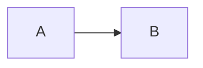
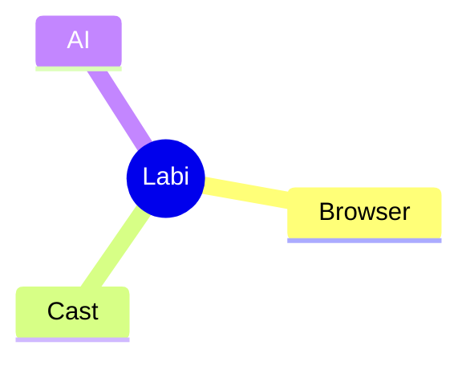
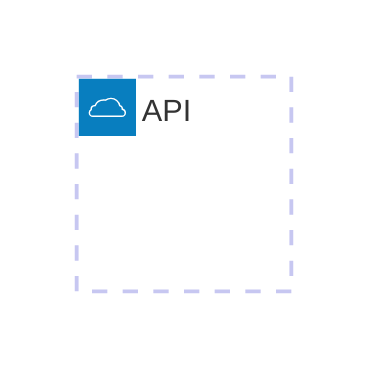
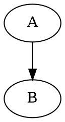
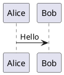

# 蜡笔投屏浏览器 Markdown + Mermaid 集成设计方案

## 1. 文档目的

本文用于指导 Codex 在 **蜡笔投屏浏览器** 中实现 Markdown 渲染与 Mermaid 图表能力。

目标不是单纯增加一个 Markdown Viewer，而是建设一个可持续扩展的 **Markdown Runtime**，后续可继续接入：

- Mermaid
- KaTeX
- 代码高亮
- ECharts
- Graphviz
- PlantUML
- AI 生成文档
- Markdown 演示模式
- 一键投屏

当前第一阶段重点是：

> 在不明显影响浏览器启动速度和主包体积的前提下，完整支持 Mermaid，尤其是 `mindmap`、`architecture`、`flowchart`、`sequenceDiagram` 等技术文档常用图类型。

---

# 2. 核心结论

建议采用以下方案：

1. 使用 Mermaid 官方完整版 11.x。
2. Mermaid 随应用本地打包，不依赖 CDN。
3. Mermaid 不进入浏览器启动主链路。
4. 仅当 Markdown 中出现 ` ```mermaid ` 代码块时，才动态加载 Mermaid。
5. Mermaid 运行在 WebView / Chromium 前端渲染层。
6. Rust Core 不负责 Mermaid 解析和绘制。
7. Markdown Runtime 采用扩展式架构。
8. Mermaid 默认使用 `securityLevel: "strict"`。
9. 不使用 Mermaid Tiny 版本。
10. 不自定义 `architecture`、`mindmap` 等 Markdown fenced block，统一使用标准 Mermaid fenced block。

推荐整体架构：

```text
Markdown 文件
    ↓
Markdown Parser
    ↓
AST / HTML
    ↓
Renderer Router
    ├── 普通 Markdown → HTML
    ├── mermaid → Mermaid Renderer → SVG
    ├── code → Syntax Highlight
    ├── math → KaTeX
    └── future extensions
```

---

# 3. 为什么选择 Mermaid 完整版

Mermaid 完整版体积不算小，但对于桌面浏览器不是核心问题。

当前可以大致理解为：

```text
完整浏览器 bundle
约 3MB+ 级别

ESM 主入口
几十 KB 级别

具体 diagram
通过 chunks 动态加载
```

真正需要优化的不是：

> “Mermaid 总共有多大”

而是：

> “是否在浏览器启动时就加载 Mermaid”

只要 Mermaid 不进入首屏加载链路，它对蜡笔浏览器整体启动体验的影响会非常有限。

---

# 4. 为什么不建议 Mermaid Tiny

Mermaid Tiny 虽然体积更小，但会牺牲部分能力。

对于蜡笔浏览器来说，以下能力很重要：

- mindmap
- architecture
- flowchart
- sequenceDiagram
- classDiagram
- stateDiagram
- erDiagram

而 Tiny 版本无法完整覆盖我们希望支持的图类型。

因此：

```text
不建议：
Mermaid Tiny

建议：
Mermaid Full + ESM + Dynamic Import
```

我们的目标不是为了节省 1~2 MB 安装包体积，而降低 Markdown 技术文档兼容性。

---

# 5. 产品定位

蜡笔浏览器中的 Markdown 能力应该被定义为：

> Markdown Runtime

而不是：

> Markdown 文件查看器

长期目标：

```text
AI
 ↓
生成 Markdown
 ↓
生成 Mermaid
 ↓
蜡笔浏览器实时渲染
 ↓
阅读 / 编辑
 ↓
演示模式
 ↓
投屏到 TV
```

因此 Markdown Runtime 应该一开始就支持扩展机制。

---

# 6. 推荐总体架构

```text
┌──────────────────────────────┐
│        Labi Browser          │
└──────────────┬───────────────┘
               │
               ▼
┌──────────────────────────────┐
│       Markdown Runtime       │
│                              │
│  Parser                      │
│  Renderer Router             │
│  Theme                       │
│  Extension Manager           │
└──────────────┬───────────────┘
               │
      ┌────────┼─────────┐
      │        │         │
      ▼        ▼         ▼
 Markdown   Mermaid    Code
 Renderer   Renderer   Highlight
      │        │
      │        ▼
      │      SVG
      │
      ├─────────────┐
      ▼             ▼
    KaTeX         Future
                  Renderer
```

---

# 7. 技术分层

## 7.1 Rust Core 负责

Rust 层建议负责：

- Markdown 文件读取
- 文件编码检测
- 文件变更监听
- 历史记录
- 最近打开
- 文件权限
- 本地搜索
- 大文件读取
- 文件缓存
- Workspace
- AI Agent 接口
- 投屏控制
- Markdown 文档状态管理

可选：

- Rust 侧预解析 Markdown
- Rust 侧生成 AST

但第一版没有必要为了 Mermaid 专门增加 Rust 解析逻辑。

---

## 7.2 WebView / Chromium 前端负责

前端负责：

- Markdown → HTML
- Mermaid
- KaTeX
- Syntax Highlight
- SVG
- CSS
- Theme
- 交互
- 代码块 UI
- Mermaid 缩放
- Mermaid 导出
- Mermaid 全屏
- 演示模式

Mermaid 本质工作流程：

```text
DSL
 ↓
Parser
 ↓
Layout
 ↓
SVG
 ↓
DOM
```

这类工作天然应该运行在 Web 前端。

---

# 8. Mermaid 加载策略

## 8.1 禁止全局启动加载

错误方案：

```text
浏览器启动
 ↓
加载 Markdown
 ↓
加载 Mermaid
 ↓
加载所有 diagram
```

这会增加：

- 首屏 JS
- 初始化成本
- 内存
- 页面解析时间

---

## 8.2 推荐动态加载

正确流程：

```text
打开 Markdown
 ↓
解析 Markdown
 ↓
扫描 fenced block
 ↓
是否存在 mermaid？
     │
   否│
     ▼
直接显示普通 Markdown

   是
     ↓
dynamic import Mermaid
     ↓
初始化 Mermaid
     ↓
render
```

示例：

```ts
let mermaidInstance: typeof import("mermaid") | null = null;

async function getMermaid() {
  if (!mermaidInstance) {
    const mod = await import("mermaid");
    mermaidInstance = mod.default;

    mermaidInstance.initialize({
      startOnLoad: false,
      securityLevel: "strict",
    });
  }

  return mermaidInstance;
}
```

只有真正遇到 Mermaid 时才加载。

---

# 9. Markdown fenced block 规范

统一使用标准 Mermaid：

````md

````

不要自定义：

````md
```architecture
...
```
````

不要自定义：

````md
```mindmap
...
```
````

正确方式：

````md

````

Architecture：

````md

````

这样可以保证文档更容易兼容：

- GitHub
- VS Code
- Obsidian
- Typora
- AI 工具
- Mermaid Live
- 其他 Markdown 编辑器

蜡笔浏览器不应该创造自己的 Markdown 方言。

---

# 10. Markdown Runtime 设计

建议设计统一 Renderer 接口。

例如：

```ts
interface MarkdownExtension {
  name: string;

  match(node: MarkdownNode): boolean;

  render(
    node: MarkdownNode,
    context: RenderContext
  ): Promise<RenderResult>;
}
```

注册：

```ts
registerExtension(markdownRenderer);
registerExtension(mermaidRenderer);
registerExtension(codeRenderer);
registerExtension(katexRenderer);
```

未来：

```ts
registerExtension(echartsRenderer);
registerExtension(graphvizRenderer);
registerExtension(plantumlRenderer);
```

这样所有特殊能力都成为 Extension。

---

# 11. 推荐目录结构

建议：

```text
src/
├── markdown/
│   ├── core/
│   │   ├── parser.ts
│   │   ├── renderer.ts
│   │   ├── document.ts
│   │   └── extension-manager.ts
│   │
│   ├── extensions/
│   │   ├── mermaid/
│   │   │   ├── index.ts
│   │   │   ├── loader.ts
│   │   │   ├── renderer.ts
│   │   │   └── mermaid.css
│   │   │
│   │   ├── highlight/
│   │   │   └── index.ts
│   │   │
│   │   └── katex/
│   │       └── index.ts
│   │
│   ├── theme/
│   │   ├── light.css
│   │   ├── dark.css
│   │   └── presentation.css
│   │
│   └── index.ts
```

---

# 12. Mermaid Renderer 设计

建议 Renderer 不调用：

```ts
mermaid.run()
```

去扫描整个页面。

优先采用：

```ts
mermaid.render()
```

针对单个 Mermaid block 渲染。

例如：

```ts
async function renderMermaid(
  code: string,
  id: string
): Promise<string> {
  const mermaid = await getMermaid();

  const result = await mermaid.render(
    `mermaid-${id}`,
    code
  );

  return result.svg;
}
```

优势：

- 容易控制
- 容易缓存
- 容易错误处理
- 容易局部刷新
- 容易做编辑器实时预览

---

# 13. Mermaid 缓存

建议增加渲染缓存。

Key：

```text
hash(
  mermaid source
  +
  theme
  +
  mermaid version
)
```

例如：

```text
mermaid-cache/
  4bf8e7...
    svg
```

如果：

```text
source 没变化
+
theme 没变化
```

则可以直接复用 SVG。

尤其以后：

```text
Markdown 编辑器
+
实时 Preview
```

缓存可以明显降低重复布局计算。

---

# 14. Mermaid 错误处理

Mermaid DSL 很容易因为 AI 或用户输入产生语法错误。

不要导致整个 Markdown 页面失败。

正确策略：

```text
Mermaid Parse Error
 ↓
当前 block 单独失败
 ↓
显示错误卡片
 ↓
其他 Markdown 正常显示
```

错误 UI 示例：

```text
┌──────────────────────────┐
│ Mermaid diagram error    │
│                          │
│ Line 6: unexpected token │
│                          │
│ [查看源码] [重新渲染]     │
└──────────────────────────┘
```

---

# 15. 安全策略

Mermaid 应默认：

```ts
mermaid.initialize({
  startOnLoad: false,
  securityLevel: "strict",
});
```

不要默认：

```ts
securityLevel: "loose"
```

原因：

蜡笔浏览器可能打开：

- 下载的 MD
- GitHub README
- AI 生成 MD
- 网络文档
- 第三方 MD

它们都应该被视为不完全可信内容。

推荐链路：

```text
Markdown
 ↓
Markdown Sanitizer
 ↓
Mermaid strict
 ↓
SVG
```

不要：

```text
Markdown
 ↓
innerHTML
 ↓
Mermaid loose
```

---

# 16. Mermaid 资源加载

Mermaid 应该随 App 本地安装。

不要依赖 CDN。

不推荐：

```ts
import mermaid from
"https://cdn.jsdelivr.net/npm/mermaid@11/..."
```

推荐：

```text
npm / pnpm dependency
 ↓
build
 ↓
本地 assets
 ↓
dynamic import
```

优势：

- 离线可用
- 无 CDN 延迟
- 无第三方依赖
- 可锁定版本
- 安全
- 文档不会因为断网无法显示
- 不受 CDN 更新影响

---

# 17. Mermaid 版本策略

第一阶段建议锁定：

```text
Mermaid 11.x
```

package.json 不要使用太宽松的版本范围。

例如优先：

```json
{
  "mermaid": "11.x.x"
}
```

具体版本由项目当前锁定。

升级 Mermaid 时：

必须做 Markdown regression test。

---

# 18. 第一阶段重点图类型

无需自己实现这些图。

全部交给 Mermaid。

优先验证：

```text
flowchart
sequenceDiagram
architecture
mindmap
classDiagram
stateDiagram
erDiagram
```

第二批：

```text
gantt
timeline
journey
quadrantChart
xychart
pie
```

原则：

> 我们只识别 fenced block 是不是 `mermaid`，图类型由 Mermaid 自己解析。

不要：

```ts
if (type === "flowchart")
if (type === "mindmap")
if (type === "architecture")
```

去自己维护 Mermaid 图类型。

---

# 19. Markdown Parser

第一阶段可以选择：

```text
markdown-it
```

或者：

```text
marked
```

建议优先考虑：

```text
markdown-it
```

原因：

- 插件机制成熟
- fenced block 好处理
- Markdown 扩展方便
- 很适合后续 Markdown Runtime

但不要把 Mermaid 强耦合在 parser 内部。

正确关系：

```text
Markdown Parser
 ↓
Node
 ↓
Extension Router
 ↓
Mermaid Renderer
```

---

# 20. Markdown Runtime 扩展接口

建议：

```ts
type MarkdownBlockType =
  | "markdown"
  | "code"
  | "mermaid"
  | "math"
  | "html";

interface RenderContext {
  theme: "light" | "dark";
  presentationMode: boolean;
}

interface RenderResult {
  html?: string;
  svg?: string;
  error?: string;
}
```

---

# 21. 大文件处理

Markdown 文件未来可能很大。

不要：

```text
一次 render 全部内容
+
一次 render 所有 Mermaid
```

可以逐步支持：

```text
Markdown Virtual Render
```

第一阶段：

Markdown HTML 可以一次生成。

但 Mermaid 建议：

```text
Viewport Lazy Render
```

也就是：

```text
Mermaid block
 ↓
进入 viewport
 ↓
才 render
```

这样一个有几十张图的技术文档不会一次性全部布局。

---

# 22. Mermaid Lazy Render

推荐：

```text
IntersectionObserver
```

流程：

```text
Markdown render
 ↓
Mermaid block placeholder
 ↓
IntersectionObserver
 ↓
进入 viewport
 ↓
dynamic import
 ↓
mermaid.render()
```

这是比单纯 Dynamic Import 更进一步的优化。

---

# 23. Theme

Mermaid Theme 应跟随浏览器主题。

例如：

```ts
function getMermaidTheme(
  theme: "light" | "dark"
) {
  return theme === "dark"
    ? "dark"
    : "default";
}
```

切换主题时：

```text
Browser Theme Change
 ↓
Markdown Theme Change
 ↓
Mermaid Theme Change
 ↓
必要时重新 Render
```

可以通过 cache key 中加入 theme 来解决。

---

# 24. Mermaid 图交互

第一阶段建议至少支持：

- 自动适配宽度
- 保持比例
- 最大宽度 100%
- 横向滚动
- 双击放大
- 全屏查看

未来支持：

- Zoom
- Pan
- SVG 导出
- PNG 导出
- 复制 Mermaid source
- 编辑 Mermaid
- AI 修改 Mermaid

---

# 25. Markdown 页面 UI

推荐 Mermaid Block：

```text
┌───────────────────────────────────┐
│ architecture            ⛶   ⋯    │
│                                   │
│            SVG                    │
│                                   │
└───────────────────────────────────┘
```

Hover：

```text
全屏
复制源码
导出 SVG
重新渲染
```

---

# 26. AI 能力

未来 AI 可以直接生成：

````md
# 系统架构


## 数据流

```mermaid
sequenceDiagram
...
```
````

蜡笔浏览器可以做到：

```text
AI
 ↓
Markdown
 ↓
Mermaid
 ↓
实时 Preview
```

进一步：

```text
选中 Mermaid
 ↓
告诉 AI：
“把这里拆成发送端 / 接收端 / Rust Core 三层”
 ↓
AI 修改 DSL
 ↓
重新 Render
```

这会成为蜡笔浏览器 AI 文档能力的重要组成部分。

---

# 27. 与投屏结合

Markdown Runtime 后续应支持：

```text
Normal Mode
Presentation Mode
TV Mode
```

Presentation Mode：

```text
Markdown
 ↓
按 Heading 拆章节
 ↓
大字体
 ↓
Mermaid 自适应
 ↓
TV 展示
```

未来用户可以：

```text
打开 architecture.md
 ↓
点击“投屏”
 ↓
TV 自动进入 Markdown Presentation
```

这是蜡笔浏览器区别于普通 Markdown Viewer 的一个重要方向。

---

# 28. 推荐最终架构

```text
               Labi Browser
                    │
                    ▼
           Markdown Document
                    │
                    ▼
             Markdown Parser
                    │
                    ▼
             Renderer Router
                    │
      ┌─────────────┼──────────────┐
      │             │              │
      ▼             ▼              ▼
 Markdown       Mermaid          Code
 Renderer       Extension        Renderer
                    │
                    ▼
             Dynamic Import
                    │
                    ▼
                Mermaid
                    │
                    ▼
                  SVG
```

未来：

```text
Renderer Router
      │
      ├── Mermaid
      ├── KaTeX
      ├── Highlight
      ├── ECharts
      ├── Graphviz
      ├── PlantUML
      └── Custom Runtime
```

---

# 29. 第一阶段 MVP

Codex 第一阶段完成：

## Markdown

- 打开 `.md`
- Markdown 渲染
- GitHub 风格基础 CSS
- Light / Dark
- fenced code block
- Syntax Highlight

## Mermaid

- 检测 ` ```mermaid `
- Mermaid Dynamic Import
- `securityLevel: strict`
- `mermaid.render()`
- Mermaid 错误隔离
- 自动适配宽度

验证：

- flowchart
- sequenceDiagram
- mindmap
- architecture
- classDiagram
- stateDiagram
- erDiagram

## Runtime

- Markdown Extension Interface
- Mermaid Extension
- Future Extension Placeholder

---

# 30. 第二阶段

增加：

- Mermaid viewport lazy render
- Mermaid cache
- Mermaid full screen
- Mermaid zoom
- SVG export
- Copy source
- Markdown outline
- TOC
- Search

---

# 31. 第三阶段

增加：

- Markdown Editor
- Live Preview
- AI Modify
- AI Generate Diagram
- Presentation Mode
- TV Mode
- Cast Markdown
- Multi-device Presentation

---

# 32. Codex 实现原则

开发时必须遵循：

## MUST

1. Mermaid 使用官方版本。
2. Mermaid 本地打包。
3. Mermaid 必须动态 import。
4. Mermaid 不进入 Browser Bootstrap。
5. Mermaid 使用 `securityLevel: strict`。
6. Mermaid block 单独错误隔离。
7. Mermaid Renderer 设计为 Markdown Extension。
8. Rust Core 不重写 Mermaid。
9. 使用标准 ` ```mermaid `。
10. 图类型由 Mermaid 自己识别。

## SHOULD

1. 使用 ESM。
2. 使用 `mermaid.render()`。
3. 支持 Theme。
4. Mermaid SVG 可缓存。
5. Mermaid 后续支持 viewport lazy render。
6. Markdown Runtime 保持插件化。

## MUST NOT

不要：

```text
全局启动 Mermaid
```

不要：

```text
CDN Mermaid
```

不要：

```text
Mermaid Tiny
```

不要：

```text
Rust 重写 Mermaid
```

不要：

```text
```mindmap
```

不要：

```text
```architecture
```

不要：

```text
securityLevel: loose
```

---

# 33. 最终决策

蜡笔投屏浏览器 Markdown 能力采用：

```text
Markdown Runtime
+
Extension Architecture
+
Mermaid Full
+
ESM
+
Dynamic Import
+
Local Assets
+
Strict Security
```

Mermaid 不作为 Markdown 主链路的一部分，而作为按需加载的图表 Renderer。

最终目标不仅是：

> Markdown 能显示 Mermaid。

而是：

> 建立一套 AI 原生、可扩展、可投屏的 Markdown Runtime。

未来整个能力可以演进为：

```text
Markdown
  +
Mermaid
  +
AI
  +
Presentation
  +
Casting
```

成为蜡笔浏览器技术文档、AI 工作流和大屏展示能力的重要基础设施。


---

# 34. Markdown 标准、方言与扩展机制

## 34.1 Markdown 本身是什么

Markdown 本身不是一个“完整文档运行时”，而是一套轻量文本标记规则。

标准 Markdown / CommonMark 主要定义：

- 标题
- 段落
- 引用
- 列表
- 链接
- 图片
- 行内代码
- fenced code block
- 强调
- 分隔线

GitHub Flavored Markdown（GFM）进一步增加：

- 表格
- 任务列表
- 删除线
- 自动链接

必须明确：

> KaTeX、Mermaid、ECharts、Graphviz、PlantUML、演示模式、AI 生成文档，都不是 CommonMark 原生语法。

它们属于：

```text
Markdown
+
扩展语法
+
Renderer
+
Runtime
```

---

# 35. Fenced Code Block 是天然扩展点

Markdown 中：

````md
```javascript
console.log("hello")
```
````

`javascript` 本质是 fenced block 的 info string。

Markdown Parser 只需要识别：

```text
Node Type = Fence
Info = javascript
Content = ...
```

至于最后怎么显示，由 Renderer 决定。

因此：

````md

````

Parser 可以解析为：

```text
Fence
  info = mermaid
  content = flowchart LR...
```

然后 Markdown Runtime 决定：

```text
info == mermaid
 ↓
Mermaid Extension
 ↓
SVG
```

同样可以扩展：

```text
echarts
graphviz
dot
plantuml
vega
vega-lite
```

因此 fenced code block 可以视为：

> Markdown Runtime 的天然插件插槽。

---

# 36. 蜡笔浏览器是否可以定义自己的 Markdown 能力

可以。

例如可以定义：

````md
```echarts
{
  "xAxis": {},
  "series": []
}
```
````

甚至：

````md
```labi-video
{
  "src": "demo.mp4"
}
```
````

技术上完全可行。

但建议遵循以下原则：

## 优先兼容现有生态

能使用社区已经存在的约定时，不创建新的命名。

优先使用：

```text
mermaid
plantuml
graphviz
dot
echarts
vega-lite
```

不要把 Mermaid 重新定义为：

```text
labi-mermaid
```

## Labi 自定义能力只用于真正独有的 Runtime

例如未来：

```text
labi-video
labi-gallery
labi-cast
labi-widget
```

这种能力其他 Markdown 工具本身没有明确对应标准，可以由 Labi Runtime 定义。

---

# 37. Markdown Runtime 三层兼容策略

推荐蜡笔 Markdown Runtime 分三层。

## Level A：标准层

必须高兼容：

```text
CommonMark
+
GFM
```

包含：

- 标题
- 段落
- 列表
- 引用
- 表格
- task list
- 链接
- 图片
- fenced code
- 删除线

这层保证普通 `.md` 文件兼容。

## Level B：成熟生态扩展

优先兼容行业常用扩展：

```text
Mermaid
KaTeX / Math
代码高亮
PlantUML
Graphviz
```

这些不是标准 Markdown，但已经有成熟社区生态。

## Level C：Labi Runtime 扩展

用于真正属于蜡笔自己的能力：

```text
ECharts Runtime
Presentation Mode
TV Mode
Cast
AI Interaction
Media Block
Gallery Block
未来 Widget
```

原则：

> `.md` 文件尽量保持普通 Markdown 可阅读；高级能力在支持 Labi Runtime 的环境里增强显示。

---

# 38. Extension Framework 总体设计

Markdown Runtime 不应该硬编码 Mermaid。

建议统一：

```text
Markdown Parser
      ↓
     AST
      ↓
Extension Router
      ↓
按节点类型和 info string 分发
```

架构：

```text
                    Markdown
                       │
                       ▼
               CommonMark / GFM
                       │
                       ▼
                      AST
                       │
                       ▼
                Extension Router
                       │
       ┌───────────────┼────────────────┐
       │               │                │
       ▼               ▼                ▼
     Inline           Block            Fence
       │               │                │
       ▼               ▼                ▼
     KaTeX         Directive         Mermaid
                                      ECharts
                                      Graphviz
                                      PlantUML
                                      Code
```

---

# 39. Extension 类型

不要只设计 Fence Extension。

建议至少支持：

```text
Inline Extension
Block Extension
Fence Extension
Container / Directive Extension
```

### Inline Extension

适合：

```md
$E = mc^2$
```

以及未来：

```text
@mention
inline variables
inline AI reference
```

### Block Extension

适合：

```md
$$
E = mc^2
$$
```

以及特殊块级结构。

### Fence Extension

适合：

```text
mermaid
echarts
graphviz
plantuml
code
```

### Container / Directive Extension

未来可支持：

```md
:::tip
局域网投屏建议使用 5GHz Wi-Fi。
:::
```

或者：

```md
:::warning
这里是警告。
:::
```

---

# 40. 推荐 Extension API

```ts
interface MarkdownExtension {
  id: string;

  type:
    | "inline"
    | "block"
    | "fence"
    | "container";

  match(
    node: MarkdownNode,
    context: RenderContext
  ): boolean;

  render(
    node: MarkdownNode,
    context: RenderContext
  ): Promise<RenderResult>;
}
```

```ts
interface RenderContext {
  theme: "light" | "dark";
  presentationMode: boolean;
  tvMode: boolean;
  trusted: boolean;
}
```

```ts
interface RenderResult {
  html?: string;
  svg?: string;
  canvas?: HTMLElement;
  error?: string;
}
```

---

# 41. Fence Router 设计

统一流程：

```text
Fence
 ↓
读取 info string
 ↓
Extension Registry
 ↓
是否有专用 Renderer？
 ├── Yes → Extension Renderer
 └── No  → Code Highlight Renderer
```

示例：

```text
mermaid
 → MermaidExtension

echarts
 → EChartsExtension

graphviz / dot
 → GraphvizExtension

plantuml
 → PlantUMLExtension

rust / js / python / unknown
 → CodeHighlightExtension
```

不要在 parser 内写大量类型判断。

---

# 42. KaTeX 集成

KaTeX 是 LaTeX 数学公式的 Web Renderer，不属于 Markdown 核心标准。

常见扩展语法：

行内：

```md
$E = mc^2$
```

块级：

```md
$$
E = mc^2
$$
```

推荐：

```text
Markdown Parser
 ↓
Math Extension
 ↓
KaTeX
 ↓
HTML / CSS
```

如果使用 markdown-it，可以采用成熟的数学插件机制。

安全要求：

- 禁止任意 HTML 注入
- 限制危险宏
- 不允许数学公式绕过 sanitizer

---

# 43. 代码高亮

Markdown Core 只负责识别 fenced code：

````md
```rust
fn main() {}
```
````

代码颜色由第三方高亮库完成。

可选：

```text
highlight.js
Shiki
Prism.js
```

MVP 推荐：

```text
highlight.js
```

后续高级模式可以评估：

```text
Shiki
```

加载策略：

```text
检测 code language
 ↓
按需加载对应 grammar
```

不要一次加载所有语言。

---

# 44. ECharts 集成

ECharts 是 JavaScript 数据可视化引擎，不属于 Markdown 标准。

适合：

- 商业报告
- Benchmark
- 性能分析
- 时间趋势
- 统计数据
- AI 分析报告

推荐第一阶段语法：

````md
```echarts
{
  "xAxis": {
    "type": "category",
    "data": ["A", "B", "C"]
  },
  "yAxis": {
    "type": "value"
  },
  "series": [{
    "type": "bar",
    "data": [10, 20, 15]
  }]
}
```
````

Renderer：

```text
Fence(info=echarts)
 ↓
JSON.parse
 ↓
Validate
 ↓
ECharts
 ↓
Canvas / SVG
```

安全原则：

只接受纯 JSON，禁止：

```text
function
eval
new Function
JavaScript callback
```

---

# 45. Graphviz 集成

Graphviz 使用 DOT DSL。

推荐同时兼容：

````md

````

以及：

````md

````

Renderer：

```text
DOT
 ↓
Graphviz Engine
 ↓
SVG
```

Graphviz 更适合：

- 有向图
- 依赖关系
- 拓扑
- 图算法
- 大量节点自动布局

建议优先评估 Graphviz WASM，避免要求本机安装 Graphviz。

---

# 46. PlantUML 集成

PlantUML 使用独立 DSL：

```text
@startuml
Alice -> Bob: Hello
@enduml
```

Markdown 中可以使用：

````md

````

PlantUML 很适合：

- UML
- sequence
- component
- deployment
- class
- activity

但传统本地运行通常涉及 Java，部分布局还会涉及 Graphviz。

因此建议：

```text
第一阶段：预留 Extension
第二/第三阶段：正式实现
```

优先级低于：

```text
Mermaid
KaTeX
Code Highlight
ECharts
Graphviz
```

---

# 47. Vega / Vega-Lite 预留

建议 Extension Framework 预留：

```text
vega
vega-lite
```

长期定位：

```text
Mermaid
 → 技术图

ECharts
 → 商业图表

Vega-Lite
 → 数据分析 / AI Research

KaTeX
 → 数学
```

---

# 48. AI 生成文档

AI 生成文档不是 Markdown Parser 功能。

AI 是：

> Markdown Source Producer

正确架构：

```text
AI Writer
   ↓
Markdown Source
   ↓
Markdown Runtime
   ↓
Extension Renderer
```

Markdown Runtime 不应该和某个特定 AI 模型绑定。

未来可以支持：

```text
选中 Mermaid
 ↓
AI 修改 Mermaid DSL
 ↓
局部重新 Render
```

以及：

```text
选中表格
 ↓
AI 生成 echarts block
 ↓
实时显示
```

因此 Markdown 可以成为：

> AI 文档的标准输出协议。

---

# 49. Markdown 演示模式

Markdown 演示模式也不是 CommonMark 标准。

成熟生态包括：

```text
Marp
reveal.js
Slidev
```

典型逻辑：

```text
Markdown
 ↓
按分隔符切 Slide
 ↓
HTML / CSS
 ↓
Presentation
```

常见 Slide 分隔：

```md
# 第一页

---

# 第二页
```

普通 Markdown 中 `---` 是 Horizontal Rule。

Presentation Runtime 中可把它解释为 Slide Separator。

---

# 50. Labi Presentation / TV Mode

建议蜡笔浏览器支持：

```text
Normal Mode
Presentation Mode
TV Mode
```

Normal：

```text
连续文档阅读
```

Presentation：

```text
按章节 / 分隔符分页
大字号
大间距
图表适配
键盘翻页
```

TV Mode：

```text
适配 16:9
遥控器翻页
较大字体
安全边距
高对比度
Mermaid / ECharts 大屏布局
```

与投屏结合：

```text
打开 Markdown
 ↓
Normal Mode
 ↓
点击“演示”
 ↓
Presentation Mode
 ↓
点击“投屏”
 ↓
TV Mode
 ↓
电视端展示
```

未来支持：

- 上一页 / 下一页
- 激光笔
- 鼠标指示
- Speaker Notes
- 当前页 / 下一页
- 计时

---

# 51. 更新后的目录结构

```text
src/
├── markdown/
│   ├── core/
│   │   ├── parser.ts
│   │   ├── renderer.ts
│   │   ├── ast.ts
│   │   ├── document.ts
│   │   ├── extension-manager.ts
│   │   ├── extension-registry.ts
│   │   └── security.ts
│   │
│   ├── extensions/
│   │   ├── mermaid/
│   │   ├── math-katex/
│   │   ├── highlight/
│   │   ├── echarts/
│   │   ├── graphviz/
│   │   ├── plantuml/
│   │   ├── vega-lite/
│   │   └── containers/
│   │
│   ├── ai/
│   │   ├── writer.ts
│   │   ├── modify-selection.ts
│   │   └── diagram-generator.ts
│   │
│   ├── presentation/
│   │   ├── slide-parser.ts
│   │   ├── presentation-runtime.ts
│   │   ├── keyboard.ts
│   │   └── tv-mode.ts
│   │
│   ├── theme/
│   │   ├── light.css
│   │   ├── dark.css
│   │   ├── github.css
│   │   ├── presentation.css
│   │   └── tv.css
│   │
│   └── index.ts
```

---

# 52. 推荐能力优先级

## P0

```text
CommonMark / GFM
Markdown Parser
代码块
代码高亮
Mermaid
Light / Dark
Extension Framework
```

## P1

```text
KaTeX
Mermaid Lazy Render
Mermaid Cache
TOC
Outline
Search
```

## P2

```text
ECharts
Graphviz
Presentation Mode
TV Mode
```

## P3

```text
PlantUML
Vega-Lite
AI Generate Document
AI Modify Diagram
AI Chart Generation
```

---

# 53. 第三方能力复用原则

上述能力绝大多数已有成熟第三方实现。

原则：

```text
不重新实现算法
只做 Runtime Integration
```

建议：

```text
Markdown
 → markdown-it / 同类 parser

KaTeX
 → 官方 KaTeX

代码高亮
 → highlight.js / Shiki

Mermaid
 → Mermaid 官方

ECharts
 → Apache ECharts

Graphviz
 → Graphviz / WASM runtime

PlantUML
 → PlantUML 官方兼容实现

Presentation
 → 借鉴 Marp / reveal.js / Slidev 思路
```

Labi 自己重点建设：

```text
Extension Framework
Runtime
安全
加载策略
缓存
AI 集成
演示模式
投屏
TV 交互
```

---

# 54. 安全模型升级

Markdown Runtime 必须默认把文档视为不可信输入。

来源可能包括：

- 本地文件
- GitHub
- AI
- 下载文件
- 网页抓取
- 网络同步
- 第三方生成

Mermaid：

```text
securityLevel = strict
```

ECharts：

```text
只允许 JSON option
禁止 eval/function/script
```

HTML：

```text
默认 sanitize
```

外部资源统一经过 Resource Policy。

未来可以支持：

```text
Allow Remote Resources
Block Remote Resources
Ask First
```

---

# 55. Runtime 加载与缓存原则

所有大型 Extension 都应该按需加载：

```text
Mermaid block 出现
 → import mermaid

ECharts block 出现
 → import echarts

KaTeX 公式出现
 → import katex

Graphviz 出现
 → import graphviz wasm
```

不要在 Browser Bootstrap 加载所有 Markdown Extension。

统一缓存：

```text
CacheKey =
  extensionId
  +
  sourceHash
  +
  extensionVersion
  +
  theme
  +
  renderOptions
```

---

# 56. Extension Manifest

后续可以定义：

```ts
interface ExtensionManifest {
  id: string;
  version: string;

  match: {
    fence?: string[];
    inline?: string[];
  };

  capabilities: {
    svg?: boolean;
    canvas?: boolean;
    interactive?: boolean;
    exportable?: boolean;
  };

  security: {
    allowNetwork: boolean;
    allowScript: boolean;
  };
}
```

为未来真正插件化做准备。

---

# 57. 最终 Markdown Runtime 架构

```text
                    Labi Browser
                         │
                         ▼
                  Markdown Source
                         │
                         ▼
                CommonMark / GFM
                         │
                         ▼
                        AST
                         │
                         ▼
                 Extension Router
                         │
      ┌──────────┬───────┼────────┬──────────┐
      ▼          ▼       ▼        ▼          ▼
    KaTeX      Code   Mermaid   ECharts   Graphviz
                 │       │        │          │
                 ▼       ▼        ▼          ▼
            Highlight   SVG    Canvas/SVG    SVG
                         │
                         └──────────────┐
                                        ▼
                                    PlantUML
                         │
                         ▼
                   Unified Document DOM
                         │
              ┌──────────┼────────────┐
              ▼          ▼            ▼
           Normal   Presentation     TV
            Mode       Mode          Mode
                         │
                         ▼
                       Cast
```

AI 位于 Markdown Source 上游：

```text
AI
 ↓
Markdown Source
 ↓
Runtime
```

而不是塞入 Markdown Core。

---

# 58. Codex 必须遵循的扩展原则

## MUST

1. Markdown Core 不绑定 Mermaid。
2. Markdown Core 不绑定 AI。
3. Markdown Core 不绑定 ECharts。
4. 特殊能力全部通过 Extension Framework。
5. Fence 类型通过 info string 路由。
6. 未识别 fence 自动降级为普通 code block。
7. Extension 单独失败不能导致整篇 Markdown 崩溃。
8. 大型 Extension 按需加载。
9. 外部输入默认不可信。
10. 所有可执行内容默认禁止。

## SHOULD

1. 优先兼容已有生态。
2. 优先使用标准 / 社区已有 fenced block 名称。
3. Extension 支持 lazy rendering。
4. Extension 支持统一 cache。
5. Extension 支持 Light / Dark / Presentation / TV context。
6. 输出尽量使用 SVG / HTML，减少不可控 native dependency。

## MUST NOT

不要：

```text
把所有扩展塞进一个巨大 Renderer
```

不要：

```text
让 Markdown 文档直接运行任意 JavaScript
```

不要：

```text
为了 ECharts 支持 function / eval
```

不要：

```text
自己重新实现 Mermaid / KaTeX / Graphviz 算法
```

不要：

```text
把 Presentation 逻辑写死在 Markdown Parser 内
```

---

# 59. 更新后的最终产品定义

蜡笔浏览器中的 Markdown 不再定义为：

> Markdown Viewer

而应定义为：

> Labi Markdown Runtime

核心能力：

```text
Standard Markdown
+
Extension Framework
+
Technical Diagrams
+
Math
+
Code
+
Data Visualization
+
AI
+
Presentation
+
Casting
```

第一阶段核心：

```text
CommonMark / GFM
+
Code Highlight
+
Mermaid
+
KaTeX
```

第二阶段：

```text
ECharts
+
Graphviz
+
Presentation Mode
+
TV Mode
```

长期：

```text
PlantUML
+
Vega-Lite
+
AI Document Generation
+
AI Diagram Editing
+
Markdown Casting Runtime
```

最终目标：

> 让 Markdown 成为蜡笔浏览器内部最重要的“AI 可生成、用户可编辑、浏览器可渲染、电视可投屏”的开放文档协议之一。
